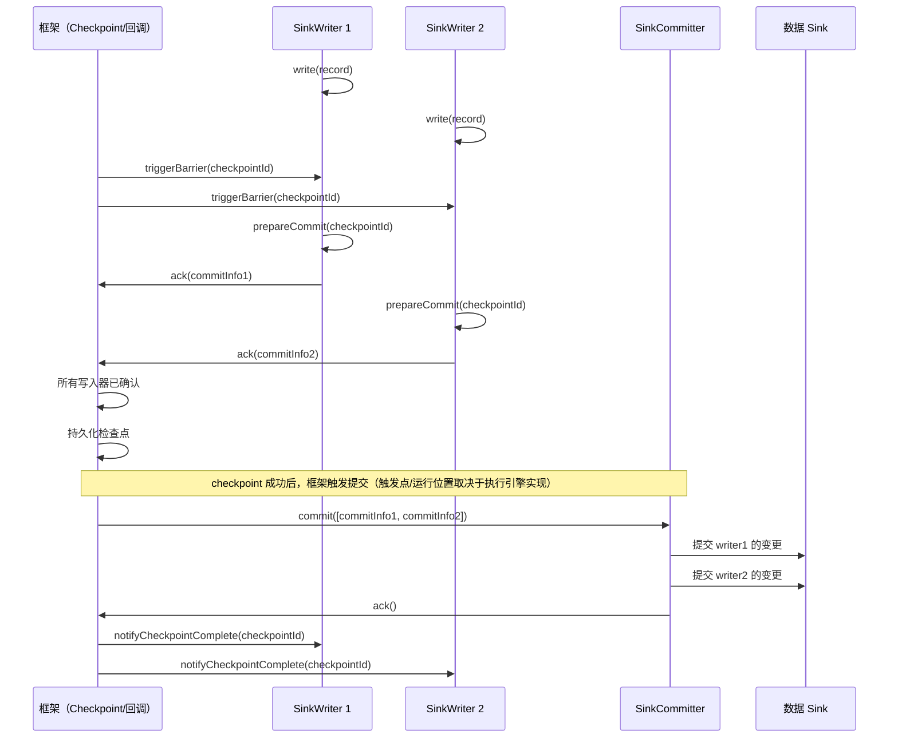
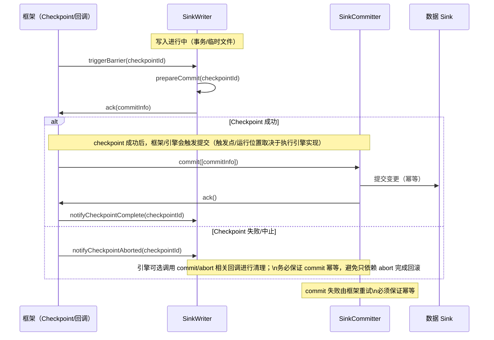

# 数据写入 Sink 架构

## 1. 概述

### 1.1 问题背景

在分布式环境中向外部系统写入数据面临关键挑战：

- **精确一次保证**：如何确保每条记录精确写入一次，而不是零次或多次？
- **事务一致性**：如何在多个并行写入器之间原子性地提交写入操作？
- **容错**：如何从失败中恢复而不丢失数据或产生重复？
- **反压**：如何处理慢速数据 Sink而不使系统过载？
- **幂等性**：如何使重试操作安全？

### 1.2 设计目标

SeaTunnel 的数据 Sink 旨在：

1. **提供可验证的一致性语义**：在外部系统支持事务/幂等提交的前提下，通过两阶段提交与检查点边界实现端到端一致性
2. **支持并行写入**：通过多个写入器实例扩展吞吐量
3. **启用全局协调**：协调分布式写入器之间的提交
4. **确保容错**：从失败中恢复而不产生数据不一致
5. **提供灵活性**：支持各种提交策略

### 1.3 适用场景

- 事务性数据库（JDBC 与 XA 事务）
- 消息队列（Kafka 与事务）
- 文件系统（原子文件重命名）
- 数据湖（Iceberg、Hudi、Paimon 与表事务）
- 搜索引擎（Elasticsearch 与版本控制）

## 2. 架构设计

### 2.1 整体架构

```
┌────────────────────────────────────────────────────────────────┐
│                   执行引擎任务侧（数据面）                       │
│                                                                │
│   ┌──────────────────────────────────────────────────────┐     │
│   │       SinkWriter<IN, CommitInfoT, StateT>            │     │
│   │                                                      │     │
│   │  • 从上游接收记录                                      │     │
│   │  • 缓冲并写入数据                                      │     │
│   │  • 在 checkpoint 边界产出 commitInfo                   │     │
│   │  • 快照写入器状态                                      │     │
│   └──────────────────────────────────────────────────────┘     │
│                            │                                   │
│                            │ checkpoint 完成通知触发            │
│                            ▼                                   │
│   ┌──────────────────────────────────────────────────────┐     │
│   │         SinkCommitter<CommitInfoT>（可选）            │     │
│   │                                                      │     │
│   │  • 使 prepare 的变更对外可见                            │     │
│   │  • 失败可重试，要求幂等                                 │     │
│   └──────────────────────────────────────────────────────┘     │
│                                                                │
└────────────────────────────────────────────────────────────────┘
                        │
                        │ （可选：聚合提交任务，单实例）
                        ▼
┌────────────────────────────────────────────────────────────────┐
│               执行引擎协调侧（控制面）                           │
│                                                                │
│   ┌──────────────────────────────────────────────────────┐     │
│   │ SinkAggregatedCommitter<CommitInfoT,                 │     │
│   │                        AggregatedCommitInfoT>（可选）│     │
│   │                                                      │     │
│   │  • 聚合多个 writer 的 commitInfo                       │     │
│   │  • 执行一次全局提交（单线程语义）                        │
│   └──────────────────────────────────────────────────────┘     │
│                                                                │
└────────────────────────────────────────────────────────────────┘
                        │
                        ▼
                外部数据系统
            (数据库 / 文件 / 消息队列)
```

### 2.2 核心组件

#### SeaTunnelSink（工厂接口）

作为创建写入器和提交器的工厂的顶层接口。

**契约要点（概念级）**：
- 创建 writer：在工作节点（Task）侧创建 `SinkWriter`，负责接收记录并写入
- 恢复 writer：在 failover 后用 checkpoint 中的 writerState 恢复未完成写入
- 创建 committer（可选）：当数据 Sink 需要两阶段提交时使用。它负责在 checkpoint 成功后提交 `prepareCommit(checkpointId)` 产生的提交信息；运行位置取决于执行引擎实现（例如在 SeaTunnel Engine 中由 Sink 任务在 `notifyCheckpointComplete` 回调中触发）
- 创建 aggregated committer（可选）：当外部系统需要“全局单点提交”（如表级提交/单次元数据提交）时使用。该提交器按单线程语义执行，通常与 committer 二选一；如果同时提供两者，需要确保语义不会重复提交/发生冲突
- 描述写入 schema：通过 `CatalogTable` 明确输入字段、投影与类型约束

这组工厂方法的核心目的是把“写入（数据面）”与“提交（控制面）”解耦，使得 checkpoint 成为全局一致性边界。

**关键设计点**：
- 两阶段提交扩展点：写入器（必需）+（committer 或 aggregated committer，按需求选择）
- committer 与 aggregated committer 在很多场景下应视为互斥选项：前者提交每个 writer 的变更，后者先聚合再做一次全局提交
- 写入器始终是必需的（执行实际的数据写入）

### 2.3 交互流程

#### 正常写入流程（带两阶段提交）



#### 失败和重试流程



**核心职责**：
- `write(element)`：接收上游记录并写入外部系统的“临时/事务内”区域（避免对外可见）
- `prepareCommit(checkpointId)`：在 checkpoint 边界生成提交信息（commitInfo），要求“无副作用”（不让数据对外可见）
- `snapshotState(checkpointId)`：把“已写入但未提交”的可恢复状态写入 checkpoint（事务句柄、文件清单、位点等）
- `abortPrepare()`：用于回滚 `prepareCommit` 阶段产生的副作用（是否会被调用取决于执行引擎/实现路径）
- `notifyCheckpointAborted()`：checkpoint 失败/中止回调（若 writer 或运行时实现了 CheckpointListener，可在此做清理）
- `notifyCheckpointComplete()`：checkpoint 成功且提交完成后做清理（释放事务、删除临时文件/状态等）

**关键要求**：
- `prepareCommit(...)` 必须无副作用；真正让数据对外可见的动作应发生在 committer 的 `commit()` 阶段
- `snapshotState()` 必须覆盖所有“已写入但未提交”的中间结果，否则恢复会丢数据或重复写
- 清理路径必须可重试且幂等：同一 checkpoint 的 abort/cleanup 可能被调用多次

**典型实现形态（不绑定具体源码）**：
- 事务型数据 Sink ：writer 在事务内写入，prepare 阶段产出事务句柄/提交 token，commit 阶段统一提交
- 文件型数据 Sink ：writer 写临时文件并产出“文件清单/元数据”，commit 阶段做原子 rename/元数据提交

### 3.2 SinkCommitter 接口

提交器由执行引擎在 checkpoint 成功后触发执行，用于使本次 checkpoint 对应的“准备写入”对外可见（运行位置取决于具体执行引擎实现）。


**契约要点**：
- `commit(commitInfos)`：对一批提交信息执行提交；必须支持重试，因此要求幂等
- 返回值语义：返回“仍需重试/未完成”的提交信息集合（框架会在后续 checkpoint 或恢复路径中重试）
- `abort(commitInfos)`（可选）：放弃提交并做资源清理（例如回滚事务、删除临时文件）

**关键要求**：
- `commit()` **必须**是幂等的（使用相同的 commitInfo 调用两次应该是安全的）
- 返回**失败的** commitInfos 列表（将被重试）
- 应优雅地处理部分失败

**实现提示**：
- 需要明确幂等键（例如事务 id、文件清单版本、外部系统的去重 key）
- 需要能区分“可重试失败”（网络抖动）与“不可重试失败”（权限/数据非法），避免无意义重试

### 3.3 SinkAggregatedCommitter 接口

聚合提交器为所有写入器执行单个全局提交。


**契约要点**：
- `combine(commitInfos)`：把多个 writer 的提交信息聚合成“全局一次提交”所需的元数据
- `commit(aggregatedCommitInfos)`：对聚合后的信息做全局提交；同样必须幂等
- `restoreCommit(...)`：恢复聚合提交器状态，确保 failover 后仍可完成/重试“全局提交”

**使用场景**：
- Hive 表提交（所有分区的单个 COMMIT TRANSACTION）
- Iceberg 表提交（单个表快照）
- 全局索引更新（为所有写入更新一次索引）

**实现示例（语义级，以 Hive 为例）**：
- `combine`： Sink 总所有 writer 产生的文件/分区元数据，形成一次表级提交所需的“全量变更集”
- `commit`：对外部 metastore/表事务执行一次全局原子提交；失败后需要可重试且不重复（幂等）

## 4. 设计考量

### 4.1 设计权衡

#### 两阶段提交

**优点**：
- 强一致性保证（精确一次）
- 自动失败恢复
- 准备和提交之间的清晰分离

**缺点**：
- 增加延迟（数据仅在提交后可见）
- 需要数据 Sink 中的事务支持
- 提交信息的额外状态
- 更复杂的实现

**何时使用**：
- 金融交易、计费、审计日志
- 外部系统支持事务/幂等提交，并且业务需要端到端精确一次的场景

**何时不使用**：
- 至少一次可接受（日志、指标）
- 数据 Sink 不支持事务
- 需要超低延迟

#### 两层提交 vs 聚合提交

**两层（写入器 → 提交器）**：
- 每个写入器的提交独立处理
- 并行提交操作
- 适用于大多数数据 Sink

**聚合提交（写入器 → 聚合提交器）**：
- 所有写入器的提交信息先被聚合
- 执行一次全局提交操作（单线程语义）
- 适用于需要“单点表级提交/元数据提交”的外部系统（Hive、Iceberg 等）

### 4.2 性能考量

#### 批量写入

将多条记录合并为一次外部写入（JDBC batch / bulk API / multi-put）。

**好处**：
- 摊销每条记录的开销
- 减少网络往返
- 更好的吞吐量

#### 异步写入

将外部 I/O 下沉到后台线程/异步客户端，以降低 `write()` 的尾延迟。但需要明确：
- 如果采用异步写入，`prepareCommit(...)` 需要等待所有“已接收记录”的异步写入完成，才能生成可靠的 commitInfo
- 需要有背压/限流策略，避免异步积压导致 OOM

#### 连接池

对 JDBC/HTTP 等短连接成本高的外部系统，优先使用连接池/长连接以减少握手与认证开销。

### 4.3 幂等性模式

#### 1. 自然幂等性（Upsert）

利用外部系统提供的 Upsert/Merge 语义，使“重复提交同一业务键”不会产生重复数据。

#### 2. 去重键

为每条写入生成可重复的幂等键（业务主键、事件 id、事务 id），并让外部系统/协议基于该键实现去重。

#### 3. 外部去重表

在外部系统维护“已提交记录表/去重索引”，提交前先检查是否已提交；这种方式通用但会引入额外写放大与一致性成本。

## 5. 最佳实践

### 5.1 使用建议

**1. 选择适当的提交级别**

- 仅 writer：适合至少一次（数据写入立即可见，恢复会重放，需外部幂等）
- writer + committer：适合两阶段提交（checkpoint 边界产出 commitInfo，并在 checkpoint 成功后触发 commit；触发位置取决于执行引擎实现）
- writer + aggregated committer：适合表级事务/全局单点提交（先聚合多个 writer 的 commitInfo，再执行一次全局提交）

**2. 正确的状态管理**

- 状态里只放“恢复必需信息”（事务句柄/临时文件清单/最后一致性偏移量等），避免把大批数据放进状态
- 恢复时要能把状态回放到 writer 内部，并确保 prepare/commit 的幂等性仍成立

**3. 资源管理**

- 明确资源生命周期：writer/committer 的 `close()` 必须可重复调用且不抛出不可恢复异常
- 尽量做到“按创建逆序关闭”，并确保失败时也能释放外部资源（连接/事务/临时文件）

### 5.2 常见陷阱

**1. prepareCommit(...) 中的副作用**

- `prepareCommit(...)` 只能生成“提交所需的凭据/元数据”，不能让数据对外可见
- 一旦在 prepare 阶段产生外部副作用，failover 重放会导致重复写入

**2. 非幂等提交**

- `commit()` 需要支持相同 commitInfo 的重复调用（网络抖动/主节点重启会发生）
- 优先依赖外部系统的幂等语义（upsert/merge/幂等事务 id），否则需要自建去重机制

**3. 大状态**

- 避免把大量缓冲记录放进 checkpoint 状态，状态越大越容易导致 checkpoint 超时与恢复变慢
- 把大数据留在外部系统（临时文件/事务日志），状态里只保留引用与必要元数据

### 5.3 调试技巧

**1. 启用 XA 事务日志**

- 记录关键生命周期事件：事务开始/prepare/commit/rollback、checkpointId、writerIndex
- 避免记录敏感数据（凭据/明文 SQL/用户数据），以可追踪的事务 id 为主

**2. 跟踪提交进度**

- 输出/采集提交指标：提交耗时、失败率、重试次数、单次提交大小
- 重点关注“提交堆积”与“commitInfo 重试风暴”，它们通常意味着幂等设计或外部系统稳定性问题

**3. 测试失败场景**

- 覆盖典型故障：writer 崩溃、committer 崩溃、commit 超时、重复提交、checkpoint 超时
- 验证点：不丢数据、不重复可见（或重复可见但幂等）、恢复后可继续推进 checkpoint

## 6. 相关资源

- [架构概览](../overview.md)
- [设计理念](../design-philosophy.md)
- [数据源架构](source-architecture.md)
- [检查点机制](../fault-tolerance/checkpoint-mechanism.md)
- [精确一次语义](../fault-tolerance/exactly-once.md)

## 7. 参考资料

### 示例连接器

- **简单数据 Sink **：ConsoleSink（输出到标准输出）
- **文件数据 Sink **：FileSink（原子文件重命名）
- **数据库数据 Sink **：JdbcSink（XA 事务）
- **流式数据 Sink **：KafkaSink（Kafka 事务）
- **表数据 Sink **：IcebergSink（表提交）

### 进一步阅读

- [两阶段提交协议](https://en.wikipedia.org/wiki/Two-phase_commit_protocol)
- [XA 事务](https://www.oracle.com/java/technologies/xa-transactions.html)
- [Kafka 事务](https://kafka.apache.org/documentation/#semantics)
- [Iceberg 表格式](https://iceberg.apache.org/spec/)
