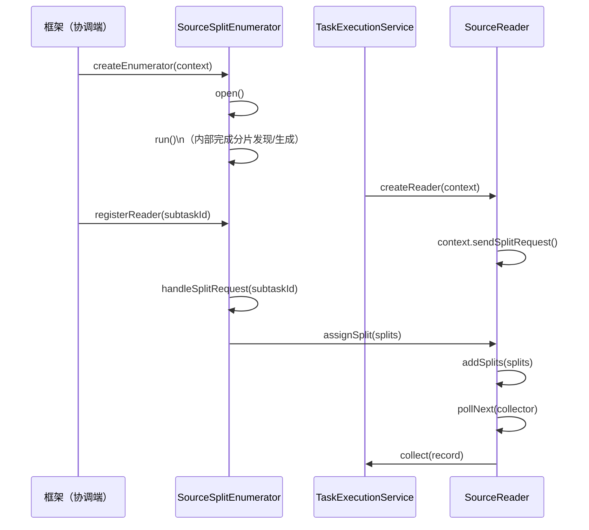
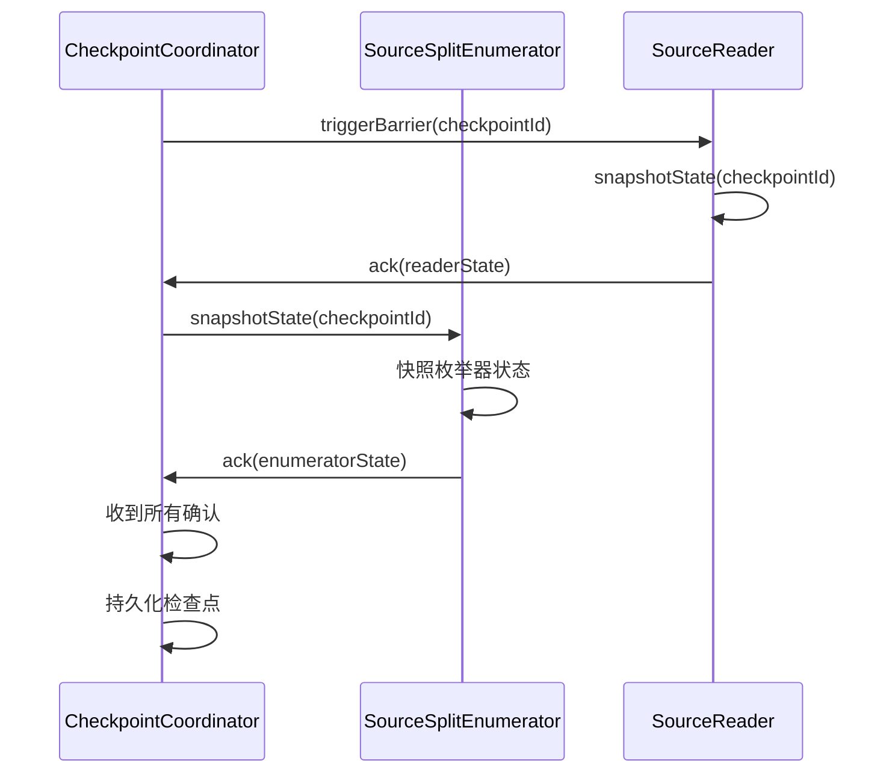
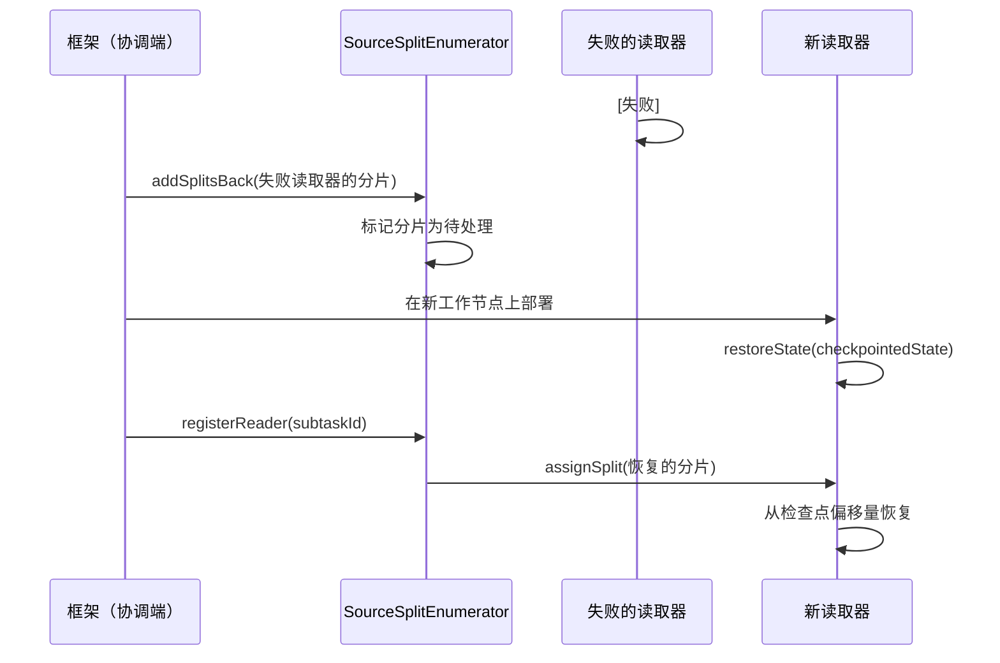

# 数据 Source 端架构

## 1. 概述

### 1.1 问题背景

分布式系统中的数据源读取端面临几个挑战：

- **并行度**：如何从单个 Sink 并行读取数据？
- **容错**：失败后如何从中断处恢复？
- **动态分配**：如何处理工作节点失败并重新分配工作？
- **有界 vs 无界**：如何统一批处理和流式数据源？
- **反压**：如何处理下游处理缓慢的情况？

### 1.2 设计目标

SeaTunnel 的源端 Source 端读取 API 旨在：

1. **启用并行读取**：通过基于分片的并行度支持可扩展性
2. **确保容错**：检查点分片状态以实现精确一次处理
3. **分离协调与执行**：枚举器（主节点）和读取器（工作节点）分离
4. **支持动态分配**：在失败或不平衡时重新分配分片
5. **统一批处理和流处理**：有界和无界数据源的单一 API

### 1.3 适用场景

- 基于文件的数据源（本地文件、HDFS、S3、OSS）等
- 数据库数据源（MySQL、PostgreSQL、Oracle、JDBC 兼容）等
- 消息队列数据源（Kafka、Pulsar、RabbitMQ）等
- CDC 数据源（MySQL CDC、PostgreSQL CDC、Oracle CDC）等
- 流式数据源（Socket、HTTP、自定义协议）等

## 2. 架构设计

### 2.1 整体架构

```
┌──────────────────────────────────────────────────────────────┐
│                    协调端（master/coordinator 侧）             │
│                                                                │
│   ┌────────────────────────────────────────────────────┐     │
│   │         SourceSplitEnumerator<SplitT, StateT>      │     │
│   │                                                      │     │
│   │  • 在 run() 中发现/生成分片（实现自定义）              │     │
│   │  • 分配分片给读取器                                 │     │
│   │  • 处理读取器注册                                   │     │
│   │  • 处理分片请求                                     │     │
│   │  • 从失败的读取器回收分片                           │     │
│   │  • 快照枚举器状态                                   │     │
│   │  • 发送/接收自定义事件                              │     │
│   └────────────────────────────────────────────────────┘     │
│                            │                                   │
└────────────────────────────┼───────────────────────────────────┘
                             │ (分片分配)
                             ▼
┌──────────────────────────────────────────────────────────────┐
│                  TaskExecutionService（工作节点侧）            │
│                                                              │
│   ┌────────────────────────────────────────────────────┐     │
│   │             SourceReader<T, SplitT>               │     │
│   │                                                    │     │
│   │  • 接收分配的分片                                    │     │
│   │  • 从分片读取数据                                    │     │
│   │  • 向下游发送记录                                    │     │
│   │  • 快照读取器状态（分片进度）                          │     │
│   │  • 处理分片完成                                      │     │
│   │  • 发送/接收自定义事件                                │     │
│   └────────────────────────────────────────────────────┘     │
│                            │                                 │
└────────────────────────────┼─────────────────────────────────┘
                             │
                             ▼
                       SeaTunnelRow
                       (到转换/数据 Sink )
```

### 2.2 核心组件

#### SeaTunnelSource（工厂接口）

作为创建读取器和枚举器的工厂的顶层接口。

本节仅保留核心契约说明，完整签名以源码为准：

**关键契约**：
- `getBoundedness()`：声明 BOUNDED/UNBOUNDED
- `createReader()`：创建运行在工作节点侧的 `SourceReader`
- `createEnumerator()` / `restoreEnumerator()`：创建/恢复运行在主节点侧的 `SourceSplitEnumerator`
- `getProducedCatalogTables()`：声明输出的表元数据（`CatalogTable` 列表，支持多表/模式信息）
- `getSplitSerializer()` / `getEnumeratorStateSerializer()`：split/枚举器状态序列化器（用于网络传输与 checkpoint）

#### SourceSplit（最小可序列化单元）

表示数据的可分区单元。

**核心约束**：
- **可独立处理**：split 表达一个可被单个 reader 独立读取的范围（例如文件片段、分区、主键范围）。
- **可序列化传输**：split 需要能在主节点与工作节点之间传递。
- **可重分配**：reader 失败时，未完成 split 必须可回收并分配给其他 reader。

**实现示例**：

- 文件类：`(filePath, startOffset, length)` 或 “单文件一个 split”
- JDBC 类：`(queryRange / shardKeyRange / partition)`
- Kafka 类：`(topic, partition, startOffset)`

**设计说明**：
- 分片必须可序列化以进行网络传输
- 分片状态（例如，当前偏移量）单独存储在读取器状态中
- 分片可以重新分配给不同的读取器

### 2.3 交互流程

#### 初始启动流程



#### 检查点流程



#### 失败恢复流程



## 3. 关键实现

### 3.1 SourceSplitEnumerator 接口

枚举器在主节点侧运行并协调分片分配。

**关键契约（摘要）**：
- `run()`：枚举/发现分片并驱动分配逻辑
- `registerReader(subtaskId)`：注册 reader（由引擎调用）
- `handleSplitRequest(subtaskId)`：处理 reader 请求分片
- `addSplitsBack(splits, subtaskId)`：reader 失败时回收未完成分片
- `snapshotState(checkpointId)`：快照枚举器状态（注意与 `run()` 的并发调用约束）

**关键职责**：
- **分片发现**：从数据源生成分片（文件、分区、分片）
- **分配策略**：决定哪些分片分配给哪些读取器
- **动态处理**：处理读取器注册、分片请求、失败
- **状态管理**：快照剩余分片和分配状态

**典型实现思路（伪代码示意）**：

```
on run():
    pendingSplits += newlyDiscoveredSplits  # 分片发现/生成逻辑由实现决定

on handleSplitRequest(subtaskId):
    if pendingSplits not empty:
        assignSplit(subtaskId, nextSplit)
    else:
        signalNoMoreSplits(subtaskId)

on addSplitsBack(splits):
    pendingSplits += splits
```

### 3.2 SourceReader 接口

读取器在工作节点上运行并执行实际的数据读取。

**关键契约（摘要）**：
- `pollNext(output)`：拉取下一批数据（建议非阻塞/可限时）
- `addSplits(splits)`：接收枚举器分配的 splits
- `snapshotState(checkpointId)`：返回 split checkpoint state（实际接口返回 `List<SplitT>`）
- `handleNoMoreSplits()`：收到无更多 split 的信号
- `CheckpointListener` 回调：由框架触发 checkpoint 完成/中止通知

**关键职责**：
- **数据读取**：从分配的分片拉取记录
- **进度跟踪**：跟踪每个分片内的偏移量/位置
- **状态管理**：快照分片进度以进行恢复
- **分片管理**：处理分片分配、完成和删除

**典型实现思路（伪代码示意）**：

```
pollNext(output):
  if no active split:
    request split if queue empty
    else activate next split
  read batch records from active split into output

snapshotState(checkpointId):
  return remaining/unconsumed splits (and progress via split内部状态或外部offset映射)
```

### 3.3 SourceEvent（自定义通信）

允许枚举器和读取器交换自定义消息。

**核心约束**：事件需可序列化，用于 `SourceReader` 与 `SourceSplitEnumerator` 之间的自定义通信。

**使用场景**：
- 动态分区发现（Kafka、HDFS）
- 运行时配置更改
- 自定义协调逻辑

## 4. 设计考量

### 4.1 设计权衡

#### 枚举器-读取器分离

**优点**：
- 清晰分离协调（主节点）和执行（工作节点）
- 枚举器可以在读取器不知情的情况下重新分配分片
- 集中协调简化分片分配逻辑
- 容错：枚举器和读取器独立失败

**缺点**：
- 额外的网络通信（分片分配消息）
- 连接器开发人员的 API 更复杂
- 如果枚举器速度慢，可能成为瓶颈

**缓解措施**：
- 异步分片分配
- 批量分片请求/分配
- 延迟分片发现

#### 分片粒度

**粗粒度分片**（少量大分片）：
- **优点**：较少的协调开销
- **缺点**：负载均衡差，恢复时间长

**细粒度分片**（许多小分片）：
- **优点**：更好的负载均衡，更快的恢复
- **缺点**：更高的协调开销

**经验建议（仅供参考）**：按数据源特性与作业目标在“负载均衡/协调开销/恢复耗时”之间权衡分片粒度；不要在文档里把某个固定大小当作必然最佳值。

### 4.2 性能考量

#### 批量读取

建议批量读取而不是逐条读取，以摊销 I/O 与序列化开销。

**好处**：
- 摊销每条记录的开销
- 更好的 CPU 缓存利用率
- 减少锁竞争

#### 非阻塞轮询

建议在无可用数据时快速返回，由框架按调度节奏再次调用，避免阻塞工作线程。

**好处**：
- 避免阻塞工作线程
- 启用反压处理
- 更好的资源利用率

#### 连接池

数据库类 Source 建议使用连接池并控制并发连接数，避免对源端造成压垮式压力。

### 4.3 可扩展性

#### 自定义分片分配策略

自定义分配策略应基于可观测信号（负载、数据局部性、split 大小差异）并确保失败回收路径可用。

典型策略包括：按 split 大小做负载均衡、按数据局部性优先分配、对热点 reader 做节流等。

#### 动态分片发现

动态分片发现通常用于“分区会随时间变化”的数据源（如 Kafka、目录新增文件等）。推荐的设计方式是：

1. **周期性发现**：枚举器按固定周期扫描新分区/新文件，并将其转换为新的 split。
2. **增量分配**：新 split 作为增量加入待分配队列，由分配策略按负载分发给 reader。
3. **一致性边界**：对“发现时点”与“开始消费时点”的关系做明确约束（例如：从发现时刻开始消费；或支持从指定 offset/时间戳消费）。
4. **与 checkpoint 的关系**：必须确保“新 split 的出现”在故障恢复后可重放（通过枚举器状态快照或外部可重复发现的元数据源实现）。

## 5. 最佳实践

### 5.1 使用建议

**1. 分片大小**
- 文件：按文件系统与下游吞吐能力合理切分（例如按 block/文件/分区等天然边界）
- 数据库：按分片键范围/分页区间/分区等可独立读取的边界切分
- 消息队列：通常使用原生分区（如 Kafka 分区）作为 split 边界

**2. 状态管理**
- 保持分片状态小（每个分片 < 1MB）
- 使用偏移量/位置而不是缓冲数据
- 高效序列化（Kryo、Protobuf）

**3. 错误处理**

建议将错误分为两类并采用不同策略：
- **瞬态错误**（网络抖动、临时超时、可重试的限流）：允许有限次数重试，并使用退避策略（exponential backoff + jitter），同时把重试次数/最后错误输出到指标与日志。
- **致命错误**（配置错误、权限不足、协议不兼容、数据不可解析且无法跳过）：应快速失败并把异常向框架上抛，触发作业失败或按作业级策略处理。

注意事项：
- 避免在工作线程里进行长时间 sleep；如果必须退避，优先采用非阻塞式调度或由框架驱动下一次 poll。
- 对“可跳过的坏数据”要显式配置并记录（计数、采样、落盘/死信），默认不建议静默吞掉。

**4. 资源管理**

资源管理建议：
- 对所有外部资源（连接、游标/ResultSet、文件句柄、线程池、缓冲区）建立“创建-使用-关闭”的明确生命周期，并保证 close 在异常路径也能执行。
- 优先使用连接池并设置上限，避免并发 reader 放大源端压力。
- 释放顺序建议与依赖关系一致（先游标/会话，后连接/池）。

### 5.2 常见陷阱

**1. 阻塞 pollNext()**

反例：在 `pollNext()` 中无限期阻塞（例如等待队列/网络直到有数据），会占用工作线程并破坏框架调度。

推荐：
- 使用非阻塞或有超时的轮询，没数据时快速返回，让框架按节奏再次调用。
- 把“等待数据”的职责交给外部组件（如有界队列 + 生产线程），但 reader 侧仍应遵循非阻塞/可中断原则。

**2. 大状态**

反例：把整段数据缓冲进 checkpoint state，会导致状态膨胀、checkpoint 变慢、恢复时间不可控。

推荐：
- 状态只保存“可重放位置”（offset、游标位置、文件 path+position、分区+时间戳等）。
- 把缓存留在内存并可丢弃，让恢复依赖可重复读取（replay）而不是依赖大状态。

**3. 忘记请求分片**

反例：当本地没有可读 split 时直接返回，且没有向框架请求更多 split，会导致 reader 长期空转。

推荐：
- 当待处理 split 为空时，主动触发 split request（或进入“等待分片”的可调度状态）。
- 同时输出指标（例如 pending split 数、空轮询次数），便于发现枚举器未分配/分配失衡问题。

### 5.3 调试技巧

**1. 启用调试日志**

建议输出“可定位”的调试日志（并可按配置开关）：
- 当前 split 标识、消费位置（offset/position）、批大小
- 上次 checkpoint 的 id/时间
- 最近一次错误类型与重试次数

**2. 跟踪指标**

建议最少暴露以下指标，便于容量规划与排障：
- 吞吐：records/s、bytes/s
- 延迟：端到端 lag（按时间戳/offset）
- backlog：待处理 split 数、每个 split 的剩余量
- 可靠性：重试次数、失败次数、坏数据计数

**3. 测试分片重新分配**

建议用“故障注入”的方式验证 split 回收与再分配：
- reader 异常退出/超时心跳 -> enumerator 回收其已分配但未完成的 splits
- 新 reader 加入 -> 能重新领取并从正确位置继续消费
- 验证点：无重复消费（或重复可被幂等吸收）、无数据丢失、恢复耗时可接受

## 6. 相关资源

- [架构概览](../overview.md)
- [设计理念](../design-philosophy.md)
- [数据 Sink 架构](sink-architecture.md)
- [检查点机制](../fault-tolerance/checkpoint-mechanism.md)
- [如何创建您的连接器](../../developer/how-to-create-your-connector.md)

## 7. 参考资料

### 示例连接器

- **简单数据源**：FakeSource（生成测试数据）
- **文件数据源**：FileSource（本地/HDFS/S3 文件）
- **数据库数据源**：JdbcSource（JDBC 兼容数据库）
- **流式数据源**：KafkaSource（Apache Kafka）
- **CDC 数据源**：MySQLCDCSource（MySQL binlog）

### 进一步阅读

- Apache Flink FLIP-27：["Refactored Source API"](https://cwiki.apache.org/confluence/display/FLINK/FLIP-27%3A+Refactor+Source+Interface)
- Kafka Consumer：[Consumer Groups and Partition Assignment](https://kafka.apache.org/documentation/#consumerconfigs)
