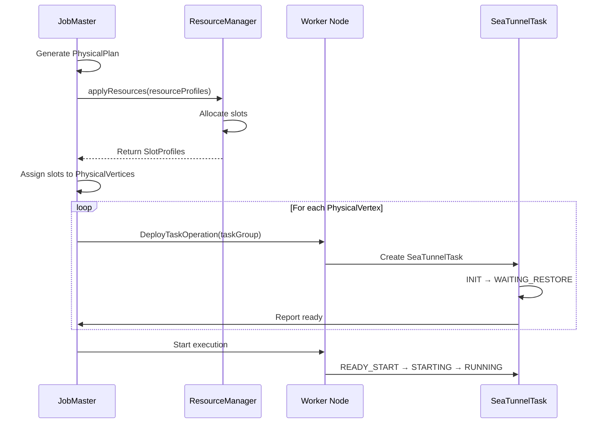

# DAG 执行模型

## 1. 概述

### 1.1 问题背景

分布式数据处理需要将用户意图转换为可执行的分布式任务:

- **抽象层次**: 如何分离逻辑意图与物理执行?
- **优化**: 如何优化任务放置和数据混洗?
- **流水线**: 如何执行具有多个数据 Source/Sink 的复杂 DAG?
- **并行度**: 如何确定任务并行度和分布?
- **故障隔离**: 如何将故障影响限制在受影响的组件内?

### 1.2 设计目标

SeaTunnel 的 DAG 执行模型旨在:

1. **关注点分离**: 逻辑规划(用户意图) vs 物理执行(运行时细节)
2. **支持优化**: 任务融合、流水线分割、资源分配
3. **支持复杂拓扑**: 多个数据源、目标端、分支、连接
4. **促进容错**: 清晰的故障边界与独立检查点
5. **最大化并行度**: 高效并行执行,最少协调开销

### 1.3 执行模型概览

```
用户配置 (HOCON)
    │
    ▼
┌─────────────────────┐
│    LogicalDag       │  逻辑计划 (做什么)
│  • LogicalVertex    │  - 数据 Source/tranform 转换器/Sink 目标端动作
│  • LogicalEdge      │  - 数据依赖关系
│  • Parallelism      │  - 逻辑并行度
└─────────────────────┘
    │ (计划生成)
    ▼
┌─────────────────────┐
│   PhysicalPlan      │  物理计划 (如何执行)
│  • SubPlan[]        │  - 多个流水线
│  • Resources        │  - 资源需求
│  • Scheduling       │  - 部署策略
└─────────────────────┘
    │ (流水线分割)
    ▼
┌─────────────────────┐
│  SubPlan (Pipeline) │  独立执行单元
│  • PhysicalVertex[] │  - 并行任务实例
│  • CheckpointCoord  │  - 独立检查点
│  • PipelineLocation │  - 唯一标识符
└─────────────────────┘
    │ (任务部署)
    ▼
┌─────────────────────┐
│  PhysicalVertex     │  已部署任务组
│  • TaskGroup        │  - 共址任务(融合)
│  • SlotProfile      │  - 分配的资源槽位
│  • ExecutionState   │  - 运行状态
└─────────────────────┘
    │ (执行)
    ▼
┌─────────────────────┐
│   SeaTunnelTask     │  实际执行
│  • Source/Transform │  - 数据处理
│  • /Sink Logic     │  - 状态管理
└─────────────────────┘
```

## 2. LogicalDag: 用户意图

### 2.1 结构

LogicalDag 以引擎无关的方式表示用户的作业配置。

LogicalDag 的核心组成:
- **logicalVertexMap**: 顶点集合(每个顶点对应一个 Source/Transform/Sink 动作)
- **edges**: 边集合(描述数据流依赖关系)
- **jobConfig**: 作业级配置(例如并行度默认值、容错/资源/运行参数)

### 2.2 LogicalVertex

表示单个动作(数据 Source/转换器/Sink 目标端)及其并行度。

一个 LogicalVertex 通常包含:
- **vertexId**: 顶点唯一标识
- **action**: 动作类型(SourceAction / TransformChainAction / SinkAction)
- **parallelism**: 并行实例数量(若未显式配置，可能由引擎推断)

**动作类型**:
- **SourceAction**: 封装 `SeaTunnelSource`,生产 `CatalogTable`
- **TransformChainAction**: `SeaTunnelTransform` 链,转换模式
- **SinkAction**: 封装 `SeaTunnelSink`,消费 `CatalogTable`

**示例**:

来自配置的直观映射关系:
- Vertex 1: JDBC Source，parallelism=4
- Vertex 2: SQL Transform，parallelism=8
- Vertex 3: Elasticsearch Sink，parallelism=2

### 2.3 LogicalEdge

表示动作之间的数据流。

一条 LogicalEdge 通常只需要描述:
- **inputVertexId**: 上游顶点
- **targetVertexId**: 下游顶点

**示例**:

典型线性拓扑中的边:
- JDBC Source(1) → SQL Transform(2)
- SQL Transform(2) → Elasticsearch Sink(3)

### 2.4 LogicalDag 创建

从用户配置构建:

LogicalDag 在作业提交/启动阶段由作业执行环境解析配置生成（可能发生在客户端或服务端），随后作为作业不可变信息的一部分交由 JobMaster 管理执行。

**过程**:
1. 解析 HOCON 配置(source、transform、sink 部分)
2. 为每个配置的组件创建 `Action` 对象
3. 从配置结构推断数据流
4. 验证模式兼容性
5. 构建 `LogicalDag` 对象

**示例配置 → LogicalDag**:
```hocon
env {
  parallelism = 4
}

source {
  JDBC {
    url = "jdbc:mysql://..."
    query = "SELECT * FROM orders"
  }
}

transform {
  Sql {
    query = "SELECT order_id, SUM(amount) FROM this GROUP BY order_id"
  }
}

sink {
  Elasticsearch {
    hosts = ["es-host:9200"]
    index = "orders_summary"
  }
}
```

生成的 LogicalDag:
```
Vertex 1 (JDBC 数据源, parallelism=4)
    │
    ▼
Vertex 2 (SQL 转换器, parallelism=4)
    │
    ▼
Vertex 3 (Elasticsearch 目标端, parallelism=4)
```

## 3. PhysicalPlan: 执行策略

### 3.1 结构

PhysicalPlan 描述如何在分布式工作节点上执行 LogicalDag。

PhysicalPlan 的核心信息通常包括:
- **pipelineList(SubPlans)**: 由 LogicalDag 切分得到的多个流水线(独立执行单元)
- **jobImmutableInformation**: 作业不可变信息(例如作业 ID、提交参数、依赖等)
- **running state store**: 分布式状态存储(用于运行态状态、时间戳、元信息等)
- **jobEndFuture**: 作业完成信号(用于协调退出、回收资源、返回结果)

### 3.2 流水线分割

LogicalDag 在生成 ExecutionPlan 时会被组织为一个或多个**流水线**(Pipeline/SubPlan)。以当前实现为准，主要规则是：

1. **按连通性拆分**：DAG 中互不相连的子图会被拆成不同流水线。
2. **遇到多输入顶点时拆分**：当存在“多输入顶点”（某个顶点有多个上游输入，例如 UNION多流汇聚）时，当前实现会沿每条 source→…→sink 的路径拆成多条线性流水线，并对共享顶点做克隆，以降低多输入拓扑在同一流水线内的协调复杂度。

说明：
- 如果仅存在“一个 source 分叉到多个 sink”（多输出/分支），但没有任何多输入顶点，当前实现通常不会仅因为多个 sink 就拆分流水线；该分支拓扑仍可能在同一流水线内执行。
- 更细粒度的切分（例如按并行度/可协调能力）在代码中仍保留 TODO，后续可能演进。

**示例 1: 简单线性流水线**:
```hocon
source { JDBC { } }
transform { Sql { } }
sink { Elasticsearch { } }
```

生成: **1 个流水线**
```
流水线 1: [JDBC 数据源] → [SQL 转换器] → [Elasticsearch 目标端]
```

**示例 2: 多个数据源**:
```hocon
source {
  JDBC { plugin_output = "orders" }
  Kafka { plugin_output = "events" }
}

transform {
  Sql { query = "SELECT * FROM orders UNION SELECT * FROM events" }
}

sink {
  Elasticsearch { }
}
```

生成: **2 个流水线**
```
流水线 1: [JDBC 数据源] → [SQL 转换器] → [Elasticsearch 目标端]
流水线 2: [Kafka 数据源] → [SQL 转换器] → [Elasticsearch 目标端]
```

**示例 3: 多个目标端**:
```hocon
source {
  MySQL-CDC { }
}

sink {
  Elasticsearch { plugin_input = "MySQL-CDC" }
  JDBC { plugin_input = "MySQL-CDC" }
}
```

生成: **通常为 1 个流水线（包含分支）**
```
流水线 1: [MySQL-CDC 数据源] → [Elasticsearch 目标端]
                      └──────→ [JDBC 目标端]
```

### 3.3 PhysicalPlan 生成

PhysicalPlan 通常由 JobMaster 在拿到 LogicalDag 后生成，并结合 ResourceManager 做资源申请与放置。

**步骤**:
1. **分析 LogicalDag**: 识别数据源、目标端和依赖关系
2. **分割为流水线**: 为每个流水线创建 SubPlan
3. **生成 PhysicalVertices**: 为每个动作创建并行实例
4. **分配资源**: 从 ResourceManager 请求槽位
5. **分配任务**: 将 PhysicalVertices 映射到槽位
6. **创建协调器**: 为每个流水线设置 CheckpointCoordinator

## 4. SubPlan (流水线)

### 4.1 结构

SubPlan 表示一个独立执行的流水线。

SubPlan(流水线)通常包含:
- **pipelineId/pipelineLocation**: 流水线的唯一标识
- **physicalVertexList**: 此流水线中的并行任务实例列表
- **coordinatorVertexList**: 协调器类任务(如 split enumerator、聚合提交等单实例协调任务)
- **checkpointCoordinator**: 本流水线的检查点协调器(独立协调域)
- **pipelineStatus**: 执行状态(如 CREATED/RUNNING/FAILED/FINISHED)

### 4.2 PhysicalVertex 列表

每个并行度为 N 的 LogicalVertex 生成 N 个 PhysicalVertices。

**示例**:
```
LogicalVertex: JDBC 数据源 (parallelism = 4)
    ↓
PhysicalVertices:
    - PhysicalVertex (子任务 0, 槽位 1)
    - PhysicalVertex (子任务 1, 槽位 2)
    - PhysicalVertex (子任务 2, 槽位 3)
    - PhysicalVertex (子任务 3, 槽位 4)
```

### 4.3 协调器顶点

用于协调任务的特殊顶点:

- **SourceSplitEnumerator**: 通常以单实例运行,分配分片给读取器（部署位置由引擎调度决定）
- **SinkAggregatedCommitter**: 当 Sink 提供 aggregated committer 时，通常以单实例运行用于全局提交协调（部署位置由引擎调度决定）

说明：`SinkCommitter` 的触发方式取决于引擎实现，并不一定体现为独立的协调器顶点；例如在 SeaTunnel Engine 中，committer 可能在 Sink 任务的 checkpoint 回调中被触发。

**示例**:
```
JDBC → Transform → Elasticsearch 的 SubPlan:
    physicalVertexList:
        - JdbcSourceTask (4 个实例)
        - TransformTask (4 个实例)
        - ElasticsearchSinkTask (4 个实例)

    coordinatorVertexList:
      - JdbcSourceSplitEnumerator (1 个实例)
      - ElasticsearchSinkAggregatedCommitter (1 个实例，可选)
```

### 4.4 独立检查点

每个流水线都有自己的 `CheckpointCoordinator`:

**优势**:
- 独立的检查点间隔
- 隔离的故障域
- 减少协调开销
- 简化屏障对齐

**示例**:
```
流水线 1 (JDBC → ES):
  CheckpointCoordinator 按作业配置的间隔触发
    仅管理 JDBC 和 ES 任务的检查点

流水线 2 (Kafka → JDBC):
  CheckpointCoordinator 按作业配置的间隔触发
    仅管理 Kafka 和 JDBC 任务的检查点
```

## 5. PhysicalVertex: 已部署任务

### 5.1 结构

PhysicalVertex 表示已部署的任务实例。

PhysicalVertex 关注“一个并行任务实例如何被部署与运行”:
- **taskGroupLocation**: 任务实例定位信息(含并行子任务序号等)
- **taskGroup**: 任务融合后的执行单元(见下节)
- **slotProfile**: 该实例被分配到的槽位(资源容量与位置)
- **currentExecutionState**: 当前执行状态(CREATED/RUNNING/FAILED 等)
- **pluginJarsUrls**: 插件依赖(用于类加载隔离)

### 5.2 TaskGroup: 任务融合

多个任务可以融合到单个 `TaskGroup` 以提高效率。

TaskGroup 的关键点:
- 将一段可融合的线性算子链(Source/Transform/Sink 的某些组合)放在同一执行单元内
- 通过共享线程/队列/内存通道减少跨算子序列化与网络开销
- 以并行度为单位生成多个 TaskGroup 实例(通常与上游并行度对齐)

**融合条件**:
1. 相同并行度
2. 顺序依赖(A → B)
3. 不需要数据混洗

**示例(带融合)**:
```
LogicalDag:
    Source (parallelism=4) → Transform (parallelism=4) → Sink (parallelism=4)

不融合:
    12 个独立任务(4 + 4 + 4)
    Source → Transform 和 Transform → Sink 有网络开销

融合后:
    4 个 TaskGroups,每个包含:
        [SourceTask → TransformTask → SinkTask] (单线程,共享内存)
```

**优势**:
- 减少网络序列化/反序列化
- 更好的 CPU 缓存局部性
- 更低的内存占用
- 简化部署

### 5.3 槽位分配

每个 PhysicalVertex 被分配一个 `SlotProfile`:

SlotProfile 表达“这个任务实例运行在哪里、能用多少资源”。具体字段与语义见资源管理文档。

**分配过程**:
1. JobMaster 从 ResourceManager 请求槽位
2. ResourceManager 根据分配策略选择工作节点（例如 RANDOM / SLOT_RATIO / SYSTEM_LOAD）
3. ResourceManager 分配槽位并返回 SlotProfiles
4. JobMaster 将 SlotProfiles 分配给 PhysicalVertices
5. JobMaster 通过 `DeployTaskOperation` 部署任务

## 6. 任务部署和执行

### 6.1 部署流程



### 6.2 任务执行

每个 `SeaTunnelTask` 执行其分配的动作:

**SourceSeaTunnelTask**:

执行要点:
- 持续从 SourceReader 拉取/接收数据并发出记录
- 在检查点触发时生成并传播 barrier(屏障)，参与流水线级的一致性快照

**TransformSeaTunnelTask**:

执行要点:
- 从上游通道读取记录
- 应用 transform 逻辑并输出到下游通道
- 若 transform 有状态，需要参与 checkpoint 的状态快照与恢复

**SinkSeaTunnelTask**:

执行要点:
- 持续消费上游记录并调用 sinkWriter 写入目标端
- 在 barrier 到达时切换到“快照边界”：准备提交信息(prepareCommit(checkpointId))、持久化 writer 状态并将提交信息交给 committer
- 在 checkpoint 成功后由 committer 进行最终提交；失败时由恢复流程回滚/重试(取决于 sink 语义)

## 7. 优化策略

### 7.1 任务融合

**何时融合**:
- 相同并行度
- 顺序算子(无分支)
- 无混洗边界

**何时不融合**:
- 不同并行度(例如 source=4, sink=8)
- 分支 DAG(一个数据源,多个目标端)
- 需要混洗(例如 GROUP BY、JOIN)

说明：任务融合的具体策略与可配置项以当前引擎实现为准，文档不在此绑定某个固定的配置开关，避免与实际版本不一致。

### 7.2 并行度推断

并行度以配置为准：
- 若连接器显式配置了 `parallelism`，则使用连接器配置。
- 否则使用 `env.parallelism`（默认值为 1）。
- 某些连接器/引擎可能会根据外部系统分区数等信息做额外推断，但这是实现细节，不能在架构文档里写成固定规则。

**示例**:
```hocon
source {
  JDBC { parallelism = 4 }  # 显式
}

transform {
  Sql { }  # 推断: 4 (来自数据源)
}

sink {
  Elasticsearch { }  # 推断: 4 (来自转换器)
}
```

### 7.3 资源分配

**槽位计算**:
```
所需槽位 = 所有任务并行度之和

示例:
  Source (parallelism=4) + Transform (parallelism=4) + Sink (parallelism=2)
  = 需要 10 个槽位

融合后:
  TaskGroup (parallelism=4, fusion[Source+Transform]) + Sink (parallelism=2)
  = 需要 6 个槽位
```

说明：资源画像/槽位资源的具体字段、单位与配置路径以引擎侧配置与实现为准；文档不在此给出不存在或不稳定的配置项示例。

## 8. 故障处理

### 8.1 任务故障

**检测**:
- 任务抛出异常
- 心跳超时

**恢复**:
1. 标记任务为 FAILED
2. 使整个流水线失败(保守策略)
3. 从最新检查点恢复
4. 重新分配资源
5. 重新部署和重启流水线

### 8.2 流水线故障隔离

**关键见解**: 流水线故障是隔离的。

**示例**:
```
有 2 个流水线的作业:
    流水线 1: JDBC → ES (RUNNING)
    流水线 2: Kafka → JDBC (FAILED)

结果:
    流水线 2 从检查点重启
    流水线 1 继续不受影响
```

**优势**:
- 减少爆炸半径
- 更快恢复(仅失败的流水线)
- 更好的资源利用率

## 9. 监控和可观测性

### 9.1 关键指标

**流水线级别**:
- `pipeline.status`: CREATED / RUNNING / FINISHED / FAILED
- `pipeline.tasks.total`: 任务总数
- `pipeline.tasks.running`: 当前运行的任务数
- `pipeline.checkpoint.latest_id`: 最新检查点 ID
- `pipeline.checkpoint.duration`: 检查点持续时间

**任务级别**:
- `task.status`: 任务执行状态
- `task.records_in`: 接收的记录数
- `task.records_out`: 发出的记录数
- `task.bytes_in`: 接收的字节数
- `task.bytes_out`: 发出的字节数

### 9.2 可视化

```
作业: mysql-to-es
│
├── 流水线 1 (mysql-cdc → elasticsearch)
│   ├── PhysicalVertex 0 [RUNNING] @ worker-1:slot-1
│   ├── PhysicalVertex 1 [RUNNING] @ worker-2:slot-1
│   ├── PhysicalVertex 2 [RUNNING] @ worker-3:slot-1
│   └── PhysicalVertex 3 [RUNNING] @ worker-4:slot-1
│
└── 流水线 2 (mysql-cdc → jdbc)
    ├── PhysicalVertex 0 [RUNNING] @ worker-1:slot-2
    └── PhysicalVertex 1 [RUNNING] @ worker-2:slot-2
```

## 10. 最佳实践

### 10.1 并行度配置

**经验法则**:
```
并行度 = min(
    数据分区数,
    可用槽位数,
    目标吞吐量 / 单任务吞吐量
)
```

**示例**:
- **JDBC 数据源**: 设置为数据库分区数(例如 8 个分区 → parallelism=8)
- **Kafka 数据源**: 设置为分区数(例如 32 个分区 → parallelism=32)
- **文件数据源**: 设置为文件数或文件分片数
- **CPU 密集型转换器**: 设置为 CPU 核心数
- **I/O 密集型目标端**: 根据目标系统容量设置

### 10.2 流水线设计

**保持流水线简单**:
- 优先使用线性流水线(数据源 → 转换器 → 目标端)
- 尽可能避免复杂分支
- 对完全独立的工作流使用多个作业

**何时使用多个作业**:
- 需要不同的检查点间隔
- 需要不同的资源需求
- 需要独立的故障域

### 10.3 故障排除

**问题**: 任务未启动

**检查**:
1. 是否有足够的可用槽位?(`required_slots <= available_slots`)
2. 资源配置文件是否合理?(不要请求 100 个 CPU 核心)
3. 标签过滤器是否正确?(如果使用基于标签的分配)

**问题**: 低吞吐量

**检查**:
1. 并行度是否太低?(增加并行度)
2. 任务融合是否被禁用?(启用以获得更好的性能)
3. 检查点间隔是否太短?(增加间隔)

## 11. 相关资源

- [引擎架构](engine-architecture.md)
- [资源管理](resource-management.md)
- [检查点机制](../fault-tolerance/checkpoint-mechanism.md)
- [架构概述](../overview.md)

## 12. 参考资料
### 进一步阅读

- [Google Borg Paper](https://research.google/pubs/pub43438/) - 任务调度灵感
- [Apache Flink JobGraph](https://nightlies.apache.org/flink/flink-docs-stable/docs/internals/job_scheduling/)
- [Spark DAG Scheduler](https://spark.apache.org/docs/latest/job-scheduling.html)
