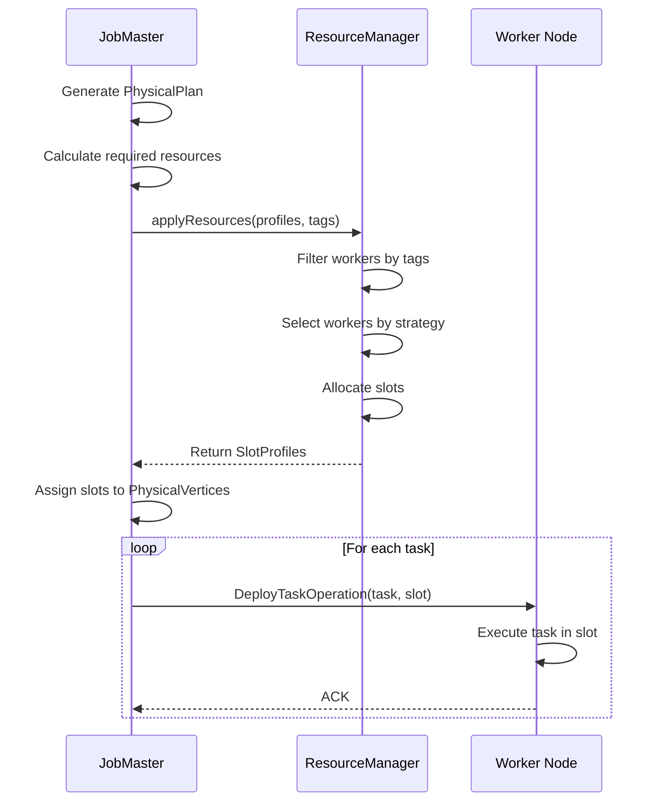
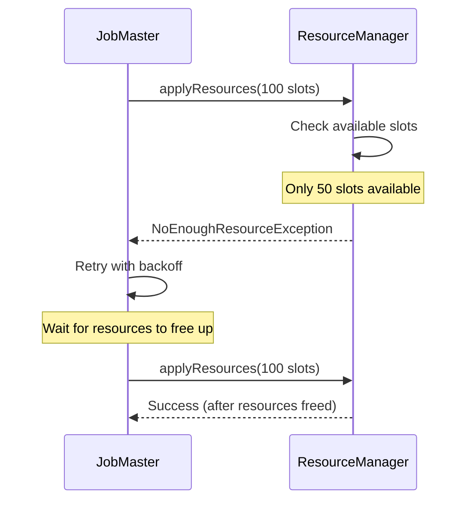
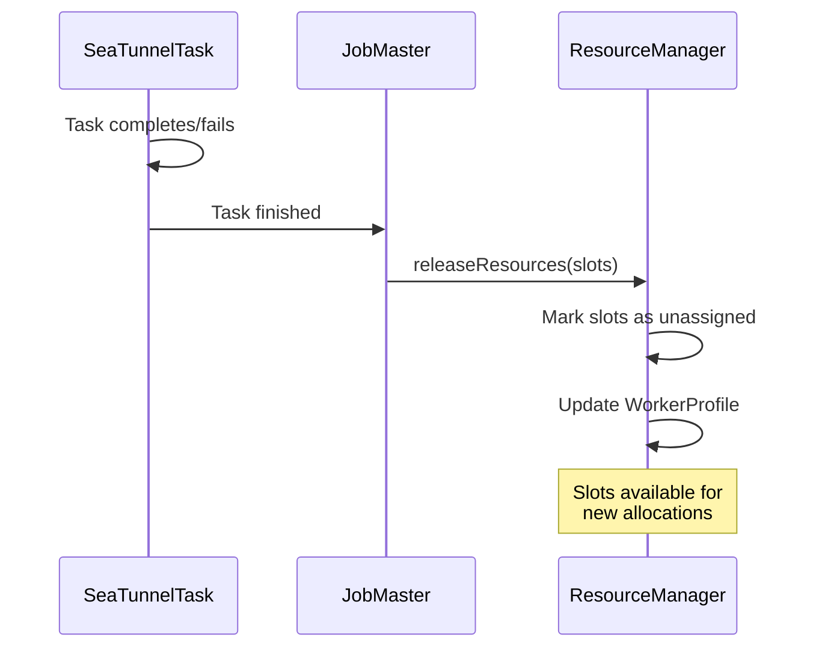

# 资源管理

## 1. 概述

### 1.1 问题背景

分布式执行引擎必须高效管理计算资源:

- **资源分配**: 如何公平高效地将任务分配给工作节点?
- **负载均衡**: 如何在工作节点之间均匀分布工作负载?
- **资源隔离**: 如何防止作业之间的资源争用?
- **动态扩缩容**: 如何在不中断作业的情况下添加/删除工作节点?
- **异构资源**: 如何处理具有不同能力的工作节点?

### 1.2 设计目标

SeaTunnel 的资源管理系统旨在:

1. **细粒度控制**: 基于槽位的分配实现精确资源管理
2. **灵活策略**: 针对不同场景的多种分配策略
3. **基于标签的过滤**: 将任务分配给特定的工作节点组
4. **高可用性**: 容忍工作节点故障并自动重新分配
5. **可观测性**: 实时跟踪资源使用和可用性

### 1.3 架构概览

```
┌──────────────────────────────────────────────────────────────┐
│                         JobMaster                             │
│                                                                │
│  ┌────────────────────────────────────────────────────┐      │
│  │  请求资源                                            │      │
│  │  • 计算所需槽位                                       │      │
│  │  • （可选）表达资源需求（以当前引擎实现为准）             │      │
│  │  • 应用标签过滤器(可选)                               │      │
│  └────────────────────────────────────────────────────┘      │
└──────────────────────────────┬───────────────────────────────┘
                               │
                               ▼
┌──────────────────────────────────────────────────────────────┐
│                     ResourceManager                           │
│                                                                │
│  ┌────────────────────────────────────────────────────┐      │
│  │  工作节点注册表                                       │      │
│  │  • WorkerProfile (每个工作节点)                      │      │
│  │    - 总资源                                          │      │
│  │    - 可用资源                                        │      │
│  │    - 已分配槽位                                      │      │
│  │    - 未分配槽位                                      │      │
│  └────────────────────────────────────────────────────┘      │
│                                                                │
│  ┌────────────────────────────────────────────────────┐      │
│  │  分配策略                                            │      │
│  │  • RandomStrategy / SlotRatioStrategy / SystemLoadStrategy│ │
│  └────────────────────────────────────────────────────┘      │
│                                                                │
│  ┌────────────────────────────────────────────────────┐      │
│  │  槽位管理                                            │      │
│  │  • 分配槽位                                          │      │
│  │  • 释放槽位                                          │      │
│  │  • 跟踪槽位使用                                      │      │
│  └────────────────────────────────────────────────────┘      │
└──────────────────────────────┬───────────────────────────────┘
                               │
                               ▼
┌──────────────────────────────────────────────────────────────┐
│                      工作节点                                  │
│                                                                │
│  Worker 1                Worker 2                Worker N     │
│  ┌──────────┐           ┌──────────┐           ┌──────────┐  │
│  │ Slot 1   │           │ Slot 1   │           │ Slot 1   │  │
│  │ Slot 2   │           │ Slot 2   │           │ Slot 2   │  │
│  │ ...      │           │ ...      │           │ ...      │  │
│  └──────────┘           └──────────┘           └──────────┘  │
└──────────────────────────────────────────────────────────────┘
```

## 2. 核心概念

### 2.1 槽位(Slot)

**槽位**是资源分配的基本单位。

一个槽位通常由以下信息描述:
- **slotID**: 槽位唯一标识
- **worker**: 槽位所在工作节点地址
- **resourceProfile**: 槽位可提供的资源容量(CPU/内存等)

**关键属性**:
- **粒度化**: 每个槽位可以托管一个或多个任务(任务融合)
- **类型化**: 槽位具有资源配置文件(CPU、内存)
- **有状态**: 槽位跟踪分配状态(已分配/未分配)

**示例**:
- slotID = 1001
- worker = worker-1:5801
- resourceProfile = cpu.cores / heapMemory.bytes（字段以引擎实现为准）

### 2.2 ResourceProfile

描述资源需求或容量。

一个资源配置文件(ResourceProfile)通常包括:
- **cpu.cores**: CPU 核心数（当前实现为整数 core）
- **heap-memory.bytes**: JVM 堆内存（字节）

说明：当前资源调度在很多场景下以“slot 是否可用”为主要约束；ResourceProfile 作为扩展点存在，但是否支持按 CPU/内存精细调度取决于具体版本实现。

**用途**:
- **任务需求**: 引擎在申请槽位时携带资源需求（当前实现常为默认/空需求，更多能力视版本而定）
- **槽位容量**: 每个槽位公布其可用资源
- **匹配**: ResourceManager 将任务需求与槽位容量匹配

### 2.3 WorkerProfile

表示工作节点的资源和槽位清单。

工作节点画像(WorkerProfile)通常包含:
- **address**: 工作节点地址
- **totalResourceProfile**: 节点总资源(常由槽位资源汇总得到)
- **availableResourceProfile**: 当前可用资源
- **assignedSlots/unassignedSlots**: 已分配/未分配槽位清单
- **tags**: 节点标签(用于过滤、隔离、数据局部性)

**生命周期**:
1. **注册**: 工作节点启动时向 ResourceManager 注册
2. **心跳**: 工作节点定期发送心跳及更新的资源信息
3. **分配**: ResourceManager 从未分配池中分配槽位
4. **释放**: 完成的任务释放槽位,将其移回未分配池
5. **注销**: 工作节点离开集群(优雅或故障)

## 3. ResourceManager

### 3.1 接口

ResourceManager 对外暴露的关键能力可以概括为:
- **applyResources(jobId, resourceProfiles, tagFilters)**: 为作业申请一组满足资源需求的槽位；当资源不足时返回失败(例如抛出 NoEnoughResourceException 或以失败的 Future 表达)
- **releaseResources(jobId, slots)**: 作业完成/失败后释放槽位，回收至可分配池
- **heartbeat(workerProfile)**: 接收工作节点心跳并更新其资源/槽位信息
- **memberRemoved(event)**: 处理成员移除事件(故障或优雅下线)，触发资源回收与作业侧重调度

### 3.2 实现: AbstractResourceManager

典型实现会维护以下状态与策略:
- **registerWorker**: 已注册工作节点到 WorkerProfile 的映射(由心跳持续刷新)
- **slotAllocationStrategy**: 选择 worker 的分配策略(随机/比例/系统负载等)
- **故障检测**: 结合 worker 心跳上报与 Hazelcast 成员事件判定节点失联（具体阈值以配置/实现为准）

申请资源的关键流程:
1. 根据 tagFilters 过滤候选工作节点
2. 针对每个 ResourceProfile 需求，使用策略选择一个满足容量约束的未分配槽位
3. 将槽位从“未分配池”标记为“已分配”，并同步更新 WorkerProfile
4. 返回分配结果；如任一需求无法满足，则整体失败并由 JobMaster 决定重试/降级

释放资源的关键流程:
1. 将 slots 标记为未分配并回收到可分配池
2. 更新工作节点可用资源与槽位统计

## 4. 槽位分配策略

### 4.1 RandomStrategy

随机选择具有可用槽位的工作节点。

核心思路:
1. 过滤出“资源满足 requiredProfile 且存在未分配槽位”的工作节点集合
2. 在集合中随机选择一个工作节点
3. 从该节点的未分配槽位中挑选一个满足容量约束的槽位返回

**优点**:
- 简单快速
- 无协调开销
- 适用于同构集群

**缺点**:
- 无负载均衡
- 可能造成热点

### 4.2 SlotRatioStrategy

优先选择可用槽位比率更高的工作节点。

核心思路:
1. 过滤出资源满足 requiredProfile 的工作节点
2. 计算并选择“可用槽位比率 = unassigned / (assigned + unassigned)”最高的节点
3. 从该节点的未分配槽位中选择一个满足容量约束的槽位

**优点**:
- 更好的负载均衡
- 均匀分布任务
- 防止工作节点过载

**缺点**:
- 计算稍多
- 可能不考虑实际 CPU/内存负载

### 4.3 SystemLoadStrategy

选择系统负载(CPU/内存使用)最低的工作节点。

核心思路:
1. 基于心跳上报的资源使用情况计算节点负载(例如 CPU/内存利用率的加权)
2. 在满足 requiredProfile 的候选节点中选择负载最低者
3. 从该节点挑选一个满足容量约束的未分配槽位

负载计算的关键在于:
- 依赖指标的时效性与稳定性(过旧会导致误判，过抖会导致分配抖动)
- 需要明确权重与采样窗口，避免频繁迁移/重分配

**优点**:
- 考虑实际资源使用
- 最适合异构集群
- 优化集群利用率

**缺点**:
- 需要实时指标
- 计算成本更高
- 如果负载快速变化可能抖动

## 5. 基于标签的槽位过滤

### 5.1 用例

**数据局部性**:
```hocon
env {
  # 作业级 worker 标签过滤（key/value 全量匹配）
  tag_filter = {
    zone = "us-west-1"
  }
}
```

**资源专业化**:
```hocon
env {
  tag_filter = {
    resource = "gpu"
  }
}
```

**多租户**:
```hocon
env {
  job.name = "tenant-a-job"
  tag_filter = {
    tenant = "a"
  }
}
```

### 5.2 TagFilter

TagFilter 可以视为一个简单的键值匹配条件:
- key/value 需要同时匹配工作节点的 attributes（标签由集群部署侧维护）
- 多个 TagFilter 之间通常按“与(AND)”组合：任一不匹配则该节点被过滤

**过滤过程**:

过滤过程通常为:
1. 枚举所有已注册工作节点
2. 对每个节点依次校验 filters；全部匹配则保留
3. 得到候选节点集合，交给槽位分配策略继续挑选

## 6. 资源分配流程

### 6.1 正常分配



### 6.2 资源不足



### 6.3 资源释放



## 7. 故障处理

### 7.1 工作节点故障

**检测**:
- worker 心跳/资源上报异常或停止（阈值以配置/实现为准）
- Hazelcast 成员移除事件

**恢复**:

ResourceManager 侧的典型处理步骤:
1. 从注册表中移除失联/下线的工作节点
2. 识别该节点上“已分配”的槽位集合(即可能承载了正在运行的任务)
3. 将槽位丢失事件通知到对应的 JobMaster(或由 Coordinator 统一转发)
4. 由作业侧触发 failover：标记任务失败、从检查点恢复、重新申请新槽位并重新部署

**JobMaster 响应**:
1. 标记失败槽位上的任务为 FAILED
2. 从最新检查点恢复
3. 从 ResourceManager 请求新槽位
4. 重新部署任务

### 7.2 ResourceManager 故障

**高可用性**:
- ResourceManager 状态是无状态的(工作节点注册表从心跳重建)
- 新的 ResourceManager 实例在主节点故障转移时启动
- 工作节点通过心跳机制重新注册

**恢复**:

恢复要点:
- ResourceManager 需要能够重新建立“工作节点注册表”：工作节点通过心跳主动上报其 address、资源、槽位与标签
- ResourceManager 需要定期清理超时心跳的节点，避免将任务分配给已失联节点
- 由于注册表可由心跳重建，故障转移后的新实例可以在短时间内恢复资源视图(视心跳间隔与超时参数而定)

## 8. 配置

### 8.1 槽位配置

```hocon
seatunnel {
  engine {
    slot-service {
      # 是否启用动态槽位
      dynamic-slot = true

      # 固定槽位数（仅在 dynamic-slot = false 时生效）
      slot-num = 2
    }
  }
}
```

### 8.2 资源策略

```hocon
seatunnel {
  engine {
    slot-service {
      # worker 选择策略（取值需能映射到 AllocateStrategy 枚举）
      # 选项: random / slot_ratio / system_load
      slot-allocate-strategy = slot_ratio
    }
  }
}
```

### 8.3 资源配置说明

资源相关的可配置项以 `config/seatunnel.yaml` 与当前引擎实现为准；在没有稳定对外能力前，不建议在文档中给出“每槽位 CPU/内存”等固定配置样例，避免与实际实现不一致。

## 9. 监控和指标

### 9.1 关键指标

**集群级别**:
- `cluster.workers.total`: 已注册工作节点总数
- `cluster.workers.active`: 最近有心跳的工作节点
- `cluster.slots.total`: 所有工作节点的槽位总数
- `cluster.slots.available`: 未分配的槽位
- `cluster.slots.assigned`: 使用中的槽位

**每个工作节点**:
- `worker.cpu.available`: 可用 CPU 核心
- `worker.memory.available`: 可用内存(MB)
- `worker.slots.total`: 工作节点上的总槽位数
- `worker.slots.assigned`: 已分配的槽位
- `worker.heartbeat.last`: 最后一次心跳时间戳

**每个作业**:
- `job.slots.requested`: 作业请求的槽位数
- `job.slots.allocated`: 成功分配的槽位数
- `job.resource.wait_time`: 等待资源的时间

### 9.2 可观测性

**资源仪表板示例**:
```
集群资源:
  工作节点: 10 (全部健康)
  总槽位: 20
  可用槽位: 8
  利用率: 60%

资源消费者排名:
  job-123: 6 个槽位 (mysql-cdc → elasticsearch)
  job-456: 4 个槽位 (kafka → jdbc)
  job-789: 2 个槽位 (file → s3)

工作节点分布:
  worker-1: 2/2 槽位 (100%)
  worker-2: 1/2 槽位 (50%)
  worker-3: 2/2 槽位 (100%)
  ...
```

## 10. 最佳实践

### 10.1 槽位大小设置

**一般指南**:
```
每个工作节点的槽位数 = CPU 核心数 - 1 (为操作系统保留 1 个)

示例:
  8 核机器 → 6-7 个槽位
  16 核机器 → 14-15 个槽位
```

**每个槽位的内存**:
```
堆内存 = 总内存 * 0.7 / 槽位数

示例:
  32GB 机器, 6 个槽位
  每个槽位的堆内存 = 32GB * 0.7 / 6 ≈ 3.7GB
```

### 10.2 策略选择

**使用 RandomStrategy 当**:
- 同构集群(所有工作节点相同)
- 简单部署
- 快速分配比完美平衡更重要

**使用 SlotRatioStrategy 当**:
- 需要良好的负载均衡
- 混合作业大小
- 中等集群规模(< 100 个工作节点)

**使用 SystemLoadStrategy 当**:
- 异构集群
- 工作节点具有不同的 CPU/内存
- 优化资源利用率至关重要

### 10.3 标签使用

**数据局部性**:
```hocon
# 按区域/可用区标记工作节点（部署侧：Hazelcast member attributes，示意）
# worker-1.attributes.zone = "us-west-1a"
# worker-2.attributes.zone = "us-east-1b"

# 将作业分配到与数据相同的区域（作业级过滤）
env {
  tag_filter = {
    zone = "us-west-1a"
  }
}
```

**资源隔离**:
```hocon
# 为关键作业分配专用工作节点（部署侧 attributes，示意）
# worker-1.attributes.priority = "high"
# worker-4.attributes.priority = "normal"

env {
  job.name = "critical-job"
  tag_filter = {
    priority = "high"
  }
}
```

## 11. 相关资源

- [引擎架构](engine-architecture.md)
- [DAG 执行](dag-execution.md)
- [架构概述](../overview.md)

## 12. 参考资料
### 进一步阅读

- [Google Borg](https://research.google/pubs/pub43438/) - 大规模集群管理
- [Apache YARN](https://hadoop.apache.org/docs/current/hadoop-yarn/hadoop-yarn-site/YARN.html) - Hadoop 中的资源管理
- [Kubernetes](https://kubernetes.io/docs/concepts/scheduling-eviction/kube-scheduler/) - 容器编排和调度
