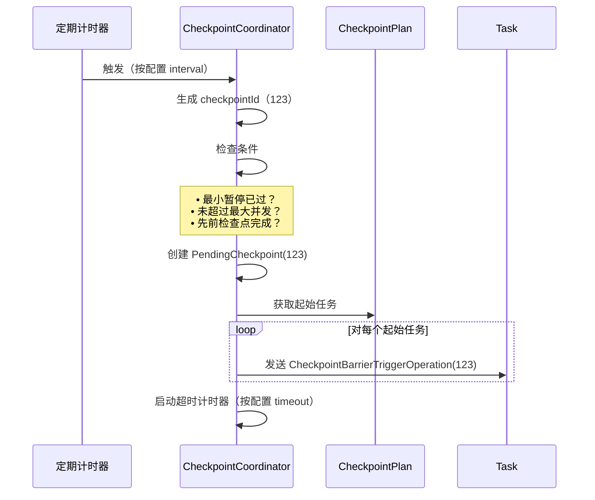
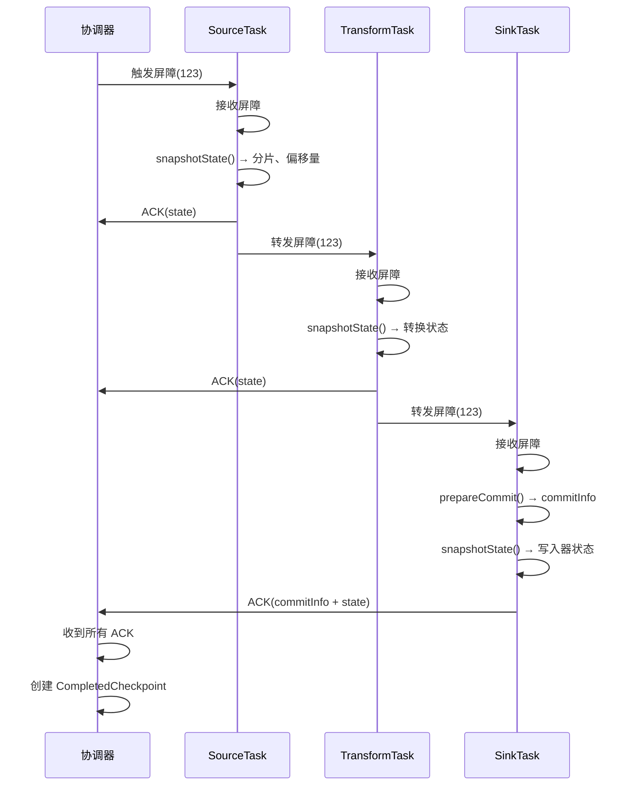
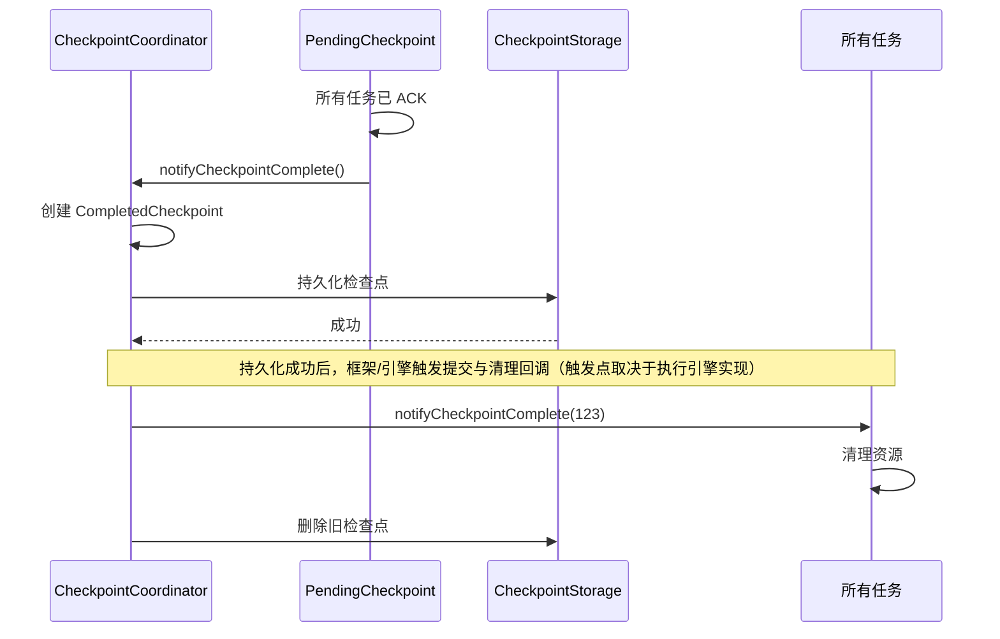
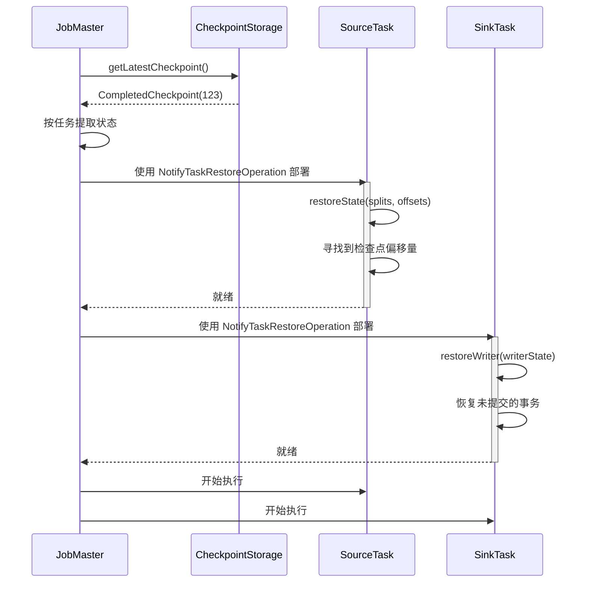

# 检查点机制

## 1. 概述

### 1.1 问题背景

分布式数据处理系统面临容错的关键挑战：

- **状态丢失**：如何在失败时保留处理状态？
- **精确一次**：如何确保每条记录被精确处理一次？
- **分布式一致性**：如何在分布式任务之间创建一致性快照？
- **性能**：如何在不阻塞数据处理的情况下执行检查点？
- **恢复**：如何在失败后高效恢复状态？

### 1.2 设计目标

SeaTunnel 的检查点机制旨在：

1. **保证精确一次语义**：一致性状态快照 + 两阶段提交
2. **最小化开销**：尽量降低 checkpoint 对数据处理的影响（同步/异步取决于具体实现）
3. **快速恢复**：从最新成功 checkpoint 恢复（耗时取决于状态大小与存储后端）
4. **分布式协调**：协调数百个任务的检查点
5. **可插拔存储**：支持可插拔的 checkpoint storage（具体后端取决于引擎插件与配置）

### 1.3 理论基础

SeaTunnel 的检查点基于 **Chandy-Lamport 分布式快照算法**：

**核心思想**：在数据流中插入特殊标记（屏障）。当任务收到屏障时：
1. 快照其本地状态
2. 向下游转发屏障
3. 继续处理

结果：无需暂停整个系统即可获得全局一致性快照。

**参考**：["Distributed Snapshots: Determining Global States of Distributed Systems"](https://lamport.azurewebsites.net/pubs/chandy.pdf)（Chandy & Lamport，1985）

## 2. 架构设计

### 2.1 检查点架构

```
┌─────────────────────────────────────────────────────────────────┐
│              JobMaster（每个作业一个，内部按 pipeline 管理）        │
│                                                                   │
│   ┌───────────────────────────────────────────────────────┐     │
│   │         CheckpointCoordinator                         │     │
│   │                                                         │     │
│   │  • 触发检查点（定期/手动）                             │     │
│   │  • 生成检查点 ID                                       │     │
│   │  • 跟踪待处理的检查点                                  │     │
│   │  • 收集任务确认                                        │     │
│   │  • 持久化完成的检查点                                  │     │
│   │  • 清理旧检查点                                        │     │
│   └───────────────────────────────────────────────────────┘     │
│                            │                                      │
│                            │ (触发屏障)                           │
│                            ▼                                      │
└─────────────────────────────────────────────────────────────────┘
                             │
                             │ (CheckpointBarrier)
                             ▼
┌─────────────────────────────────────────────────────────────────┐
│                         工作节点                                  │
│                                                                   │
│   ┌──────────────┐      ┌──────────────┐      ┌──────────────┐ │
│   │ SourceTask 1 │      │ SourceTask 2 │      │ SourceTask N │ │
│   │              │      │              │      │              │ │
│   │ 1. 接收      │      │ 1. 接收      │      │ 1. 接收      │ │
│   │    屏障      │      │    屏障      │      │    屏障      │ │
│   │ 2. 快照      │      │ 2. 快照      │      │ 2. 快照      │ │
│   │    状态      │      │    状态      │      │    状态      │ │
│   │ 3. ACK       │      │ 3. ACK       │      │ 3. ACK       │ │
│   │ 4. 转发      │      │ 4. 转发      │      │ 4. 转发      │ │
│   └──────┬───────┘      └──────┬───────┘      └──────┬───────┘ │
│          │                     │                     │          │
│          │ (屏障传播)           │                     │          │
│          ▼                     ▼                     ▼          │
│   ┌──────────────┐      ┌──────────────┐      ┌──────────────┐ │
│   │ Transform 1  │      │ Transform 2  │      │ Transform N  │ │
│   │              │      │              │      │              │ │
│   │ 1. 接收      │      │ 1. 接收      │      │ 1. 接收      │ │
│   │    屏障      │      │    屏障      │      │    屏障      │ │
│   │ 2. 快照      │      │ 2. 快照      │      │ 2. 快照      │ │
│   │    状态      │      │    状态      │      │    状态      │ │
│   │ 3. ACK       │      │ 3. ACK       │      │ 3. ACK       │ │
│   │ 4. 转发      │      │ 4. 转发      │      │ 4. 转发      │ │
│   └──────┬───────┘      └──────┬───────┘      └──────┬───────┘ │
│          │                     │                     │          │
│          ▼                     ▼                     ▼          │
│   ┌──────────────┐      ┌──────────────┐      ┌──────────────┐ │
│   │  SinkTask 1  │      │  SinkTask 2  │      │  SinkTask N  │ │
│   │              │      │              │      │              │ │
│   │ 1. 接收      │      │ 1. 接收      │      │ 1. 接收      │ │
│   │    屏障      │      │    屏障      │      │    屏障      │ │
│   │ 2. 准备      │      │ 2. 准备      │      │ 2. 准备      │ │
│   │    提交      │      │    提交      │      │    提交      │ │
│   │ 3. 快照      │      │ 3. 快照      │      │ 3. 快照      │ │
│   │    状态      │      │    状态      │      │    状态      │ │
│   │ 4. ACK       │      │ 4. ACK       │      │ 4. ACK       │ │
│   └──────────────┘      └──────────────┘      └──────────────┘ │
└─────────────────────────────────────────────────────────────────┘
                             │
                             │ (收到所有 ACK)
                             ▼
┌─────────────────────────────────────────────────────────────────┐
│                    CheckpointStorage                             │
│            （例如 localfile/hdfs 等，取决于插件与配置）              │
│                                                                   │
│   CompletedCheckpoint {                                          │
│     checkpointId: 123                                            │
│     taskStates: {                                                │
│       SourceTask-1: { splits: [...], offsets: [...] }           │
│       SinkTask-1: { commitInfo: XidInfo(...) }                  │
│       ...                                                        │
│     }                                                            │
│   }                                                              │
└─────────────────────────────────────────────────────────────────┘
```

### 2.2 关键数据结构

#### CheckpointCoordinator

**职责摘要**：
- 触发 checkpoint（按 interval/并发/最小间隔约束）
- 跟踪进行中的 `PendingCheckpoint`，收集各 task 的 ACK 与状态
- 将 `CompletedCheckpoint` 持久化到 `CheckpointStorage`，并维护“最近成功 checkpoint”

**关键字段（概念级）**：
- `checkpointIdCounter`：生成 checkpointId
- `pendingCheckpoints`：进行中的 checkpoint 集合
- `checkpointStorage`：状态持久化后端
- 调度参数：`checkpointInterval` / `checkpointTimeout` / `minPauseBetweenCheckpoints`

#### PendingCheckpoint

表示进行中的检查点。

**职责摘要**：
- 持有本次 checkpoint 的中间态（已 ACK/未 ACK 的 task、收集到的 action 状态与统计）
- 在全部 task ACK 后组装 `CompletedCheckpoint`（或触发失败/超时处理）

#### CompletedCheckpoint

持久化的检查点数据。

**职责摘要**：
- 表示一次成功的 checkpoint 的“可恢复快照”，可被持久化并用于作业恢复

**状态组织方式（概念级）**：
- 以“算子/Action + subtask”作为索引维度收集状态
- 每个 subtask 上报一份序列化状态（可能为空，取决于算子是否有状态）

### 2.3 CheckpointStorage

检查点持久化的抽象。

**能力要求（语义级）**：
- 持久化：将一次成功 checkpoint 的快照写入外部存储
- 读取：支持读取“最新成功 checkpoint”以及按 checkpointId 定位读取
- 清理：支持按保留策略删除旧 checkpoint
- 一致性：写入完成前不得对外可见“半成品”，避免恢复读到不完整快照

**实现**：
- `LocalFileStorage`：本地文件存储（localfile 插件）
- `HdfsStorage`：基于 Hadoop FileSystem 的存储（hdfs 插件，可通过插件配置指向不同文件系统）

## 3. 检查点流程

### 3.1 触发检查点



**触发条件**：
1. 检查点间隔已过（`checkpoint.interval` 或引擎默认值）
2. 检查点之间的最小暂停已过（`min-pause` 或引擎默认值）
3. 触发时机与并发行为以当前实现为准（文档不绑定固定“最大并发 checkpoint”配置项）

### 3.2 屏障传播



**屏障流动规则**：
1. **数据 Source 源任务**：管道起点，从协调器接收屏障
2. **转换任务**：从上游接收，快照，向下游转发
3. **数据 Sink 任务**：管道终点，从上游接收，快照，不转发

**屏障对齐**（对于具有多个输入的任务）：

当一个任务有多个上游输入时，需要在本任务处形成一致性快照边界。典型做法是：
- 先到达屏障的输入先“对齐等待”（短暂停止向下游发出该输入的后续数据）
- 直到所有输入都收到同一 checkpointId 的屏障，才触发本地状态快照，并继续处理

对齐带来的直接影响是：上游数据乱序/不均衡会放大等待时间，因此需要结合并行度、分区策略与 backpressure 做调优。

### 3.3 状态快照

每种任务类型快照不同的状态：

**SourceTask**：

- 快照内容：reader 的“分片分配 + 分片内进度（偏移量/游标/切分点）”
- 交互行为：上报 ACK（携带状态）给协调器，并向下游转发屏障以推进全局一致性边界

**TransformTask**：

- 快照内容：算子状态（无状态算子通常为空状态）
- 交互行为：上报 ACK，并转发屏障

**SinkTask**：

- 快照内容：writer 的内部状态（例如未刷新的 buffer、事务句柄等）
- 提交准备：在 checkpoint 边界生成“可提交但未提交”的提交信息（2PC 的 prepare 阶段）
- 交互行为：上报 ACK（携带 writer state + commitInfo），作为管道终点不再转发屏障

### 3.4 检查点完成



**完成步骤**：
1. 所有任务已确认
2. 从 `PendingCheckpoint` 创建 `CompletedCheckpoint`
3. 将检查点持久化到存储
4. 触发数据 Sink 提交（两阶段提交）
5. 通知所有任务完成
6. 清理旧检查点（保留最后 N 个）

### 3.5 检查点超时

协调器为每个进行中的 checkpoint 启动超时计时。

**超时触发后的语义**：
- 将该次 checkpoint 标记为失败并清理其进行中状态
- 作业继续运行（仍以“最近一次成功 checkpoint”作为可恢复点）
- 是否触发 failover 取决于作业容错策略与失败类型（例如连续失败、关键任务不可用等）

**超时处理**：
- 默认超时以引擎配置为准（作业可通过 `checkpoint.timeout` 覆盖）
- 如果超时，检查点失败
- 作业继续使用先前的检查点
- 下一个检查点将按计划触发

## 4. 恢复过程

### 4.1 从检查点恢复



**恢复步骤**：
1. JobMaster 从存储检索最新的 `CompletedCheckpoint`
2. 为每个任务提取状态（按 ActionStateKey 和 subtaskIndex）
3. 使用包含状态的 `NotifyTaskRestoreOperation` 部署任务
4. 任务恢复状态：
   - **SourceReader**：恢复分片和偏移量，寻找到位置
   - **Transform**：恢复转换状态（通常为无）
   - **SinkWriter**：恢复写入器状态，可能有未提交的事务
5. 任务转换到 READY_START 状态
6. 作业恢复执行

**示例：JDBC 数据源恢复**：

以 JDBC 为例，恢复需要满足两点：
- 能把“分片 + 进度（offset/游标）”可靠序列化到 checkpoint
- 能在恢复时把读取位置回放到该进度（例如通过主键范围、游标、时间戳或 connector 支持的 offset 语义）

### 4.2 精确一次恢复

检查点恢复 + 数据 Sink 两阶段提交的组合确保精确一次：

```
检查点 N（已完成）：
  数据源偏移量：[100, 200, 300]
  数据 Sink 准备的提交：[XID-1, XID-2, XID-3]
  数据 Sink 提交器提交 XID-1、XID-2、XID-3

                    ↓ [失败]

从检查点 N 恢复：
  1. 恢复数据源偏移量：[100, 200, 300]
  2. 数据源从偏移量 100、200、300 开始读取
  3. 数据 Sink 写入器恢复状态（可能有未提交的 XID）
  4. 数据 Sink 提交器重试提交 XID（幂等）

结果：记录 0-99、100-199、200-299 精确提交一次
      从 100+ 开始的记录重新处理但不重复（幂等提交）
```

## 5. 配置和调优

### 5.1 检查点配置

```hocon
# 作业级（env）：可覆盖 interval/timeout/min-pause
env {
  checkpoint.interval = 60000
  checkpoint.timeout = 600000
  min-pause = 10000
}
```

引擎侧（`config/seatunnel.yaml`）配置 checkpoint storage（示意）：

```yaml
seatunnel:
  engine:
    checkpoint:
      storage:
        type: hdfs
        max-retained: 3
        plugin-config:
          namespace: /tmp/seatunnel/checkpoint_snapshot
```

说明：
- BATCH 模式下如果作业 env 未配置 `checkpoint.interval`，当前实现会禁用 checkpoint（以源码实现为准）。
- checkpoint storage 主要由引擎侧配置管理；作业级配置不应假设可以随意指定 storage type/path。

### 5.2 调优指南

**检查点间隔**：
- **短间隔（10-30s）**：快速恢复，但开销更高
- **中间隔（60-120s）**：平衡（推荐）
- **长间隔（300-600s）**：低开销，但恢复较慢

**权衡**：
- 更短的间隔 → 更频繁的 I/O → 更高的存储成本
- 更长的间隔 → 更少的开销 → 更长的恢复时间

**经验法则**：将间隔设置为可容忍的恢复时间（数据丢失窗口）。

**检查点超时**：
- 应该 >> 检查点间隔
- 取决于状态大小和存储速度
- 默认值以引擎配置为准；建议结合状态大小与存储后端能力设置

**并发行为**：
- 并发 checkpoint 的能力与策略以当前实现为准；架构文档不绑定固定的“最大并发 checkpoint”配置项

**存储选择**：
- **localfile**：仅测试/单机场景，无 HA
- **hdfs**：生产环境常用（hdfs 插件基于 Hadoop FileSystem，可通过插件配置对接不同文件系统后端）

## 6. 性能优化

### 6.1 异步检查点

异步 checkpoint 能降低对数据处理主路径的阻塞（是否异步、异步程度取决于具体实现）：

核心思路是把“生成快照引用/拷贝（快）”与“序列化 + 上传（慢）”解耦：
- 任务线程快速冻结一份一致性快照（或引用）后立即继续处理
- 后台线程异步完成序列化与外部存储写入

这样可以降低对数据处理主路径的阻塞，但也需要关注异步积压导致的内存压力。

### 6.2 增量检查点（未来）

仅检查点更改的状态：

- 完整 checkpoint：第一次需要上传全量状态
- 增量 checkpoint：后续只上传变化部分，并以链式/引用方式组织快照

**好处**：
- 减少检查点时间
- 降低存储 I/O
- 更快的检查点完成

**挑战**：
- 更复杂的状态管理
- 需要跟踪状态变化
- 恢复需要增量链

### 6.3 本地状态后端（未来）

在本地存储热状态，仅检查点摘要：

典型做法是把热状态存到本地（例如 RocksDB），checkpoint 时只上传“可恢复的快照引用/元数据”，从而降低远端存储压力。

## 7. 最佳实践

### 7.1 状态大小优化

**1. 保持状态小**：

- 避免把“可重放的数据本身”放进状态（会放大 checkpoint 体积与时延）
- 只保存“可定位读取位置”的最小信息（offset/游标/分片进度），把数据重放交给上游存储或 connector 的读取语义

**2. 使用高效的序列化**：
- 优先使用 Protobuf、Kryo 而不是 Java 序列化
- 压缩大状态（gzip、snappy）

### 7.2 监控

**关键指标（示例，名称以实际 metrics 实现为准）**：
- checkpoint_duration：从触发到完成的时间
- checkpoint_size：持久化检查点的大小
- checkpoint_failure_rate：失败检查点的比例
- checkpoint_alignment_duration：屏障对齐所花费的时间

**告警**：
- 告警阈值需结合业务可接受的恢复窗口与存储后端能力制定
- 如果在 2x 间隔内没有完成检查点则告警

### 7.3 故障排除

**问题**：检查点超时

**可能原因**：
1. 任务卡住（数据处理缓慢）
2. 大状态（序列化/上传缓慢）
3. 慢速存储（网络/磁盘 I/O）
4. 屏障对齐缓慢（数据倾斜）

**解决方案**：
- 增加检查点超时
- 优化状态大小
- 使用更快的存储
- 调整并行度

**问题**：高检查点开销

**可能原因**：
1. 检查点间隔太短
2. 大状态大小
3. 慢速存储

**解决方案**：
- 增加检查点间隔
- 优化状态大小
- 启用增量检查点（可用时）

## 8. 相关资源

- [架构概览](../overview.md)
- [设计理念](../design-philosophy.md)
- [引擎架构](../engine/engine-architecture.md)
- [数据 Sink 架构](../api-design/sink-architecture.md)
- [精确一次语义](exactly-once.md)

## 9. 参考资料

### 学术论文

- Chandy, K. M., & Lamport, L. (1985). ["Distributed Snapshots: Determining Global States of Distributed Systems"](https://lamport.azurewebsites.net/pubs/chandy.pdf)
- Carbone, P., et al. (2017). ["State Management in Apache Flink"](http://www.vldb.org/pvldb/vol10/p1718-carbone.pdf)

### 进一步阅读

- [Apache Flink 检查点](https://nightlies.apache.org/flink/flink-docs-stable/docs/dev/datastream/fault-tolerance/checkpointing/)
- [Spark 结构化流检查点](https://spark.apache.org/docs/latest/structured-streaming-programming-guide.html#recovering-from-failures-with-checkpointing)
