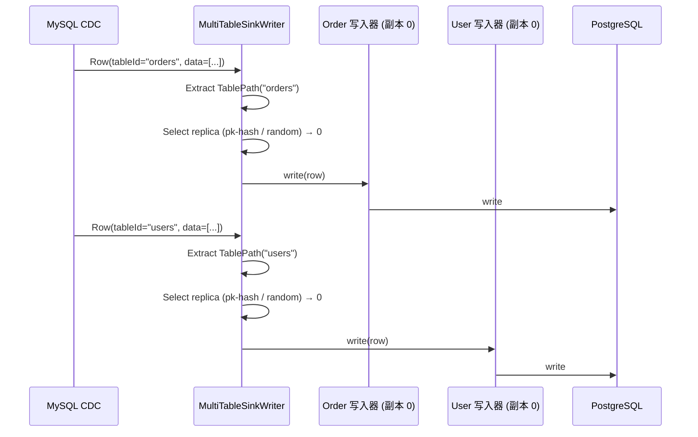
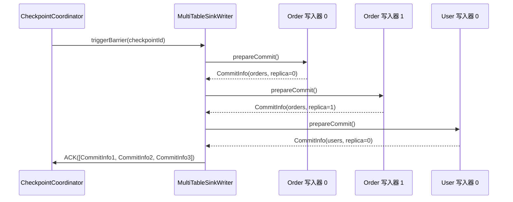

# 多表同步架构

## 1. 概述

### 1.1 问题背景

数据库迁移和 CDC 场景通常需要同步数百张表:

- **资源效率**: 如何避免为每张表创建一个作业?
- **一致快照**: 如何确保所有表从同一时间点开始?
- **模式路由**: 如何将数据路由到正确的目标表?
- **独立模式**: 如何处理每张表的不同模式?
- **并行写入**: 如何最大化多表的吞吐量?

### 1.2 设计目标

SeaTunnel 的多表同步旨在:

1. **单作业,多表**: 在一个作业中同步数百张表
2. **资源效率**: 跨表共享资源
3. **模式独立**: 每张表维护自己的模式
4. **动态路由**: 根据表标识将记录路由到正确的目标端
5. **水平扩展**: 支持副本写入器以实现高吞吐量

### 1.3 用例

**数据库迁移**:
```hocon
source {
  MySQL-CDC {
    # 捕获数据库中的所有表
    database-name = "my_db"
    table-name = ".*" # 正则表达式: 所有表
  }
}

sink {
  Jdbc {
    # 写入 PostgreSQL
    url = "jdbc:postgresql://..."
  }
}
```

**多表 CDC**:
```hocon
source {
  MySQL-CDC {
    table-name = "order_.*|user_.*|product_.*" # 多个表模式
  }
}

sink {
  Elasticsearch {
    # 每张表对应不同的索引
  }
}
```

## 2. 核心抽象

### 2.1 TablePath

用于将记录路由到表的唯一标识符。

TablePath 由三段信息组成:
- **databaseName**: 数据库名
- **schemaName**: schema 名(对无 schema 的系统可为空或使用默认值)
- **tableName**: 表名

它需要满足两个要求:
- **可稳定序列化**: 能被序列化为唯一字符串(例如 `db.schema.table`)并在链路上传播
- **可逆**: 能从字符串/结构化字段反解析回 TablePath

**示例**:

- my_db.public.orders
- my_db.public.users

### 2.2 SeaTunnelRow 带 TableId

记录携带表标识用于路由。

多表场景中，一条记录除了字段本身，还必须携带:
- **tableId**: 表标识(通常是 TablePath 的序列化形式)
- **rowKind**: 变更类型(INSERT/UPDATE/DELETE 等)

路由侧通过 tableId 还原出 TablePath，再决定写入到哪个目标表/索引。

### 2.3 SinkIdentifier

目标端写入器的唯一标识符(表 + 副本索引)。

SinkIdentifier 的作用是把“写入目标”精确到:
- **表标识**: TablePath/TableIdentifier
- **副本索引**: index(用于同一张表的多 writer 副本并行写入)

示例:
- (orders, 0), (orders, 1)
- (users, 0), (users, 1)

## 3. MultiTableSource 架构

多表 Source 的具体实现取决于 connector（例如 CDC connector 往往以“库/表”为维度产出变更）。

为了让下游能按表路由，核心要求是：
- 输出的每条 `SeaTunnelRow` 必须携带 `tableId`（通常为 `TablePath` 的序列化字符串）
- 变更流场景还需要携带 `rowKind`（INSERT/UPDATE/DELETE 等），便于下游做正确语义处理

至于“内部是否维护 TablePath→Reader/Enumerator 映射、如何做多表公平调度、是否共享底层连接”等，属于 connector 自身的实现选择，文档不做强绑定描述。

## 4. MultiTableSink 架构

### 4.1 结构

MultiTableSink 是一个“按表路由 + 可多副本并行写入”的 Sink:
- 内部维护 **TablePath → SeaTunnelSink** 的映射(每张表一个底层 sink)
- 通过 **replicaNum** 为每张表创建多个 writer 副本以提升写入吞吐
- 依赖 catalogTables 提供各表 schema 信息(用于写入/类型转换/DDL 处理)
- 运行时要求底层 `SinkWriter` 支持多表能力（例如实现 `SupportMultiTableSinkWriter`），以提供主键路由信息与多表资源管理能力；不满足该能力的 sink 不适用于 `MultiTableSink`

### 4.2 写入器: 带副本的多表写入

写入器的关键流程:
1. 从输入记录中解析 TablePath(tableId)
2. 为该表选择一个 writer 副本(replicaIndex)
3. 路由到 (TablePath, replicaIndex) 对应的底层 writer 执行写入

副本选择需要兼顾两类诉求:
- **顺序性/一致落点**: 对同一主键（或唯一键）相关的记录尽量路由到同一副本，降低乱序与写入冲突风险
- **吞吐量**: 在不破坏顺序性要求的前提下，尽量分散写入压力

在当前 MultiTableSinkWriter 的实现中，副本选择主要依据“主键信息是否可用”：
- 有主键：对主键字段做哈希，稳定映射到某个副本
- 无主键：使用随机策略在副本间分配

这意味着“是否按 rowKind（INSERT/UPDATE/DELETE）切换策略”不是该实现的默认行为；如果需要按 rowKind 细分策略，应以 connector/实现代码为准。

在 checkpoint 边界:
- prepareCommit: 汇总所有表/所有副本的 CommitInfo，并打包为多表级提交信息
- snapshotState: 快照所有 writer 状态；恢复时必须能通过 SinkIdentifier 将状态路由回正确的(表,副本)

### 4.3 提交器: 多表提交协调

提交器的核心责任是把多表提交信息“拆回每张表”，并委托给对应表的底层 committer:
1. 解析 commitInfos，将其按 TablePath 分组
2. 对每个表调用对应的 SinkCommitter.commit(tableCommitInfos)
3. 汇总失败列表并按框架约定触发重试/回滚

注意事项:
- commit 必须幂等(可能被重试)
- 单表提交失败的处理策略需要明确：是整体失败(保守)还是允许部分表推进(取决于端到端一致性要求)
 - abort/回滚相关的触发点与语义在不同执行引擎中可能不同，不能在文档层面假设一定会对每个子 sink 执行 abort；务必保证整体可重试、commit 幂等

## 5. 副本机制

### 5.1 为什么需要副本?

**问题**: 每张表的单个写入器成为高吞吐量表的瓶颈。

**解决方案**: 每张表多个副本写入器用于并行写入。

```
无副本:
  orders 表(1000 写入/秒) → [单个写入器] → 瓶颈

有副本(replicaNum=4):
  orders 表(1000 写入/秒) → [写入器 0] (250 写入/秒)
                          → [写入器 1] (250 写入/秒)
                          → [写入器 2] (250 写入/秒)
                          → [写入器 3] (250 写入/秒)
```

### 5.2 副本配置

```hocon
sink {
  Jdbc {
    url = "..."

    # 多表配置
    multi_table_sink_replica = 4 # 写入器副本数（对所有表生效）
  }
}
```

### 5.3 副本选择策略

**基于主键哈希（稳定路由）**:

要点:
- 以主键（或业务唯一键）做哈希，将同一键稳定映射到同一副本
- 典型映射: $replica = hash(pk) \bmod replicaNum$

**随机（无主键兜底）**:

要点:
- 当记录缺少主键字段信息时，无法提供稳定落点
- 使用随机分配在副本间扩散压力，但不保证同一键的顺序性

## 6. 多表中的模式管理

### 6.1 独立模式


每张表维护自己的 CatalogTable/Schema:
- 运行时根据 TablePath 查询对应的 schema，用于类型转换与写入
- 不同表之间 schema 互不影响，避免“全局 schema”导致的兼容性冲突

### 6.2 模式演化路由

模式演化需要被路由到“正确的表”，并应用到该表的所有 writer 副本:
1. 从 SchemaChangeEvent 中解析出 TablePath
2. 选择该表对应的 schema/元数据更新逻辑
3. 将变更广播到该表的所有副本 writer，保证后续写入使用一致的 schema

## 7. 数据流示例

### 7.1 完整流水线

```
┌──────────────────────────────────────────────────────────────┐
│                    MySQL CDC 数据源                           │
│  • 从 100 张表捕获变更                                         │
│  • 用 TablePath 标记每行                                      │
└──────────────────────────────┬───────────────────────────────┘
                               │
                               ▼
         ┌─────────────────────────────────────┐
         │ SeaTunnelRow (带 TablePath)         │
         │  tableId: "my_db.public.orders"     │
         │  fields: [1, "order-001", 99.99]    │
         └─────────────────────────────────────┘
                               │
                               ▼
┌──────────────────────────────────────────────────────────────┐
│                  MultiTableSinkWriter                        │
│  • 从行中提取 TablePath                                        │
│  • 选择副本（按主键哈希或随机）                                  │
│  • 路由到正确的写入器                                           │
└──────────────────────────────┬───────────────────────────────┘
                               │
        ┌──────────────────┼──────────────────┐
        ▼                  ▼                  ▼
┌──────────────┐   ┌──────────────┐   ┌──────────────┐
│ orders       │   │ users        │   │ products     │
│ 写入器 0      │   │ 写入器 0      │   │ 写入器 0      │
│ 写入器 1      │   │ 写入器 1      │   │ 写入器 1      │
│ 写入器 2      │   │              │   │              │
│ 写入器 3      │   │              │   │              │
└──────────────┘   └──────────────┘   └──────────────┘
        │                  │                  │
        ▼                  ▼                  ▼
┌──────────────┐   ┌──────────────┐   ┌──────────────┐
│ PostgreSQL   │   │ PostgreSQL   │   │ PostgreSQL   │
│ orders       │   │ users        │   │ products     │
└──────────────┘   └──────────────┘   └──────────────┘
```

### 7.2 写入流程



### 7.3 检查点流程



## 8. 性能优化

### 8.1 副本大小设置

**经验法则**:
```
replicaNum = ceil(表写入速率 / 单个写入器吞吐量)

示例:
  orders: 10,000 写入/秒
  单个写入器: 2,500 写入/秒
  replicaNum = ceil(10,000 / 2,500) = 4
```

### 8.2 表特定副本

优化思路:
- 不同表的写入速率差异很大时，理想情况下应允许按表配置不同的副本数
- 但在当前实现中，`multi_table_sink_replica` 是对所有表生效的全局配置；如果需要“按表覆盖”，需要 connector/框架层提供额外能力

### 8.3 批量写入

优化思路:
- 为每个 (TablePath, replicaIndex) 维护独立缓冲区，避免不同表/不同副本相互干扰
- 达到 batch-size 或超时阈值时触发 flush，将外部系统交互开销摊薄
- 需要关注内存上限：多表 × 多副本 × 批次缓存会放大峰值占用

## 9. 监控和可观测性

### 9.1 关键指标

多表场景下建议至少具备以下维度的可观测性（具体指标命名以 connector/引擎实现为准）：

- 按 `tableId` 维度的写入条数/字节数/延迟
- 按（表，副本）维度的写入分布与队列堆积情况（用于判断是否存在热点）
- 全局维度的表数量、writer 数量、整体吞吐与失败重试次数

### 9.2 监控仪表板

```
多表作业: mysql-to-postgres

表: 100
写入器: 250 (平均每张表 2.5 个副本)
吞吐量: 50,000 记录/秒

按吞吐量排名的表:
  1. orders: 15,000 记录/秒 (4 个副本)
  2. events: 10,000 记录/秒 (4 个副本)
  3. users: 5,000 记录/秒 (2 个副本)
  ...

副本分布:
  orders:
    副本 0: 3,750 记录/秒 (25%)
    副本 1: 3,800 记录/秒 (25.3%)
    副本 2: 3,700 记录/秒 (24.7%)
    副本 3: 3,750 记录/秒 (25%)
```

## 10. 最佳实践

### 10.1 表选择

**使用正则表达式模式**:
```hocon
source {
  MySQL-CDC {
    # 包含特定模式
    table-name = "order_.*|user_.*"
  }
}
```

### 10.2 副本配置

**保守开始**:
```hocon
sink {
  Jdbc {
    # 从 1 个副本开始,如果出现瓶颈则增加
    multi_table_sink_replica = 1
  }
}
```

**监控和调优**:

如果单副本写入成为瓶颈（例如写入延迟持续升高、队列堆积明显），可逐步增加 `multi_table_sink_replica` 并结合目标端能力评估收益。

### 10.3 模式管理

**预创建目标表**:
```sql
-- 更好: 预创建所有目标表
CREATE TABLE orders (...);
CREATE TABLE users (...);
CREATE TABLE products (...);
```

**谨慎启用自动创建**:
```hocon
sink {
  Jdbc {
    # 作业启动阶段：若表不存在则创建（用于首次建表）
    schema_save_mode = "CREATE_SCHEMA_WHEN_NOT_EXIST"

    # 说明：运行时 schema 变更由 CDC source 的 `schema-changes.enabled` 控制；
    # 是否能自动应用新增/删除列等变更取决于 JDBC 方言与目标端能力。
  }
}
```

## 13. 相关资源

- [CatalogTable 和元数据](../api-design/catalog-table.md)
- [目标端架构](../api-design/sink-architecture.md)
- [DAG 执行](../engine/dag-execution.md)
- [模式演化](../../introduction/concepts/schema-evolution.md)

## 14. 参考资料

如需进一步了解 Schema、Sink 语义与 DAG 执行，请从“相关资源”章节继续阅读。
