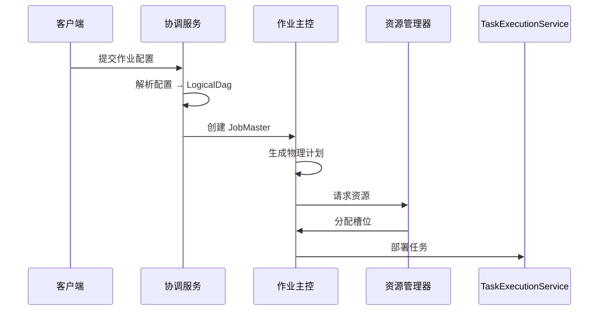

# SeaTunnel 架构概览

## 1. 简介

### 1.1 设计目标

SeaTunnel 设计为分布式多模态数据集成工具，具有以下核心目标：

- **引擎独立性**：将连接器逻辑尽量与执行引擎解耦；连接器可通过转换层适配到不同引擎，具体可用性以连接器能力与引擎支持为准
- **超高性能**：支持高吞吐、低延迟的大规模数据同步
- **容错性**：在启用 checkpoint 且外部系统支持事务/幂等提交等前提下，通过分布式快照与提交协议提供可验证的一致性语义
- **易用性**：提供简单的配置方式和丰富的连接器生态系统
- **可扩展性**：基于插件的架构，便于添加新的连接器和转换组件

### 1.2 目标场景

- **批量数据同步**：异构数据源之间的大规模批量数据迁移
- **实时数据集成**：支持 CDC 的流式数据捕获和同步
- **数据湖/仓入库**：高效加载数据到数据湖（Iceberg、Hudi、Delta Lake）和数据仓库
- **多表同步**：在单个作业中同步多个表，支持模式演化

## 2. 整体架构

SeaTunnel 采用分层架构，实现关注点分离和灵活性：

```
┌─────────────────────────────────────────────────────────────────┐
│                        用户配置层                                 │
│                  (HOCON 配置 / SQL)                     │
└─────────────────────────────────────────────────────────────────┘
                              │
                              ▼
┌─────────────────────────────────────────────────────────────────┐
│                      SeaTunnel API 层                            │
│         (数据源 API / 数据 Sink  API / 转换 API / 表 API)             │
│                                                                   │
│  • SeaTunnelSource        • CatalogTable                         │
│  • SeaTunnelSink          • TableSchema                          │
│  • SeaTunnelTransform     • SchemaChangeEvent                    │
└─────────────────────────────────────────────────────────────────┘
                              │
                              ▼
┌─────────────────────────────────────────────────────────────────┐
│                       连接器生态系统                              │
│                                                                   │
│  [Jdbc] [Kafka] [MySQL-CDC] [Elasticsearch] [Iceberg] ...       │
│                    (连接器生态)                                   │
└─────────────────────────────────────────────────────────────────┘
                              │
                              ▼
┌─────────────────────────────────────────────────────────────────┐
│                        转换层                                     │
│          (将 SeaTunnel API 适配到引擎特定 API)                    │
│                                                                   │
│  • FlinkSource/FlinkSink     • SparkSource/SparkSink            │
│  • 上下文适配器                • 序列化适配器                      │
└─────────────────────────────────────────────────────────────────┘
                              │
        ┌─────────────────────┼─────────────────────┐
        ▼                     ▼                     ▼
┌──────────────┐      ┌──────────────┐      ┌──────────────┐
│  SeaTunnel   │      │    Apache    │      │    Apache    │
│ Engine (Zeta)│      │     Flink    │      │     Spark    │
│              │      │              │      │              │
│ • 主节点      │      │ • JobManager │      │ • Driver     │
│ • 工作节点    │      │ • TaskManager│      │ • Executor   │
│ • 检查点      │      │ • State      │      │ • RDD/DS     │
└──────────────┘      └──────────────┘      └──────────────┘
```

### 2.1 层级职责

| 层级 | 职责 | 核心组件 |
|-----|------|---------|
| **配置层** | 作业定义、参数配置 | HOCON 解析器、SQL 解析器、配置验证 |
| **API 层** | 连接器的统一抽象 | 数据源/数据 Sink /转换接口、CatalogTable |
| **连接器层** | 数据源/Sink 实现 | 连接器实现（JDBC、Kafka、CDC 等） |
| **转换层** | 引擎特定适配 | Flink/Spark 适配器、上下文包装器 |
| **引擎层** | 作业执行和资源管理 | 调度、容错、状态管理 |

## 3. 核心组件

### 3.1 SeaTunnel API

API 层提供引擎独立的抽象：

#### 数据源 Source API
- **SeaTunnelSource**：创建读取器和枚举器的工厂接口
- **SourceSplitEnumerator**：主节点侧组件，负责分片生成和分配
- **SourceReader**：工作节点侧组件，负责从分片读取数据
- **SourceSplit**：表示数据分区的最小可序列化单元

**关键设计**：协调（枚举器）与执行（读取器）分离，实现高效的并行处理和容错。

#### 数据 Sink  API
- **SeaTunnelSink**：创建写入器和提交器的工厂接口
- **SinkWriter**：工作节点侧组件，负责写入数据
- **SinkCommitter**：多个写入器的提交操作协调器
- **SinkAggregatedCommitter**：聚合提交的全局协调器

**关键设计**：两阶段提交协议（prepareCommit → commit）在外部系统支持事务/幂等提交且启用 checkpoint 的前提下，可提供一致性语义。

#### 转换 API
- **SeaTunnelTransform**：数据转换接口
- **SeaTunnelMapTransform**：1:1 转换
- **SeaTunnelFlatMapTransform**：1:N 转换

#### 表 API
- **CatalogTable**：完整的表元数据（模式、分区键、选项）
- **TableSchema**：模式定义（列、主键、约束）
- **SchemaChangeEvent**：表示模式演化的 DDL 变更

### 3.2 SeaTunnel Engine (Zeta)

原生执行引擎提供：

#### 主节点组件
- **CoordinatorService**：管理所有运行中的 JobMaster
- **JobMaster**：管理单个作业生命周期、生成物理计划、协调检查点
- **CheckpointCoordinator**：每个管道协调分布式快照
- **ResourceManager**：管理工作节点资源和槽位分配

#### 工作节点组件
- **TaskExecutionService**：部署和执行任务
- **SeaTunnelTask**：执行数据源 Source/转换/数据 Sink 逻辑
- **FlowLifeCycle**：管理数据源 Source/转换/数据 Sink 组件的生命周期

#### 执行模型
```
LogicalDag → PhysicalPlan → SubPlan (管道) → PhysicalVertex → TaskGroup → SeaTunnelTask
```

### 3.3 转换层

通过适配器模式实现引擎可移植性：

- **FlinkSource/FlinkSink**：将 SeaTunnel API 适配到 Flink 的数据源/Sink 接口
- **SparkSource/SparkSink**：将 SeaTunnel API 适配到 Spark 的 RDD/Dataset 接口
- **上下文适配器**：包装引擎特定的上下文（SourceReaderContext、SinkWriterContext）
- **序列化适配器**：桥接 SeaTunnel 和引擎序列化机制

### 3.4 连接器生态系统

所有连接器遵循标准化结构：

```
connector-[name]/
├── src/main/java/.../
│   ├── [Name]Source.java          # 实现 SeaTunnelSource
│   ├── [Name]SourceReader.java    # 实现 SourceReader
│   ├── [Name]SourceSplitEnumerator.java
│   ├── [Name]SourceSplit.java
│   ├── [Name]Sink.java            # 实现 SeaTunnelSink
│   ├── [Name]SinkWriter.java      # 实现 SinkWriter
│   └── config/[Name]Config.java
└── src/main/resources/META-INF/services/
    ├── org.apache.seatunnel.api.table.factory.TableSourceFactory
    └── org.apache.seatunnel.api.table.factory.TableSinkFactory
```

**发现机制**：Java SPI（服务提供者接口）用于动态连接器加载。

## 4. 数据流模型

### 4.1 数据读取 Source 端数据流

```
数据源 Source
    │
    ▼
┌─────────────────────┐
│ SourceSplitEnumerator│ (主节点侧)
│  • 生成分片          │
│  • 分配给读取器      │
└─────────────────────┘
    │ (分片分配)
    ▼
┌─────────────────────┐
│   SourceReader      │ (工作节点侧)
│  • 从分片读取       │
│  • 发送记录         │
└─────────────────────┘
    │
    ▼
 SeaTunnelRow
    │
    ▼
 转换链（可选）
    │
    ▼
 SeaTunnelRow
    │
    ▼
┌─────────────────────┐
│    SinkWriter       │ (工作节点侧)
│  • 缓冲记录         │
│  • 准备提交         │
└─────────────────────┘
    │ (CommitInfo)
    ▼
┌─────────────────────┐
│   SinkCommitter     │ (协调器)
│  • 提交变更         │
└─────────────────────┘
    │
    ▼
数据 Sink 
```

### 4.2 基于分片的并行度

- 数据源被划分为**分片**（如文件块、数据库分区、Kafka 分区）
- 每个 **SourceReader** 独立处理一个或多个分片
- 动态分片分配实现负载均衡和故障恢复
- 分片状态被检查点化以实现精确一次处理

### 4.3 管道执行

作业被划分为**管道**（SubPlan）：

```
管道 1: [数据 Source A] → [转换 1] → [数据 Sink  A]
                                ↓
管道 2: [数据 Source B] ───────→ [转换 2] → [数据 Sink  B]
```

每个管道：
- 具有独立的并行度配置
- 维护自己的检查点协调器
- 可以并发或顺序执行

## 5. 作业执行流程

### 5.1 提交阶段



### 5.2 执行阶段

1. **任务初始化**
   - 将任务部署到分配的槽位
   - 初始化数据 Source/转换/数据 Sink 组件
   - 从检查点恢复状态（如果在恢复中）

2. **数据处理**
   - SourceReader 从分片拉取数据
   - 数据流经转换链
   - SinkWriter 缓冲和写入数据

3. **检查点协调**
   - CheckpointCoordinator 触发检查点
   - 检查点屏障流经数据管道
   - 任务快照其状态
   - 协调器收集确认

4. **提交阶段**
   - SinkWriter 准备提交信息
   - SinkCommitter 协调提交
   - 状态持久化到检查点存储

### 5.3 状态机

**任务状态转换**：
```
CREATED → INIT → WAITING_RESTORE → READY_START → STARTING → RUNNING
                                                                ↓
                    FAILED ← ─────────────────────── → PREPARE_CLOSE → CLOSED
                                                                ↓
                                                             CANCELED
```

**作业状态转换**：
```
CREATED → SCHEDULED → RUNNING → FINISHED
            ↓            ↓
          FAILED      CANCELING → CANCELED
```

## 6. 关键特性

### 6.1 容错

**检查点机制**：
- 受 Chandy-Lamport 算法启发的分布式快照
- 检查点屏障在数据流中传播
- 状态存储在可插拔的检查点存储中（HDFS、S3、本地）
- 从最新成功的检查点自动恢复

**故障转移策略**：
- 任务级故障转移：重启失败的任务和相关管道
- 基于区域的故障转移：最小化对未受影响任务的影响
- 分片重新分配：失败的分片重新分配给健康的工作节点

### 6.2 精确一次语义

**两阶段提交协议**：
1. **准备阶段**：SinkWriter 在检查点期间准备提交信息
2. **提交阶段**：SinkCommitter 在检查点完成后提交
3. **中止处理**：在提交前失败时回滚

**幂等性**：SinkCommitter 操作必须是幂等的以处理重试

### 6.3 动态资源管理

- **基于槽位的分配**：细粒度的资源管理
- **基于标签的过滤**：将任务分配到特定的工作节点组
- **负载均衡**：多种策略（随机、槽位比率、系统负载）
- **动态扩缩容**：无需重启作业即可添加/移除工作节点（未来特性）

### 6.4 模式演化

- **DDL 传播**：从数据源捕获模式变更（ADD/DROP/MODIFY 列）
- **模式映射**：通过管道转换模式变更
- **动态应用**：将模式变更应用到数据 Sink 表
- **兼容性检查**：在应用前验证模式变更

### 6.5 多表支持

- **单作业多表**：在一个作业中同步数百个表
- **表路由**：根据 TablePath 将记录路由到正确的数据 Sink 
- **独立模式**：每个表维护自己的模式
- **副本支持**：每个表多个写入器副本以获得更高吞吐量

## 7. 模块结构

```
seatunnel/
├── seatunnel-api/                 # 核心 API 定义
│   ├── source/                    # 数据源 API
│   ├── sink/                      # 数据 Sink  API
│   ├── transform/                 # 转换 API
│   └── table/                     # 表和模式 API
│
├── seatunnel-connectors-v2/       # 连接器实现
│   ├── connector-jdbc/            # JDBC 连接器
│   ├── connector-kafka/           # Kafka 连接器
│   ├── connector-cdc/             # CDC 连接器集合
│   │   ├── connector-cdc-mysql/   # MySQL CDC 连接器
│   └── ...                        # 更多连接器
│
├── seatunnel-transforms-v2/       # 转换实现
│   ├── src/                       # Transform 实现源码（如：SQL、Filter 等）
│   └── ...
│
├── seatunnel-engine/              # SeaTunnel Engine (Zeta)
│   ├── seatunnel-engine-core/     # 核心执行逻辑
│   ├── seatunnel-engine-server/   # 服务器组件（主节点/工作节点）
│   └── seatunnel-engine-storage/  # 检查点存储
│
├── seatunnel-translation/         # 引擎转换层
│   ├── seatunnel-translation-flink/
│   └── seatunnel-translation-spark/
│
├── seatunnel-formats/             # 数据格式处理器
│   ├── seatunnel-format-json/
│   ├── seatunnel-format-avro/
│   └── ...
│
├── seatunnel-core/                # 作业提交和 CLI
└── seatunnel-e2e/                 # 端到端测试
```

## 8. 设计原则

### 8.1 关注点分离

- **API vs 实现**：清晰的 API 边界支持多种实现
- **协调 vs 执行**：枚举器/提交器（主节点）与读取器/写入器（工作节点）分离
- **逻辑 vs 物理**：LogicalDag（用户意图）与 PhysicalPlan（执行细节）分离

### 8.2 插件架构

- **基于 SPI 的发现**：连接器通过 Java SPI 动态加载
- **类加载器隔离**：每个连接器使用隔离的类加载器
- **热插拔**：无需重新构建核心即可添加连接器

### 8.3 引擎独立性

- **统一 API**：相同的连接器代码在任何引擎上运行
- **转换层**：将 API 适配到引擎特定细节
- **无引擎泄漏**：连接器开发人员无需了解引擎知识

### 8.4 可扩展性

- **水平扩展**：添加工作节点以提高吞吐量
- **基于分片的并行度**：细粒度并行处理
- **无状态工作节点**：工作节点可以动态添加/移除

### 8.5 可靠性

- **分布式检查点**：跨分布式任务的一致性快照
- **增量状态**：优化大状态的检查点大小
- **精确一次保证**：端到端一致性

## 9. 下一步

深入了解特定架构组件：

- [设计理念](design-philosophy.md) - 核心设计原则和权衡
- [数据 Source 架构](api-design/source-architecture.md) - 数据源 API 设计深入探讨
- [数据 Sink 架构](api-design/sink-architecture.md) - 数据 Sink  API 设计深入探讨
- [引擎架构](engine/engine-architecture.md) - SeaTunnel Engine 内部机制
- [检查点机制](fault-tolerance/checkpoint-mechanism.md) - 容错实现

实践指南：

- [如何创建您的连接器](../developer/how-to-create-your-connector.md)
- [快速入门](../getting-started/locally/quick-start-seatunnel-engine.md)

## 10. 参考资料

### 10.1 相关概念

- [Apache Flink](https://flink.apache.org/) - 检查点和状态管理的灵感来源
- [Apache Kafka](https://kafka.apache.org/) - 消费者组模型影响了分片分配
- [Chandy-Lamport 算法](https://en.wikipedia.org/wiki/Chandy-Lamport_algorithm) - 分布式快照算法
