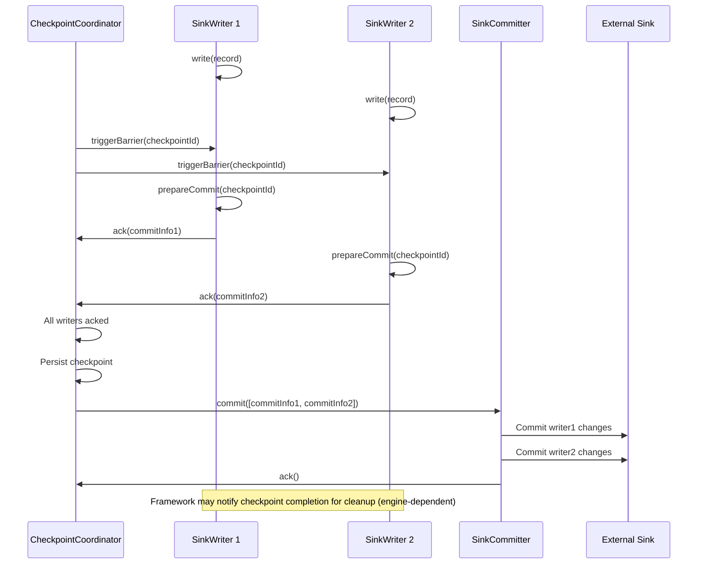
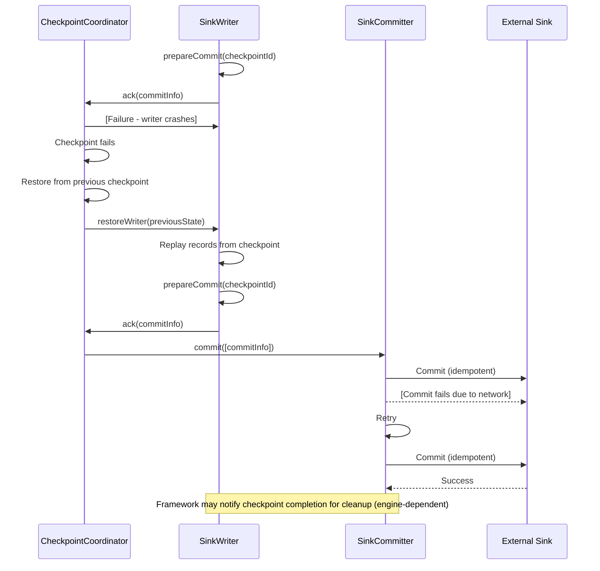

# Sink Architecture

## 1. Overview

### 1.1 Problem Background

Writing data to external systems in distributed environments presents critical challenges:

- **Exactly-Once Guarantee**: How to ensure each record is written exactly once, not zero or multiple times?
- **Transactional Consistency**: How to commit writes atomically across multiple parallel writers?
- **Fault Tolerance**: How to recover from failures without data loss or duplication?
- **Backpressure**: How to handle slow sinks without overwhelming the system?
- **Idempotency**: How to make retries safe?

### 1.2 Design Goals

SeaTunnel's Sink API aims to:

1. **Provide Verifiable Consistency Semantics**: With checkpoint boundaries + 2PC, achieve exactly-once when the external sink supports transactional/idempotent commit
2. **Support Parallel Writes**: Scale throughput with multiple writer instances
3. **Enable Global Coordination**: Coordinate commits across distributed writers
4. **Ensure Fault Tolerance**: Recover from failures without data inconsistency
5. **Provide Flexibility**: Support various commit strategies (per-writer, aggregated, none)

### 1.3 Applicable Scenarios

- Transactional databases (JDBC with XA transactions)
- Message queues (Kafka with transactions)
- File systems (atomic file rename)
- Data lakes (Iceberg, Hudi, Delta Lake with table transactions)
- Search engines (Elasticsearch with versioning)

## 2. Architecture Design

### 2.1 Overall Architecture

```
┌────────────────────────────────────────────────────────────────┐
│                    TaskExecutionService (Worker Side)           │
│                                                                  │
│   ┌──────────────────────────────────────────────────────┐     │
│   │       SinkWriter<IN, CommitInfoT, StateT>            │     │
│   │                                                        │     │
│   │  • Receive records from upstream                      │     │
│   │  • Buffer and write data                              │     │
│   │  • Produce commitInfo at checkpoint boundary          │     │
│   │  • Snapshot writer state                              │     │
│   │  • Cleanup/rollback on failure (engine-dependent)     │     │
│   └──────────────────────────────────────────────────────┘     │
│                            │                                     │
└────────────────────────────┼─────────────────────────────────────┘
                             │ (CommitInfo)
                             ▼
┌────────────────────────────────────────────────────────────────┐
│            Coordinator Side (control plane, engine-dependent)   │
│                                                                  │
│   ┌──────────────────────────────────────────────────────┐     │
│   │         SinkCommitter<CommitInfoT> (Optional)        │     │
│   │                                                        │     │
│   │  • Receive commit infos from multiple writers        │     │
│   │  • Commit each writer's changes independently        │     │
│   │  • Retry failed commits                               │     │
│   │  • Must be idempotent                                 │     │
│   └──────────────────────────────────────────────────────┘     │
│                            │                                     │
│                            │ (Optional: AggregatedCommitInfo)   │
│                            ▼                                     │
│   ┌──────────────────────────────────────────────────────┐     │
│   │   SinkAggregatedCommitter<CommitInfoT,               │     │
│   │                          AggregatedCommitInfoT>      │     │
│   │                         (Optional)                    │     │
│   │                                                        │     │
│   │  • Aggregate commit infos from all writers           │     │
│   │  • Perform single global commit operation            │     │
│   │  • Single-threaded, global coordinator               │     │
│   └──────────────────────────────────────────────────────┘     │
│                                                                  │
└──────────────────────────────────────────────────────────────────┘
                             │
                             ▼
                    External Data Sink
               (Database / File / Message Queue)
```

### 2.2 Core Components

#### SeaTunnelSink (Factory Interface)

The top-level interface that serves as a factory for creating writers and committers.

```java
public interface SeaTunnelSink<IN, StateT, CommitInfoT, AggregatedCommitInfoT>
    extends Serializable {

    /**
     * Create SinkWriter (called on worker)
     */
    SinkWriter<IN, CommitInfoT, StateT> createWriter(SinkWriter.Context context)
        throws IOException;

    /**
     * Restore SinkWriter from checkpoint (called on worker)
     */
    default SinkWriter<IN, CommitInfoT, StateT> restoreWriter(
        SinkWriter.Context context,
        List<StateT> states) throws IOException {
        return createWriter(context);
    }

    /**
     * Serializer for writer state (optional).
     */
    default Optional<Serializer<StateT>> getWriterStateSerializer() {
        return Optional.empty();
    }

    /**
     * Create SinkCommitter (optional, trigger location depends on execution engine)
     */
    default Optional<SinkCommitter<CommitInfoT>> createCommitter() throws IOException {
        return Optional.empty();
    }

    /**
     * Serializer for commit info (optional).
     */
    default Optional<Serializer<CommitInfoT>> getCommitInfoSerializer() {
        return Optional.empty();
    }

    /**
     * Create SinkAggregatedCommitter (optional).
     */
    default Optional<SinkAggregatedCommitter<CommitInfoT, AggregatedCommitInfoT>>
        createAggregatedCommitter() throws IOException {
        return Optional.empty();
    }

    /**
     * Serializer for aggregated commit info (optional).
     */
    default Optional<Serializer<AggregatedCommitInfoT>> getAggregatedCommitInfoSerializer() {
        return Optional.empty();
    }

    /**
     * Get input schema.
     */
    default Optional<CatalogTable> getWriteCatalogTable() {
        return Optional.empty();
    }
}
```

**Key Design Points**:
- Three-tier commit architecture: Writer → Committer → AggregatedCommitter
- Committer and AggregatedCommitter are optional (depends on sink requirements)
- Writer is always required (performs actual data writing)

### 2.3 Interaction Flow

#### Normal Write Flow (with Two-Phase Commit)



#### Failure and Retry Flow



## 3. Key Implementations

### 3.1 SinkWriter Interface

The writer runs on workers and performs actual data writing.

```java
public interface SinkWriter<IN, CommitInfoT, StateT> {

    /**
     * Write single record
     */
    void write(IN element) throws IOException;

    /**
     * Prepare commit info during checkpoint.
     *
     * Guideline: do not make data externally visible in this phase.
     */
    Optional<CommitInfoT> prepareCommit(long checkpointId) throws IOException;

    /**
     * Abort prepared commit if checkpoint fails
     */
    void abortPrepare();

    /**
     * Snapshot writer state for checkpoint
     */
    List<StateT> snapshotState(long checkpointId) throws IOException;

    /**
     * Close writer
     */
    void close() throws IOException;

    /**
     * Context for interacting with framework
     */
    interface Context {
        int getIndexOfSubtask();
        MetricsContext getMetricsContext();
    }
}
```

**Critical Requirements**:
- `prepareCommit(checkpointId)` should not make data externally visible (commit is done in `SinkCommitter` / `SinkAggregatedCommitter`)
- `prepareCommit(checkpointId)` returns commit info that will be passed to committer
- State returned by `snapshotState()` must capture all uncommitted writes
- `abortPrepare()` is only used by Spark when `prepareCommit(...)` fails by throwing an exception

**Implementation Example (JDBC with XA Transactions)**:

```java
public class JdbcExactlyOnceSinkWriter implements SinkWriter<SeaTunnelRow, XidInfo, Void> {

    private final XAConnection xaConnection;
    private final XAResource xaResource;
    private final Connection connection;
    private final PreparedStatement statement;
    private final List<Xid> pendingXids = new ArrayList<>();

    @Override
    public void write(SeaTunnelRow element) throws IOException {
        try {
            // Start XA transaction if needed
            if (currentXid == null) {
                currentXid = generateXid();
                xaResource.start(currentXid, XAResource.TMNOFLAGS);
            }

            // Execute INSERT (buffered in transaction)
            setParameters(statement, element);
            statement.executeUpdate();

        } catch (SQLException e) {
            throw new IOException("Failed to write record", e);
        }
    }

    @Override
    public Optional<XidInfo> prepareCommit(long checkpointId) throws IOException {
        if (currentXid == null) {
            return Optional.empty(); // No data written
        }

        try {
            // End XA transaction
            xaResource.end(currentXid, XAResource.TMSUCCESS);

            // Prepare XA transaction (FIRST PHASE - no side effects yet)
            xaResource.prepare(currentXid);

            // Return XID for committer
            XidInfo xidInfo = new XidInfo(currentXid);
            pendingXids.add(currentXid);
            currentXid = null;

            return Optional.of(xidInfo);

        } catch (XAException e) {
            throw new IOException("Failed to prepare XA transaction", e);
        }
    }

    @Override
    public void abortPrepare() {
        // Rollback prepared transaction
        if (currentXid != null) {
            try {
                xaResource.rollback(currentXid);
            } catch (XAException e) {
                LOG.error("Failed to rollback XA transaction", e);
            }
        }
    }

    @Override
    public List<Void> snapshotState(long checkpointId) {
        // For XA, state is managed by database
        return Collections.emptyList();
    }
}
```

**Implementation Example (File Sink with Atomic Rename)**:

```java
public class FileSinkWriter implements SinkWriter<SeaTunnelRow, FileCommitInfo, FileWriterState> {

    private final String tempFilePath;
    private final String finalFilePath;
    private final OutputStream outputStream;
    private long bytesWritten = 0;

    @Override
    public void write(SeaTunnelRow element) throws IOException {
        // Write to temporary file
        byte[] bytes = serialize(element);
        outputStream.write(bytes);
        bytesWritten += bytes.length;
    }

    @Override
    public Optional<FileCommitInfo> prepareCommit(long checkpointId) throws IOException {
        // Flush and close temp file (no rename yet!)
        outputStream.flush();
        outputStream.close();

        // Return commit info for committer to rename file
        return Optional.of(new FileCommitInfo(tempFilePath, finalFilePath));
    }

    @Override
    public void abortPrepare() {
        // Delete temporary file
        new File(tempFilePath).delete();
    }

    @Override
    public List<FileWriterState> snapshotState(long checkpointId) {
        // Save current write position
        return Collections.singletonList(new FileWriterState(bytesWritten));
    }
}
```

### 3.2 SinkCommitter Interface

The committer runs on master and coordinates commits from multiple writers.

```java
public interface SinkCommitter<CommitInfoT> extends Closeable {

    /**
     * Commit multiple commit infos (from multiple writers or retries)
     * MUST be idempotent - may be called multiple times with same commitInfo
     */
    List<CommitInfoT> commit(List<CommitInfoT> commitInfos) throws IOException;

    /**
     * Abort commit infos (optional)
     */
    default void abort(List<CommitInfoT> commitInfos) throws IOException {}

    /**
     * Close committer
     */
    void close() throws IOException;
}
```

**Critical Requirements**:
- `commit()` **MUST** be idempotent (calling twice with same commitInfo should be safe)
- Returns list of **failed** commitInfos (will be retried)
- Should handle partial failures gracefully

**Implementation Example (JDBC XA Committer)**:

```java
public class JdbcSinkCommitter implements SinkCommitter<XidInfo> {

    private final XADataSource xaDataSource;

    @Override
    public List<XidInfo> commit(List<XidInfo> commitInfos) throws IOException {
        List<XidInfo> failed = new ArrayList<>();

        for (XidInfo xidInfo : commitInfos) {
            try {
                XAConnection xaConn = xaDataSource.getXAConnection();
                XAResource xaResource = xaConn.getXAResource();

                // SECOND PHASE: Commit prepared transaction
                xaResource.commit(xidInfo.getXid(), false);

                xaConn.close();

            } catch (XAException e) {
                if (e.errorCode == XAException.XAER_NOTA) {
                    // Transaction already committed (idempotent)
                    LOG.info("XA transaction already committed: {}", xidInfo.getXid());
                } else {
                    // Commit failed, will retry
                    LOG.error("Failed to commit XA transaction: {}", xidInfo.getXid(), e);
                    failed.add(xidInfo);
                }
            }
        }

        return failed; // Framework will retry failed commits
    }

    @Override
    public void abort(List<XidInfo> commitInfos) {
        // Rollback prepared transactions
        for (XidInfo xidInfo : commitInfos) {
            try {
                XAConnection xaConn = xaDataSource.getXAConnection();
                xaConn.getXAResource().rollback(xidInfo.getXid());
                xaConn.close();
            } catch (Exception e) {
                LOG.error("Failed to rollback XA transaction", e);
            }
        }
    }
}
```

**Implementation Example (File Committer with Atomic Rename)**:

```java
public class FileSinkCommitter implements SinkCommitter<FileCommitInfo> {

    private final FileSystem fileSystem;

    @Override
    public List<FileCommitInfo> commit(List<FileCommitInfo> commitInfos) {
        List<FileCommitInfo> failed = new ArrayList<>();

        for (FileCommitInfo commitInfo : commitInfos) {
            try {
                Path tempPath = new Path(commitInfo.getTempFilePath());
                Path finalPath = new Path(commitInfo.getFinalFilePath());

                // Atomic rename (commit)
                if (fileSystem.exists(finalPath)) {
                    // File already committed (idempotent)
                    LOG.info("File already exists, skipping: {}", finalPath);
                    fileSystem.delete(tempPath, false); // Clean up temp file
                } else {
                    boolean success = fileSystem.rename(tempPath, finalPath);
                    if (!success) {
                        failed.add(commitInfo);
                    }
                }

            } catch (IOException e) {
                LOG.error("Failed to commit file: {}", commitInfo, e);
                failed.add(commitInfo);
            }
        }

        return failed;
    }
}
```

### 3.3 SinkAggregatedCommitter Interface

The aggregated committer performs single global commit for all writers.

```java
public interface SinkAggregatedCommitter<CommitInfoT, AggregatedCommitInfoT>
    extends Closeable {

    /**
     * Combine commit infos from multiple writers into single aggregated info
     */
    AggregatedCommitInfoT combine(List<CommitInfoT> commitInfos);

    /**
     * Commit aggregated info (single global operation)
     * MUST be idempotent
     */
    List<AggregatedCommitInfoT> commit(List<AggregatedCommitInfoT> aggregatedCommitInfos)
        throws IOException;

    /**
     * Abort aggregated commit infos
     */
    default void abort(List<AggregatedCommitInfoT> aggregatedCommitInfos) throws IOException {}

    /**
     * Restore committer state from checkpoint
     */
    default void restoreCommit(List<AggregatedCommitInfoT> aggregatedCommitInfos)
        throws IOException {}

    /**
     * Close committer
     */
    void close() throws IOException;
}
```

**Use Cases**:
- Hive table commit (single COMMIT TRANSACTION for all partitions)
- Iceberg table commit (single table snapshot)
- Global index updates (update index once for all writes)

**Implementation Example (Hive Sink)**:

```java
public class HiveAggregatedCommitter
    implements SinkAggregatedCommitter<HiveWriteInfo, HiveCommitInfo> {

    @Override
    public HiveCommitInfo combine(List<HiveWriteInfo> commitInfos) {
        // Collect all written files across all writers
        List<String> allFiles = new ArrayList<>();
        for (HiveWriteInfo writeInfo : commitInfos) {
            allFiles.addAll(writeInfo.getWrittenFiles());
        }
        return new HiveCommitInfo(allFiles);
    }

    @Override
    public List<HiveCommitInfo> commit(List<HiveCommitInfo> aggregatedCommitInfos) {
        List<HiveCommitInfo> failed = new ArrayList<>();

        for (HiveCommitInfo commitInfo : aggregatedCommitInfos) {
            try {
                // Single global commit for entire table
                hiveMetastore.beginTransaction();

                for (String file : commitInfo.getAllFiles()) {
                    hiveMetastore.addPartitionFile(tableName, file);
                }

                hiveMetastore.commitTransaction(); // Global atomic commit

            } catch (Exception e) {
                LOG.error("Failed to commit to Hive", e);
                hiveMetastore.rollbackTransaction();
                failed.add(commitInfo);
            }
        }

        return failed;
    }
}
```

### 3.4 Code References

**API Interfaces**:
- [SeaTunnelSink.java](../../../seatunnel-api/src/main/java/org/apache/seatunnel/api/sink/SeaTunnelSink.java)
- [SinkWriter.java](../../../seatunnel-api/src/main/java/org/apache/seatunnel/api/sink/SinkWriter.java)
- [SinkCommitter.java](../../../seatunnel-api/src/main/java/org/apache/seatunnel/api/sink/SinkCommitter.java)
- [SinkAggregatedCommitter.java](../../../seatunnel-api/src/main/java/org/apache/seatunnel/api/sink/SinkAggregatedCommitter.java)

**Example Implementations**:
- JDBC Sink: `seatunnel-connectors-v2/connector-jdbc/src/main/java/org/apache/seatunnel/connectors/seatunnel/jdbc/sink/`
- Kafka Sink: `seatunnel-connectors-v2/connector-kafka/src/main/java/org/apache/seatunnel/connectors/seatunnel/kafka/sink/`
- File Sink: `seatunnel-connectors-v2/connector-file/connector-file-base/src/main/java/org/apache/seatunnel/connectors/seatunnel/file/sink/`

## 4. Design Considerations

### 4.1 Design Trade-offs

#### Two-Phase Commit

**Pros**:
- Strong consistency guarantee (exactly-once)
- Automatic failure recovery
- Clear separation between prepare and commit

**Cons**:
- Increased latency (data visible only after commit)
- Requires transactional support in sink
- Additional state for commit info
- More complex implementation

**When to Use**:
- Financial transactions, billing, audit logs
- Any scenario requiring exactly-once guarantee

**When Not to Use**:
- At-least-once is acceptable (logging, metrics)
- Sink doesn't support transactions
- Ultra-low latency required

#### Three-Tier vs Two-Tier Commit

**Two-Tier (Writer → Committer)**:
- Each writer's commit handled independently
- Parallel commit operations
- Suitable for most sinks

**Three-Tier (Writer → Committer → AggregatedCommitter)**:
- All writers' commits aggregated into single operation
- Single global commit point
- Required for table-level transactions (Hive, Iceberg)

### 4.2 Performance Considerations

#### Batch Writing

```java
public class BatchSinkWriter {
    private final List<SeaTunnelRow> batch = new ArrayList<>();
    private static final int BATCH_SIZE = 1000;

    @Override
    public void write(SeaTunnelRow element) {
        batch.add(element);
        if (batch.size() >= BATCH_SIZE) {
            flushBatch();
        }
    }

    private void flushBatch() {
        // Write entire batch in single operation
        statement.executeBatch();
        batch.clear();
    }
}
```

**Benefits**:
- Amortize per-record overhead
- Reduce network round-trips
- Better throughput

#### Async Writes

```java
public class AsyncSinkWriter {
    private final BlockingQueue<CompletableFuture<Void>> pendingWrites = new LinkedBlockingQueue<>();

    @Override
    public void write(SeaTunnelRow element) {
        CompletableFuture<Void> future = CompletableFuture.runAsync(() -> {
            // Async write operation
            actualWrite(element);
        }, executorService);

        pendingWrites.add(future);
    }

    @Override
    public Optional<CommitInfo> prepareCommit(long checkpointId) {
        // Wait for all pending writes to complete
        for (CompletableFuture<Void> future : pendingWrites) {
            future.join();
        }
        pendingWrites.clear();

        return Optional.of(createCommitInfo());
    }
}
```

#### Connection Pooling

```java
public class JdbcSinkWriter {
    private final HikariDataSource dataSource;

    @Override
    public void write(SeaTunnelRow element) {
        try (Connection conn = dataSource.getConnection()) {
            // Reuse pooled connections
            PreparedStatement stmt = conn.prepareStatement(sql);
            stmt.executeUpdate();
        }
    }
}
```

### 4.3 Idempotency Patterns

#### 1. Natural Idempotency (Upsert)

```java
// INSERT ON DUPLICATE KEY UPDATE (MySQL)
String sql = "INSERT INTO table (id, name) VALUES (?, ?) " +
             "ON DUPLICATE KEY UPDATE name = VALUES(name)";

// MERGE INTO (Oracle, SQL Server)
String sql = "MERGE INTO table USING (SELECT ? as id, ? as name FROM dual) src " +
             "ON (table.id = src.id) " +
             "WHEN MATCHED THEN UPDATE SET table.name = src.name " +
             "WHEN NOT MATCHED THEN INSERT (id, name) VALUES (src.id, src.name)";
```

#### 2. Deduplication Key

```java
public class KafkaSinkWriter {
    @Override
    public void write(SeaTunnelRow element) {
        ProducerRecord<String, String> record = new ProducerRecord<>(
            topic,
            element.getField(0).toString(), // Key for deduplication
            element.toString()
        );

        // Kafka deduplicates based on (topic, partition, offset, idempotent producer)
        producer.send(record);
    }
}
```

#### 3. External Deduplication Table

```java
public class JdbcCommitter {
    @Override
    public List<XidInfo> commit(List<XidInfo> commitInfos) {
        for (XidInfo xidInfo : commitInfos) {
            String xidString = xidInfo.getXid().toString();

            // Check if already committed
            boolean exists = checkCommitTable(xidString);
            if (exists) {
                LOG.info("XID already committed: {}", xidString);
                continue; // Idempotent
            }

            // Commit transaction
            xaResource.commit(xidInfo.getXid(), false);

            // Record commit
            insertCommitTable(xidString, System.currentTimeMillis());
        }
    }
}
```

## 5. Best Practices

### 5.1 Usage Recommendations

**1. Choose Appropriate Commit Level**

```java
// Simple sink: Writer only (at-least-once)
public class SimpleSink implements SeaTunnelSink<...> {
    SinkWriter createWriter(...) { return new SimpleWriter(); }
    // No committer - data written directly
}

// Transactional sink: Writer + Committer (exactly-once)
public class TransactionalSink implements SeaTunnelSink<...> {
    SinkWriter createWriter(...) { return new TransactionalWriter(); }
    Optional<SinkCommitter> createCommitter() { return Optional.of(new Committer()); }
}

// Table sink: Writer + Committer + AggregatedCommitter
public class TableSink implements SeaTunnelSink<...> {
    SinkWriter createWriter(...) { return new TableWriter(); }
    Optional<SinkCommitter> createCommitter() { return Optional.of(new Committer()); }
    Optional<SinkAggregatedCommitter> createAggregatedCommitter() {
        return Optional.of(new AggregatedCommitter());
    }
}
```

**2. Proper State Management**

```java
public class StatefulSinkWriter {
    private long recordsWritten = 0;
    private long bytesWritten = 0;

    @Override
    public List<WriterState> snapshotState(long checkpointId) {
        return Collections.singletonList(
            new WriterState(recordsWritten, bytesWritten)
        );
    }

    public StatefulSinkWriter restoreState(List<WriterState> states) {
        if (!states.isEmpty()) {
            WriterState state = states.get(0);
            this.recordsWritten = state.getRecordsWritten();
            this.bytesWritten = state.getBytesWritten();
        }
        return this;
    }
}
```

**3. Resource Management**

```java
@Override
public void close() throws IOException {
    // Close in reverse order of creation
    if (statement != null) statement.close();
    if (connection != null) connection.close();
    if (dataSource != null) dataSource.close();
}
```

### 5.2 Common Pitfalls

**1. Side Effects in prepareCommit(checkpointId)**

```java
// ❌ BAD: Actual commit in prepareCommit(checkpointId)
public Optional<CommitInfo> prepareCommit(long checkpointId) {
    connection.commit(); // WRONG! This is a side effect!
    return Optional.of(new CommitInfo());
}

// ✅ GOOD: Only prepare, no side effects
public Optional<CommitInfo> prepareCommit(long checkpointId) {
    xaResource.end(xid, XAResource.TMSUCCESS);
    xaResource.prepare(xid); // Prepare only, no commit yet
    return Optional.of(new XidInfo(xid));
}
```

**2. Non-Idempotent Commit**

```java
// ❌ BAD: Direct INSERT (not idempotent)
public List<CommitInfo> commit(List<CommitInfo> commitInfos) {
    for (CommitInfo info : commitInfos) {
        executeInsert(info); // May fail if called twice!
    }
}

// ✅ GOOD: UPSERT (idempotent)
public List<CommitInfo> commit(List<CommitInfo> commitInfos) {
    for (CommitInfo info : commitInfos) {
        executeUpsert(info); // Safe to call multiple times
    }
}
```

**3. Large State**

```java
// ❌ BAD: Buffer all records in state
public class BadWriter {
    private List<SeaTunnelRow> bufferedRows = new ArrayList<>(); // May be huge!

    public List<State> snapshotState() {
        return Collections.singletonList(new State(bufferedRows));
    }
}

// ✅ GOOD: Flush before checkpoint, track metadata only
public class GoodWriter {
    private long lastCommittedOffset = 0;

    public Optional<CommitInfo> prepareCommit(long checkpointId) {
        flushBufferedRows(); // Write to external system
        return Optional.of(new CommitInfo(lastCommittedOffset));
    }
}
```

### 5.3 Debugging Tips

**1. Enable XA Transaction Logging**

```java
// Log XA operations for debugging
LOG.info("Starting XA transaction: {}", xid);
xaResource.start(xid, XAResource.TMNOFLAGS);

LOG.info("Preparing XA transaction: {}", xid);
xaResource.prepare(xid);

LOG.info("Committing XA transaction: {}", xid);
xaResource.commit(xid, false);
```

**2. Track Commit Progress**

```java
public class MonitoredCommitter {
    private final Counter commitAttempts = metricGroup.counter("commit_attempts");
    private final Counter commitSuccesses = metricGroup.counter("commit_successes");
    private final Counter commitFailures = metricGroup.counter("commit_failures");

    public List<CommitInfo> commit(List<CommitInfo> commitInfos) {
        commitAttempts.inc(commitInfos.size());

        List<CommitInfo> failed = new ArrayList<>();
        for (CommitInfo info : commitInfos) {
            try {
                doCommit(info);
                commitSuccesses.inc();
            } catch (Exception e) {
                commitFailures.inc();
                failed.add(info);
            }
        }
        return failed;
    }
}
```

**3. Test Failure Scenarios**

```java
@Test
public void testCheckpointFailureRecovery() {
    // Write data
    writer.write(row1);
    writer.write(row2);

    // Prepare commit
    Optional<CommitInfo> commitInfo = writer.prepareCommit(checkpointId);

    // Simulate checkpoint failure
    writer.abortPrepare();

    // Verify no data committed
    assertFalse(dataExistsInSink());

    // Restore and retry
    writer.write(row1);
    writer.write(row2);
    commitInfo = writer.prepareCommit(checkpointId);

    // Commit should succeed
    committer.commit(Collections.singletonList(commitInfo.get()));
    assertTrue(dataExistsInSink());
}
```

## 6. Related Resources

- [Architecture Overview](../overview.md)
- [Design Philosophy](../design-philosophy.md)
- [Source Architecture](source-architecture.md)
- [Checkpoint Mechanism](../fault-tolerance/checkpoint-mechanism.md)
- [Exactly-Once Semantics](../fault-tolerance/exactly-once.md)

## 7. References

### Example Connectors

- **Simple Sink**: ConsoleSink (logs to stdout)
- **File Sink**: FileSink (atomic file rename)
- **Database Sink**: JdbcSink (XA transactions)
- **Streaming Sink**: KafkaSink (Kafka transactions)
- **Table Sink**: IcebergSink (table commits)

### Further Reading

- [Two-Phase Commit Protocol](https://en.wikipedia.org/wiki/Two-phase_commit_protocol)
- [XA Transactions](https://www.oracle.com/java/technologies/xa-transactions.html)
- [Kafka Transactions](https://kafka.apache.org/documentation/#semantics)
- [Iceberg Table Format](https://iceberg.apache.org/spec/)
