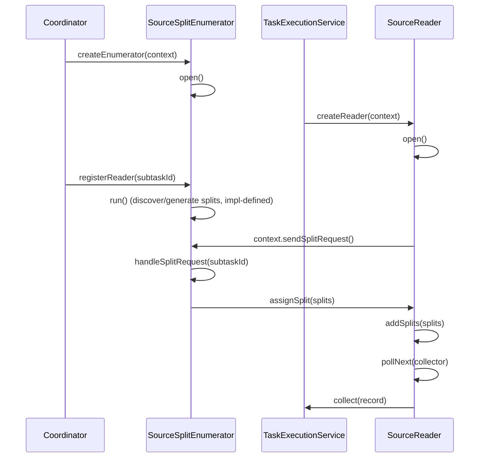
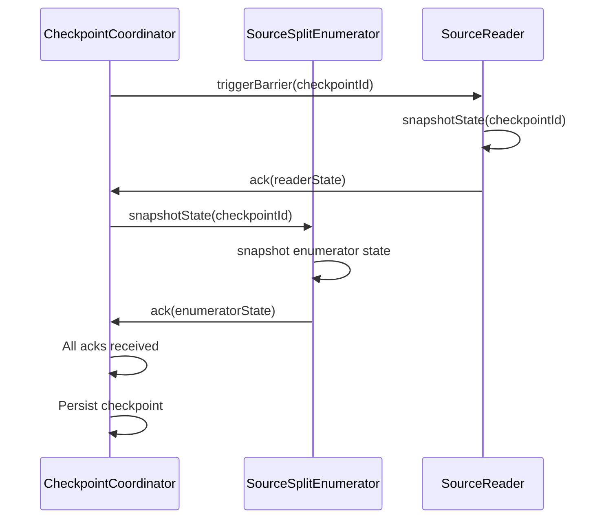
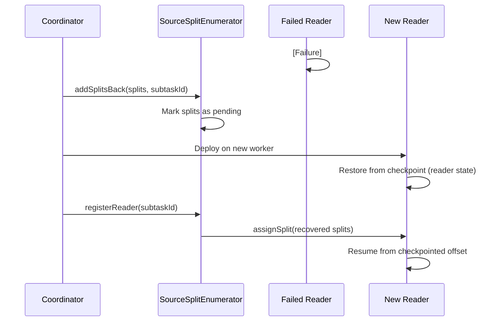

# Source Architecture

## 1. Overview

### 1.1 Problem Background

Data sources in distributed systems present several challenges:

- **Parallelism**: How to read data in parallel from a single source?
- **Fault Tolerance**: How to resume from where we left off after failures?
- **Dynamic Assignment**: How to handle worker failures and redistribute work?
- **Bounded vs Unbounded**: How to unify batch and streaming sources?
- **Backpressure**: How to handle slow downstream processing?

### 1.2 Design Goals

SeaTunnel's Source API aims to:

1. **Enable Parallel Reading**: Support split-based parallelism for scalability
2. **Ensure Fault Tolerance**: Checkpoint split state for exactly-once processing
3. **Separate Coordination from Execution**: Enumerator (master) and Reader (worker) separation
4. **Support Dynamic Assignment**: Reassign splits on failures or imbalance
5. **Unify Batch and Streaming**: Single API for both bounded and unbounded sources

### 1.3 Applicable Scenarios

- File-based sources (local files, HDFS, S3, OSS)
- Database sources (MySQL, PostgreSQL, Oracle, JDBC-compatible)
- Message queue sources (Kafka, Pulsar, RabbitMQ)
- CDC sources (MySQL CDC, PostgreSQL CDC, Oracle CDC)
- Stream sources (Socket, HTTP, custom protocols)

## 2. Architecture Design

### 2.1 Overall Architecture

```
┌──────────────────────────────────────────────────────────────┐
│                 Coordinator (master/coordinator side)         │
│                                                                │
│   ┌────────────────────────────────────────────────────┐     │
│   │         SourceSplitEnumerator<SplitT, StateT>      │     │
│   │                                                      │     │
│   │  • Discover/generate splits in run() (impl-defined) │     │
│   │  • Assign splits to readers                         │     │
│   │  • Handle reader registration                       │     │
│   │  • Handle split requests                            │     │
│   │  • Reclaim splits from failed readers               │     │
│   │  • Snapshot enumerator state                        │     │
│   │  • Send/receive custom events                       │     │
│   └────────────────────────────────────────────────────┘     │
│                            │                                   │
└────────────────────────────┼───────────────────────────────────┘
                             │ (Split Assignment)
                             ▼
┌──────────────────────────────────────────────────────────────┐
│                  TaskExecutionService (Worker Side)           │
│                                                                │
│   ┌────────────────────────────────────────────────────┐     │
│   │             SourceReader<T, SplitT>               │     │
│   │                                                      │     │
│   │  • Receive assigned splits                          │     │
│   │  • Read data from splits                            │     │
│   │  • Emit records downstream                          │     │
│   │  • Snapshot reader state (split progress)           │     │
│   │  • Handle split completion                          │     │
│   │  • Send/receive custom events                       │     │
│   └────────────────────────────────────────────────────┘     │
│                            │                                   │
└────────────────────────────┼───────────────────────────────────┘
                             │
                             ▼
                       SeaTunnelRow
                       (to Transform/Sink)
```

### 2.2 Core Components

#### SeaTunnelSource (Factory Interface)

The top-level interface that serves as a factory for creating readers and enumerators.

```java
public interface SeaTunnelSource<T, SplitT extends SourceSplit, StateT extends Serializable>
    extends Serializable {

    /**
     * Get source boundedness (BOUNDED for batch, UNBOUNDED for streaming)
     */
    Boundedness getBoundedness();

    /**
     * Create SourceReader (called on worker)
     */
    SourceReader<T, SplitT> createReader(SourceReader.Context readerContext) throws Exception;

    /**
     * Split serializer used for network transfer and checkpointing.
     */
    Serializer<SplitT> getSplitSerializer();

    /**
     * Create SourceSplitEnumerator (called on master)
     */
    SourceSplitEnumerator<SplitT, StateT> createEnumerator(
        SourceSplitEnumerator.Context<SplitT> enumeratorContext) throws Exception;

    /**
     * Restore SourceSplitEnumerator from checkpoint (called on master)
     */
    SourceSplitEnumerator<SplitT, StateT> restoreEnumerator(
        SourceSplitEnumerator.Context<SplitT> enumeratorContext,
        StateT checkpointState) throws Exception;

    /**
     * Enumerator-state serializer used for checkpointing.
     */
    Serializer<StateT> getEnumeratorStateSerializer();

    /**
     * Get output schema (CatalogTable list, supports multi-table)
     */
    List<CatalogTable> getProducedCatalogTables();
}
```

**Key Methods**:
- `getBoundedness()`: Indicates if source is bounded (batch) or unbounded (stream)
- `createReader()`: Factory for reader instances (one per worker task)
- `createEnumerator()`: Factory for enumerator (single instance on master)
- `restoreEnumerator()`: Restore enumerator from checkpoint state
- `getProducedCatalogTables()`: Defines output schema (supports multi-table)
- `getSplitSerializer()` / `getEnumeratorStateSerializer()`: Split/enumerator-state serializers for network transfer and checkpointing

#### SourceSplit (Minimal Serializable Unit)

Represents a partitionable unit of data.

```java
public interface SourceSplit extends Serializable {
    /**
     * Unique identifier for this split
     */
    String splitId();
}
```

**Implementation Examples**:

```java
// File-based split
public class FileSplit implements SourceSplit {
    private final String splitId;
    private final String filePath;
    private final long startOffset;
    private final long length;
}

// JDBC-based split (query range)
public class JdbcSourceSplit implements SourceSplit {
    private final String splitId;
    private final String query;
    private final Object[] queryParams;
}

// Kafka-based split (partition)
public class KafkaSourceSplit implements SourceSplit {
    private final String splitId;
    private final String topic;
    private final int partition;
    private final long startOffset;
}
```

**Design Notes**:
- Splits must be serializable for network transfer
- Split state (e.g., current offset) stored separately in reader state
- Splits can be reassigned to different readers

### 2.3 Interaction Flow

#### Initial Startup Flow



#### Checkpoint Flow



#### Failure Recovery Flow



## 3. Key Implementations

### 3.1 SourceSplitEnumerator Interface

The enumerator runs on the master side and coordinates split assignment.

```java
public interface SourceSplitEnumerator<SplitT extends SourceSplit, StateT>
    extends AutoCloseable, CheckpointListener {

    /**
     * Called when enumerator starts
     */
    void open();

    /**
     * Executes split discovery and background coordination logic.
     *
     * Note: run() and snapshotState() may be invoked concurrently by different threads.
     */
    void run() throws Exception;

    /**
     * Add a split back to the enumerator for reassignment (typically after reader failure).
     */
    void addSplitsBack(List<SplitT> splits, int subtaskId);

    /**
     * Current number of unassigned splits.
     */
    int currentUnassignedSplitSize();

    /**
     * Called when a reader requests more splits.
     */
    void handleSplitRequest(int subtaskId);

    /**
     * Called when a reader registers.
     */
    void registerReader(int subtaskId);

    /**
     * Snapshot enumerator state for checkpoint
     */
    StateT snapshotState(long checkpointId) throws Exception;

    /**
     * Handle custom event from reader
     */
    default void handleSourceEvent(int subtaskId, SourceEvent sourceEvent) {}

    /**
     * Close enumerator
     */
    void close() throws IOException;

    /**
     * Context for interacting with framework
     */
    interface Context<SplitT extends SourceSplit> {
        int currentParallelism();
        Set<Integer> registeredReaders();
        void assignSplit(int subtaskId, List<SplitT> splits);
        void signalNoMoreSplits(int subtaskId);
        void sendEventToSourceReader(int subtaskId, SourceEvent event);
    }
}
```

**Key Responsibilities**:
- **Split Discovery**: Generate splits from data source (files, partitions, shards)
- **Assignment Strategy**: Decide which splits go to which readers
- **Dynamic Handling**: Handle reader registration, split requests, failures
- **State Management**: Snapshot remaining splits and assignment state

**Implementation Example**:

```java
public class JdbcSourceSplitEnumerator implements SourceSplitEnumerator<JdbcSourceSplit, JdbcSourceState> {

    private final Queue<JdbcSourceSplit> pendingSplits = new LinkedList<>();
    private final Set<String> assignedSplits = new HashSet<>();
    private final Context<JdbcSourceSplit> context;

    @Override
    public void run() throws Exception {
        // Discover splits by querying database metadata
        List<JdbcSourceSplit> splits = generateSplitsByPartition();
        pendingSplits.addAll(splits);
    }

    @Override
    public void handleSplitRequest(int subtaskId) {
        // Assign next available split
        JdbcSourceSplit split = pendingSplits.poll();
        if (split != null) {
            context.assignSplit(subtaskId, Collections.singletonList(split));
            assignedSplits.add(split.splitId());
        } else {
            context.signalNoMoreSplits(subtaskId);
        }
    }

    @Override
    public void addSplitsBack(List<JdbcSourceSplit> splits, int subtaskId) {
        // Reclaim splits from failed reader
        pendingSplits.addAll(splits);
        splits.forEach(split -> assignedSplits.remove(split.splitId()));
    }

    @Override
    public JdbcSourceState snapshotState(long checkpointId) {
        // Save remaining splits and assignment info
        return new JdbcSourceState(new ArrayList<>(pendingSplits), assignedSplits);
    }
}
```

### 3.2 SourceReader Interface

The reader runs on workers and performs actual data reading.

```java
public interface SourceReader<T, SplitT extends SourceSplit>
    extends AutoCloseable, CheckpointListener {

    /**
     * Called when reader starts
     */
    void open() throws Exception;

    /**
     * Poll next batch of records (non-blocking or timeout)
     */
    void pollNext(Collector<T> output) throws Exception;

    /**
     * Snapshot reader state for checkpoint (typically the current splits/positions).
     */
    List<SplitT> snapshotState(long checkpointId) throws Exception;

    /**
     * Add newly assigned splits.
     */
    void addSplits(List<SplitT> splits);

    /**
     * Signal no more splits will be assigned.
     */
    void handleNoMoreSplits();

    /**
     * Handle custom event from enumerator
     */
    default void handleSourceEvent(SourceEvent sourceEvent) {}

    /**
     * Close reader
     */
    void close() throws IOException;

    /**
     * Context for interacting with framework
     */
    interface Context {
        int getIndexOfSubtask();
        Boundedness getBoundedness();
        void signalNoMoreElement();
        void sendSplitRequest();
        void sendSourceEventToEnumerator(SourceEvent sourceEvent);
    }
}
```

**Key Responsibilities**:
- **Data Reading**: Pull records from assigned splits
- **Progress Tracking**: Track offset/position within each split
- **State Management**: Snapshot split progress for recovery
- **Split Management**: Handle split assignment, completion, and removal

**Implementation Example**:

```java
public class JdbcSourceReader implements SourceReader<SeaTunnelRow, JdbcSourceSplit> {

    private final Queue<JdbcSourceSplit> pendingSplits = new LinkedList<>();
    private JdbcSourceSplit currentSplit;
    private ResultSet currentResultSet;

    @Override
    public void pollNext(Collector<SeaTunnelRow> output) throws Exception {
        if (currentResultSet == null) {
            // Fetch next split
            currentSplit = pendingSplits.poll();
            if (currentSplit == null) {
                context.sendSplitRequest(); // Request more splits
                return;
            }
            // Execute query for current split
            currentResultSet = executeQuery(currentSplit);
        }

        // Read batch of rows
        int count = 0;
        while (currentResultSet.next() && count++ < BATCH_SIZE) {
            SeaTunnelRow row = convertToRow(currentResultSet);
            output.collect(row);
        }

        // Check if split completed
        if (!currentResultSet.next()) {
            currentResultSet.close();
            currentResultSet = null;
            currentSplit = null;
        }
    }

    @Override
    public void addSplits(List<JdbcSourceSplit> splits) {
        pendingSplits.addAll(splits);
    }

    @Override
    public List<JdbcSourceState> snapshotState(long checkpointId) {
        // Save current split and offset
        List<JdbcSourceState> states = new ArrayList<>();
        if (currentSplit != null) {
            states.add(new JdbcSourceState(currentSplit, currentRow));
        }
        pendingSplits.forEach(split ->
            states.add(new JdbcSourceState(split, 0)));
        return states;
    }
}
```

### 3.3 SourceEvent (Custom Communication)

Allows enumerator and reader to exchange custom messages.

```java
public interface SourceEvent extends Serializable {
}

// Example: Reader notifies enumerator of discovered partitions
public class PartitionDiscoveredEvent implements SourceEvent {
    private final List<String> newPartitions;
}

// Example: Enumerator notifies reader of configuration change
public class ConfigChangeEvent implements SourceEvent {
    private final Map<String, String> newConfig;
}
```

**Use Cases**:
- Dynamic partition discovery (Kafka, HDFS)
- Runtime configuration changes
- Custom coordination logic

### 3.4 Code References

**API Interfaces**:
- [SeaTunnelSource.java](../../../seatunnel-api/src/main/java/org/apache/seatunnel/api/source/SeaTunnelSource.java)
- [SourceSplitEnumerator.java](../../../seatunnel-api/src/main/java/org/apache/seatunnel/api/source/SourceSplitEnumerator.java)
- [SourceReader.java](../../../seatunnel-api/src/main/java/org/apache/seatunnel/api/source/SourceReader.java)
- [SourceSplit.java](../../../seatunnel-api/src/main/java/org/apache/seatunnel/api/source/SourceSplit.java)

**Example Implementations**:
- JDBC Source: `seatunnel-connectors-v2/connector-jdbc/src/main/java/org/apache/seatunnel/connectors/seatunnel/jdbc/source/`
- Kafka Source: `seatunnel-connectors-v2/connector-kafka/src/main/java/org/apache/seatunnel/connectors/seatunnel/kafka/source/`
- File Source: `seatunnel-connectors-v2/connector-file/connector-file-base/src/main/java/org/apache/seatunnel/connectors/seatunnel/file/source/`

## 4. Design Considerations

### 4.1 Design Trade-offs

#### Enumerator-Reader Separation

**Pros**:
- Clean separation of coordination (master) and execution (worker)
- Enumerator can reassign splits without reader knowledge
- Centralized coordination simplifies split assignment logic
- Fault tolerance: enumerator and reader fail independently

**Cons**:
- Additional network communication (split assignment messages)
- More complex API for connector developers
- Potential bottleneck if enumerator is slow

**Mitigation**:
- Asynchronous split assignment
- Batch split requests/assignments
- Lazy split discovery

#### Split Granularity

**Coarse-grained splits** (few large splits):
- **Pro**: Less coordination overhead
- **Con**: Poor load balancing, longer recovery time

**Fine-grained splits** (many small splits):
- **Pro**: Better load balancing, faster recovery
- **Con**: Higher coordination overhead

**Guideline**: Choose split granularity based on source capabilities, expected parallelism, and checkpoint/recovery cost.

### 4.2 Performance Considerations

#### Batch Reading

```java
@Override
public void pollNext(Collector<SeaTunnelRow> output) throws Exception {
    // Read batch instead of single record
    for (int i = 0; i < BATCH_SIZE && hasNext(); i++) {
        output.collect(readNextRow());
    }
}
```

**Benefits**:
- Amortize per-record overhead
- Better CPU cache utilization
- Reduce lock contention

#### Non-blocking Poll

```java
@Override
public void pollNext(Collector<SeaTunnelRow> output) throws Exception {
    // Return immediately if no data available
    if (!hasNext()) {
        return; // Framework will call again later
    }
    output.collect(readNextRow());
}
```

**Benefits**:
- Avoid blocking worker thread
- Enable backpressure handling
- Better resource utilization

#### Connection Pooling

```java
public class JdbcSourceReader {
    private final HikariDataSource dataSource; // Connection pool

    @Override
    public void pollNext(Collector<SeaTunnelRow> output) {
        try (Connection conn = dataSource.getConnection()) {
            // Reuse pooled connections
        }
    }
}
```

### 4.3 Extensibility

#### Custom Split Assignment Strategy

```java
public class CustomEnumerator implements SourceSplitEnumerator<...> {

    @Override
    public void handleSplitRequest(int subtaskId) {
        // Custom logic: assign splits based on data locality
        JdbcSourceSplit split = findClosestSplit(subtaskId);
        context.assignSplit(subtaskId, Collections.singletonList(split));
    }

    private JdbcSourceSplit findClosestSplit(int subtaskId) {
        // Check worker location and assign split on same rack/region
        WorkerLocation location = getWorkerLocation(subtaskId);
        return pendingSplits.stream()
            .filter(split -> split.location().equals(location))
            .findFirst()
            .orElse(pendingSplits.poll());
    }
}
```

#### Dynamic Split Discovery

```java
public class KafkaSourceSplitEnumerator {

    @Override
    public void run() throws Exception {
        // Discover initial partitions
        discoverPartitions();

        // Periodically check for new partitions
        scheduledExecutor.scheduleAtFixedRate(
            this::discoverPartitions,
            60, 60, TimeUnit.SECONDS
        );
    }

    private void discoverPartitions() {
        List<TopicPartition> newPartitions = kafkaAdmin.listPartitions();
        // Assign new partitions to readers
        assignNewPartitions(newPartitions);
    }
}
```

## 5. Best Practices

### 5.1 Usage Recommendations

**1. Split Sizing**
- Files: split by file/offset ranges according to file format and I/O characteristics
- Databases: split by primary key / partition key ranges (or other stable predicates)
- Message queues: use native partitions (e.g., Kafka partitions)

**2. State Management**
- Keep split/reader state small and stable across versions
- Use offsets/positions instead of buffered data
- Serialize efficiently (Kryo, Protobuf)

**3. Error Handling**
```java
@Override
public void pollNext(Collector<SeaTunnelRow> output) throws Exception {
    try {
        // Read data
    } catch (TransientException e) {
        // Retry transient errors
        Thread.sleep(1000);
        retry();
    } catch (FatalException e) {
        // Fatal errors should propagate
        throw e;
    }
}
```

**4. Resource Management**
```java
@Override
public void close() throws IOException {
    // Always close resources
    if (resultSet != null) resultSet.close();
    if (connection != null) connection.close();
    if (dataSource != null) dataSource.close();
}
```

### 5.2 Common Pitfalls

**1. Blocking pollNext()**
```java
// ❌ BAD: Blocks indefinitely
public void pollNext(Collector<SeaTunnelRow> output) {
    while (true) {
        Record record = queue.take(); // Blocks until data available
        output.collect(record);
    }
}

// ✅ GOOD: Non-blocking or timeout
public void pollNext(Collector<SeaTunnelRow> output) {
    Record record = queue.poll(100, TimeUnit.MILLISECONDS);
    if (record != null) {
        output.collect(record);
    }
}
```

**2. Large State**
```java
// ❌ BAD: Buffer entire split in state
public class BadReaderState {
    private List<SeaTunnelRow> bufferedRows; // May be huge!
}

// ✅ GOOD: Only track offset
public class GoodReaderState {
    private long currentOffset; // Small and efficient
}
```

**3. Forgetting to Request Splits**
```java
// ❌ BAD: Reader never gets splits
public void pollNext(Collector<SeaTunnelRow> output) {
    if (pendingSplits.isEmpty()) {
        return; // Oops, should request more splits!
    }
}

// ✅ GOOD: Explicitly request splits
public void pollNext(Collector<SeaTunnelRow> output) {
    if (pendingSplits.isEmpty()) {
        context.sendSplitRequest();
        return;
    }
}
```

### 5.3 Debugging Tips

**1. Enable Debug Logging**
```java
private static final Logger LOG = LoggerFactory.getLogger(JdbcSourceReader.class);

public void pollNext(Collector<SeaTunnelRow> output) {
    LOG.debug("Polling split: {}, offset: {}", currentSplit.splitId(), currentOffset);
    // ...
}
```

**2. Track Metrics**
```java
public class JdbcSourceReader {
    private long recordsRead = 0;
    private long bytesRead = 0;

    public void pollNext(Collector<SeaTunnelRow> output) {
        SeaTunnelRow row = readRow();
        recordsRead++;
        bytesRead += row.getBytesSize();
        output.collect(row);
    }
}
```

**3. Test Split Reassignment**
```java
// Simulate reader failure to test split recovery
@Test
public void testSplitReassignment() {
    // Assign splits to reader 0
    enumerator.handleSplitRequest(0);

    // Simulate reader 0 failure
    enumerator.addSplitsBack(assignedSplits, 0);

    // New reader 1 should get those splits
    enumerator.registerReader(1);
    enumerator.handleSplitRequest(1);

    // Verify splits were reassigned
    assertThat(assignedSplits).isNotEmpty();
}
```

## 6. Related Resources

- [Architecture Overview](../overview.md)
- [Design Philosophy](../design-philosophy.md)
- [Sink Architecture](sink-architecture.md)
- [Checkpoint Mechanism](../fault-tolerance/checkpoint-mechanism.md)
- [How to Create Your Connector](../../developer/how-to-create-your-connector.md)

## 7. References

### Example Connectors

- **Simple Source**: FakeSource (generates test data)
- **File Source**: FileSource (local/HDFS/S3 files)
- **Database Source**: JdbcSource (JDBC-compatible databases)
- **Streaming Source**: KafkaSource (Apache Kafka)
- **CDC Source**: MySQLCDCSource (MySQL binlog)

### Further Reading

- Apache Flink FLIP-27: ["Refactored Source API"](https://cwiki.apache.org/confluence/display/FLINK/FLIP-27%3A+Refactor+Source+Interface)
- Kafka Consumer: [Consumer Groups and Partition Assignment](https://kafka.apache.org/documentation/#consumerconfigs)
