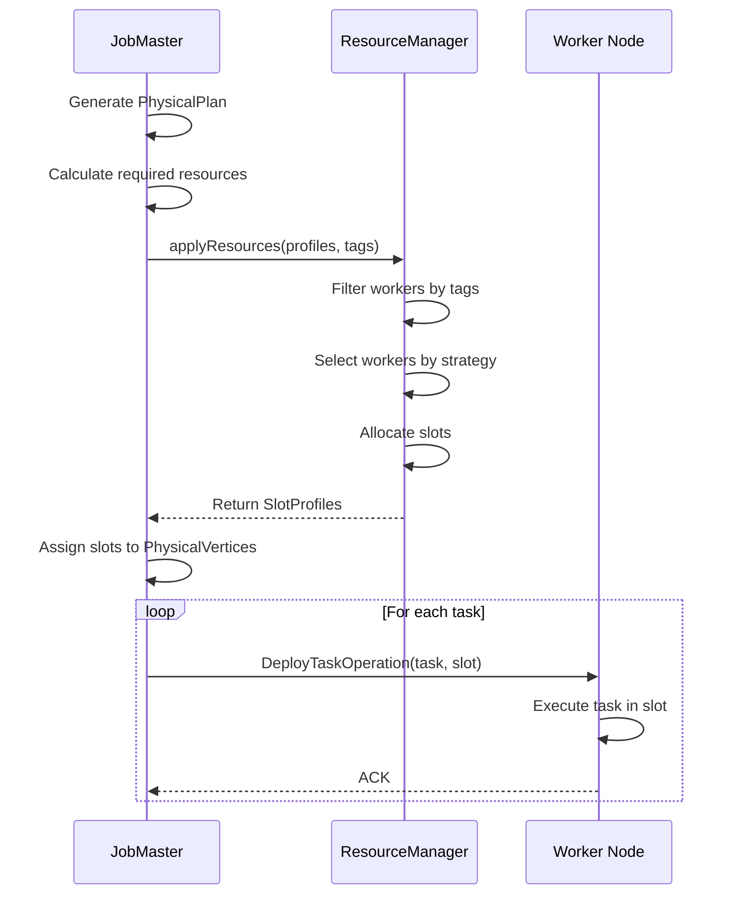
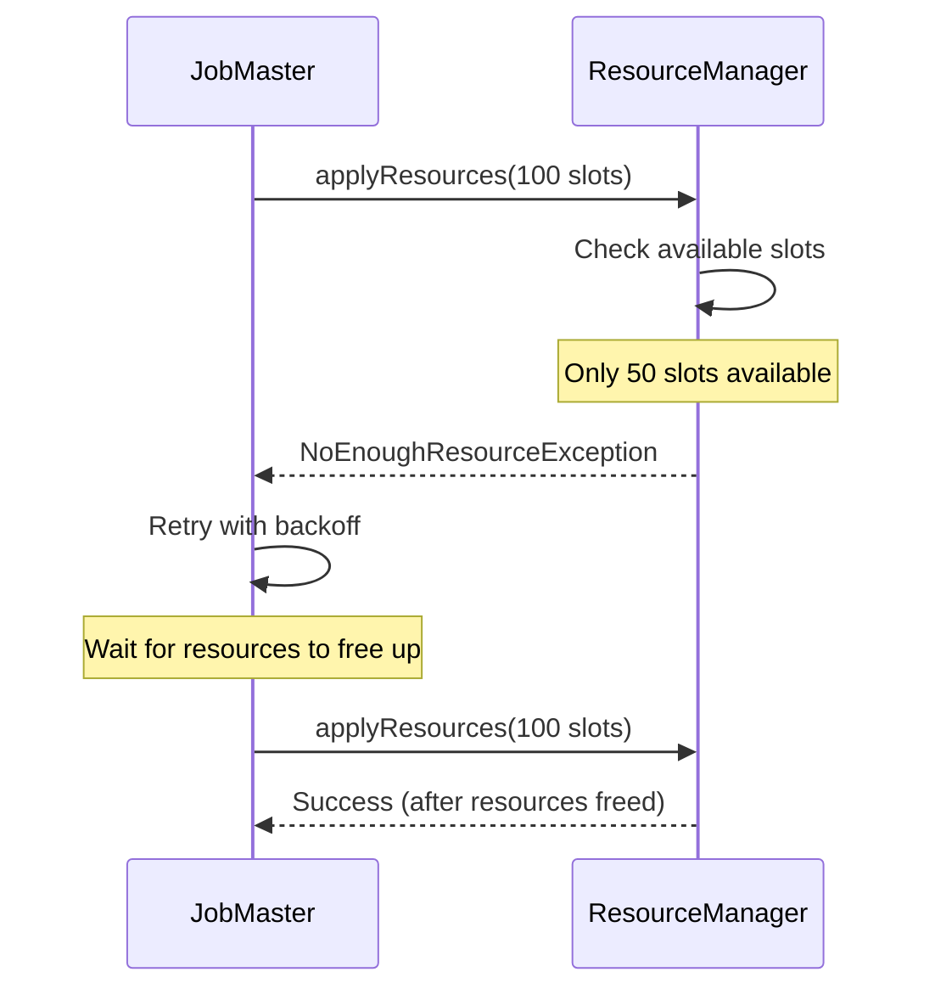
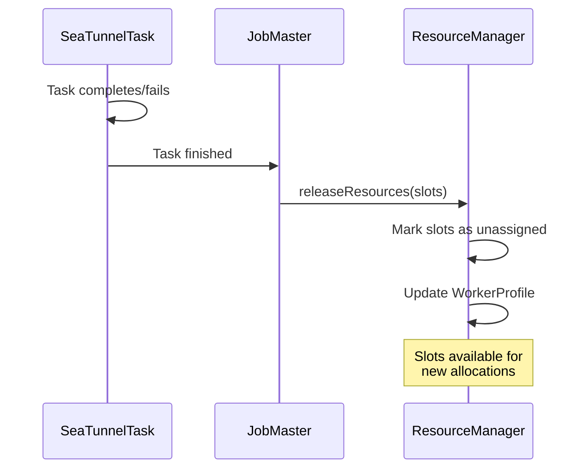

# Resource Management

## 1. Overview

### 1.1 Problem Background

Distributed execution engines must efficiently manage computing resources:

- **Resource Allocation**: How to assign tasks to workers fairly and efficiently?
- **Load Balancing**: How to distribute workload evenly across workers?
- **Resource Isolation**: How to prevent resource contention between jobs?
- **Dynamic Scaling**: How to add/remove workers without disrupting jobs?
- **Heterogeneous Resources**: How to handle workers with different capabilities?

### 1.2 Design Goals

SeaTunnel's resource management system aims to:

1. **Fine-Grained Control**: Slot-based allocation for precise resource management
2. **Flexible Strategies**: Multiple allocation strategies for different scenarios
3. **Tag-Based Filtering**: Assign tasks to specific worker groups
4. **High Availability**: Tolerate worker failures with automatic reassignment
5. **Observability**: Track resource usage and availability in real-time

### 1.3 Architecture Overview

```
┌──────────────────────────────────────────────────────────────┐
│                         JobMaster                             │
│                                                                │
│  ┌────────────────────────────────────────────────────┐      │
│  │  Request Resources                                  │      │
│  │  • Calculate required slots                        │      │
│  │  • Specify resource profiles (CPU, memory)         │      │
│  │  • Apply tag filters (optional)                    │      │
│  └────────────────────────────────────────────────────┘      │
└──────────────────────────────┬───────────────────────────────┘
                               │
                               ▼
┌──────────────────────────────────────────────────────────────┐
│                     ResourceManager                           │
│                                                                │
│  ┌────────────────────────────────────────────────────┐      │
│  │  Worker Registry                                    │      │
│  │  • WorkerProfile (per worker)                      │      │
│  │    - Total resources                               │      │
│  │    - Available resources                           │      │
│  │    - Assigned slots                                │      │
│  │    - Unassigned slots                              │      │
│  └────────────────────────────────────────────────────┘      │
│                                                                │
│  ┌────────────────────────────────────────────────────┐      │
│  │  Allocation Strategies                              │      │
│  │  • RandomStrategy / SlotRatioStrategy / SystemLoadStrategy │
│  └────────────────────────────────────────────────────┘      │
│                                                                │
│  ┌────────────────────────────────────────────────────┐      │
│  │  Slot Management                                    │      │
│  │  • Allocate slots                                  │      │
│  │  • Release slots                                   │      │
│  │  • Track slot usage                                │      │
│  └────────────────────────────────────────────────────┘      │
└──────────────────────────────┬───────────────────────────────┘
                               │
                               ▼
┌──────────────────────────────────────────────────────────────┐
│                      Worker Nodes                             │
│                                                                │
│  Worker 1                Worker 2                Worker N     │
│  ┌──────────┐           ┌──────────┐           ┌──────────┐  │
│  │ Slot 1   │           │ Slot 1   │           │ Slot 1   │  │
│  │ Slot 2   │           │ Slot 2   │           │ Slot 2   │  │
│  │ ...      │           │ ...      │           │ ...      │  │
│  └──────────┘           └──────────┘           └──────────┘  │
└──────────────────────────────────────────────────────────────┘
```

## 2. Core Concepts

### 2.1 Slot

A **Slot** is the fundamental unit of resource allocation.

```java
public class SlotProfile {
    // Unique slot identifier
    private final int slotID;

    // Worker address where this slot resides
    private final Address worker;

    // Resource capacity of this slot
    private final ResourceProfile resourceProfile;
}
```

**Key Properties**:
- **Granular**: Each slot can host one or more tasks (task fusion)
- **Typed**: Slots have resource profiles (CPU, memory)
- **Stateful**: Slots track assignment status (assigned/unassigned)

**Example**:
```java
SlotProfile slot =
    new SlotProfile(
        new Address("worker-1", 5801),
        1001,
        new ResourceProfile(CPU.of(1), Memory.of(512 * 1024 * 1024L)),
        "seq-1"
    );
```

### 2.2 ResourceProfile

Describes resource requirements or capacity.

```java
public class ResourceProfile {
    private final CPU cpu;
    private final Memory heapMemory;
}

public class CPU {
    private final int core; // Number of CPU cores
}

public class Memory {
    private final long bytes; // Heap memory in bytes
}
```

**Usage**:
- **Task Requirements**: JobMaster specifies required resources per task
- **Slot Capacity**: Each slot advertises its available resources
- **Matching**: ResourceManager matches task requirements to slot capacity

### 2.3 WorkerProfile

Represents a worker node's resources and slot inventory.

```java
public class WorkerProfile {
    // Worker address
    private final Address address;

    // Total resources (all slots combined)
    private final ResourceProfile profile;

    // Currently available resources
    private final ResourceProfile unassignedResource;

    // Slots assigned to jobs
    private final SlotProfile[] assignedSlots;

    // Slots available for assignment
    private final SlotProfile[] unassignedSlots;

    // Worker attributes (used by job-level tag_filter)
    private final Map<String, String> attributes;

    // Optional system load info (for SystemLoadStrategy)
    private final SystemLoadInfo systemLoadInfo;
}
```

**Lifecycle**:
1. **Registration**: Worker registers with ResourceManager on startup
2. **Heartbeat**: Worker sends periodic heartbeats with updated resource info
3. **Allocation**: ResourceManager assigns slots from unassigned pool
4. **Release**: Completed tasks free slots, moving them back to unassigned pool
5. **Deregistration**: Worker leaves cluster (graceful or failure)

## 3. Resource Manager

### 3.1 Interface

```java
public interface ResourceManager {
    /**
     * Apply for resources (called by JobMaster)
     */
    CompletableFuture<List<SlotProfile>> applyResources(
        long jobId,
        List<ResourceProfile> resourceProfiles,
        Map<String, String> tagFilter
    ) throws NoEnoughResourceException;

    /**
     * Release resources (called by JobMaster after task completion)
     */
    CompletableFuture<Void> releaseResources(long jobId, List<SlotProfile> slots);

    /**
     * Worker heartbeat (called by TaskExecutionService)
     */
    void heartbeat(WorkerProfile workerProfile);

    /**
     * Handle worker removal (failure or graceful shutdown)
     */
    void memberRemoved(MembershipServiceEvent event);
}
```

### 3.2 Implementation: AbstractResourceManager

```java
public abstract class AbstractResourceManager implements ResourceManager {
    // Registered workers
    protected final ConcurrentMap<Address, WorkerProfile> registerWorker;

    // Worker selection strategy (RandomStrategy / SlotRatioStrategy / SystemLoadStrategy)
    protected final SlotAllocationStrategy slotAllocationStrategy;

    @Override
    public CompletableFuture<List<SlotProfile>> applyResources(
        long jobId,
        List<ResourceProfile> resourceProfiles,
        Map<String, String> tagFilter
    ) throws NoEnoughResourceException {
        // 1. Filter workers by tagFilter (match worker attributes)
        Map<Address, WorkerProfile> candidates = filterWorkerByTag(tagFilter);

        // 2. For each requested profile, select a worker by strategy and pick an unassigned slot
        // (actual slot selection/marking is implementation-defined)
        return requestSlots(jobId, resourceProfiles, candidates, slotAllocationStrategy);
    }
}
```

## 4. Slot Allocation Strategies

In SeaTunnel Engine / Zeta, allocation typically consists of:
1. Select a candidate worker (strategy)
2. Pick an unassigned slot from that worker

### 4.1 RandomStrategy

Randomly selects a worker from the available candidates.

```java
public class RandomStrategy implements SlotAllocationStrategy {
    @Override
    public Optional<WorkerProfile> selectWorker(List<WorkerProfile> availableWorkers) {
        Collections.shuffle(availableWorkers);
        return availableWorkers.stream().findFirst();
    }
}
```

### 4.2 SlotRatioStrategy

Selects the worker with the lowest slot usage ratio (prefers workers with more available slots).

### 4.3 SystemLoadStrategy

Selects the worker with the lowest system load (based on heartbeat-reported load information).

## 5. Tag-Based Slot Filtering

### 5.1 Use Cases

**Data Locality**:
```hocon
env {
  # Job-level worker attribute filter (full key/value match)
  tag_filter = {
    zone = "us-west-1"
  }
}
```

**Resource Specialization**:
```hocon
env {
  tag_filter = {
    resource = "gpu"
  }
}
```

**Multi-Tenancy**:
```hocon
env {
  job.name = "tenant-a-job"
  tag_filter = {
    tenant = "a"
  }
}
```

### 5.2 Matching Semantics

The engine matches `env.tag_filter` against worker `attributes` (key/value full match). If no worker matches, resource allocation fails.

## 6. Resource Allocation Flow

### 6.1 Normal Allocation



### 6.2 Insufficient Resources



### 6.3 Resource Release



## 7. Failure Handling

### 7.1 Worker Failure

**Detection**:
- Heartbeat timeout (default: 60 seconds)
- Hazelcast member removed event

**Recovery**:
```java
@Override
public void memberRemoved(MembershipEvent event) {
    Address failedWorker = event.getMember().getAddress();

    // 1. Remove worker from registry
    WorkerProfile failed = registerWorker.remove(failedWorker);

    // 2. Notify JobMasters of slot losses
    List<SlotProfile> lostSlots = failed.getAssignedSlots();
    for (SlotProfile slot : lostSlots) {
        long jobId = getJobIdForSlot(slot);
        JobMaster jobMaster = getJobMaster(jobId);

        // 3. Trigger job failover
        jobMaster.notifySlotLost(slot);
    }
}
```

**JobMaster Response**:
1. Mark tasks on failed slots as FAILED
2. Restore from latest checkpoint
3. Request new slots from ResourceManager
4. Redeploy tasks

### 7.2 ResourceManager Failure

**High Availability**:
- ResourceManager state is stateless (worker registry rebuilt from heartbeats)
- New ResourceManager instance starts on master failover
- Workers re-register via heartbeat mechanism

**Recovery**:
- Worker liveness is determined by heartbeat updates and cluster membership events (exact timeout/threshold is implementation/config-dependent)

## 8. Configuration

### 8.1 Slot Configuration

Example (`config/seatunnel.yaml`, SeaTunnel Engine / Zeta):

```yaml
seatunnel:
  engine:
    slot-service:
      dynamic-slot: true
      slot-num: 16
      slot-allocate-strategy: RANDOM # RANDOM / SLOT_RATIO / SYSTEM_LOAD
```

## 9. Monitoring and Metrics

### 9.1 Key Metrics

**Cluster-Level**:
- Worker count and liveness (registered vs active)
- Slot inventory and utilization (assigned vs unassigned)

**Per-Worker**:
- CPU/memory utilization (if reported)
- Slots assigned/unassigned

**Per-Job**:
- Slots requested/allocated
- Resource wait time (if available)

### 9.2 Observability

**Resource Dashboard Example**:
```
Cluster Resources:
  Workers: 10 (all healthy)
  Total Slots: 20
  Available Slots: 8
  Utilization: 60%

Top Resource Consumers:
  job-123: 6 slots (mysql-cdc → elasticsearch)
  job-456: 4 slots (kafka → jdbc)
  job-789: 2 slots (file → s3)

Worker Distribution:
  worker-1: 2/2 slots (100%)
  worker-2: 1/2 slots (50%)
  worker-3: 2/2 slots (100%)
  ...
```

## 10. Best Practices

### 10.1 Slot Sizing

Slot sizing (slots per worker, heap per slot, etc.) depends on workload characteristics and deployment constraints. Avoid treating formulas in architecture docs as mandatory defaults.

### 10.2 Strategy Selection

**Use RandomStrategy when**:
- Homogeneous cluster (all workers identical)
- Simple deployments
- Fast allocation more important than perfect balance

**Use SlotRatioStrategy when**:
- Need good load balancing
- Mixed job sizes
- Moderate cluster size (< 100 workers)

**Use SystemLoadStrategy when**:
- Heterogeneous cluster
- Workers have varying CPU/memory
- Optimizing resource utilization is critical

### 10.3 Tag Usage

**Data Locality**:
```hocon
env {
  # Match worker attributes, e.g., zone=us-west-1a
  tag_filter = {
    zone = "us-west-1a"
  }
}
```

**Resource Isolation**:
```hocon
env {
  job.name = "critical-job"
  tag_filter = {
    priority = "high"
  }
}
```

## 11. Related Resources

- [Engine Architecture](engine-architecture.md)
- [DAG Execution](dag-execution.md)
- [Architecture Overview](../overview.md)

## 12. References

### Key Source Files

- [ResourceManager.java](../../../seatunnel-engine/seatunnel-engine-server/src/main/java/org/apache/seatunnel/engine/server/resourcemanager/ResourceManager.java)
- [AbstractResourceManager.java](../../../seatunnel-engine/seatunnel-engine-server/src/main/java/org/apache/seatunnel/engine/server/resourcemanager/AbstractResourceManager.java)
- [SlotProfile.java](../../../seatunnel-engine/seatunnel-engine-server/src/main/java/org/apache/seatunnel/engine/server/resourcemanager/resource/SlotProfile.java)
- [WorkerProfile.java](../../../seatunnel-engine/seatunnel-engine-server/src/main/java/org/apache/seatunnel/engine/server/resourcemanager/worker/WorkerProfile.java)

### Further Reading

- [Google Borg](https://research.google/pubs/pub43438/) - Large-scale cluster management
- [Apache YARN](https://hadoop.apache.org/docs/current/hadoop-yarn/hadoop-yarn-site/YARN.html) - Resource management in Hadoop
- [Kubernetes](https://kubernetes.io/docs/concepts/scheduling-eviction/kube-scheduler/) - Container orchestration and scheduling
