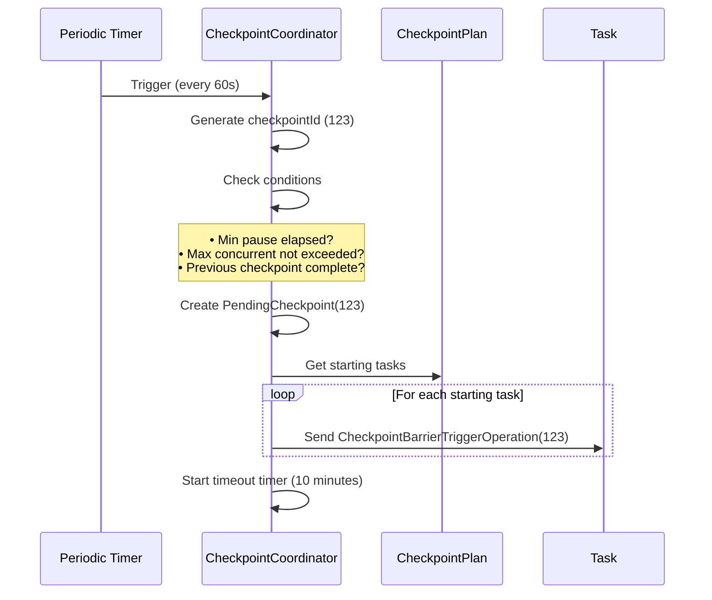
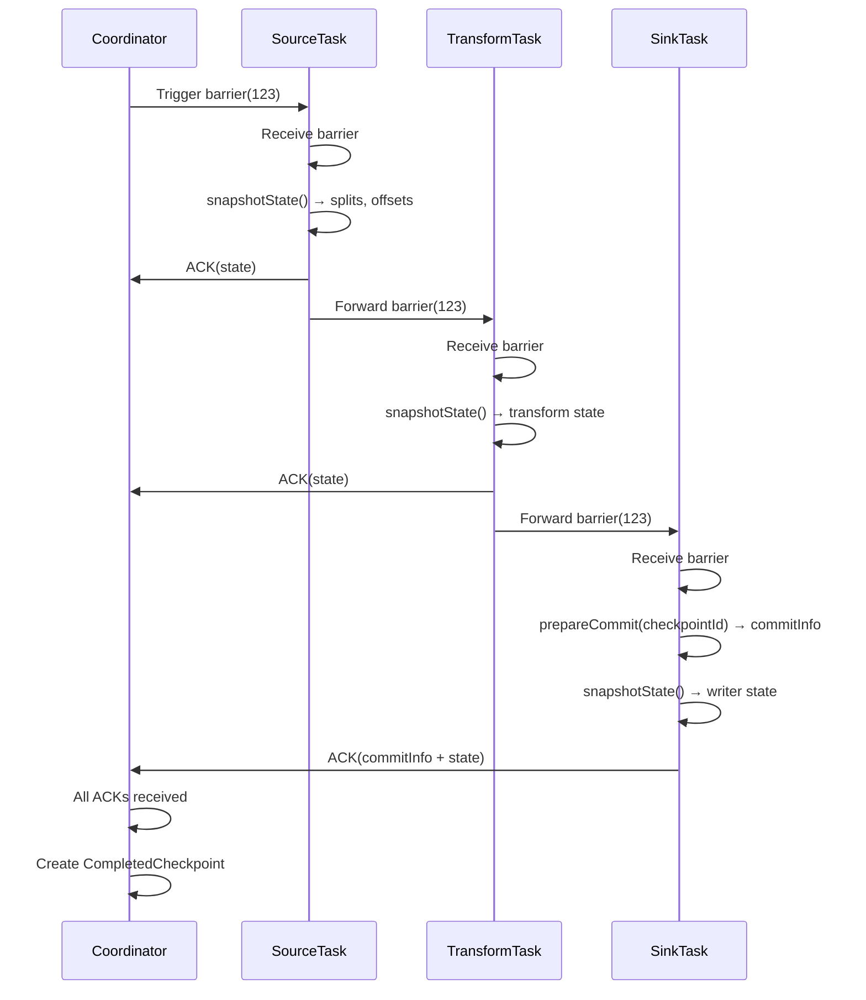
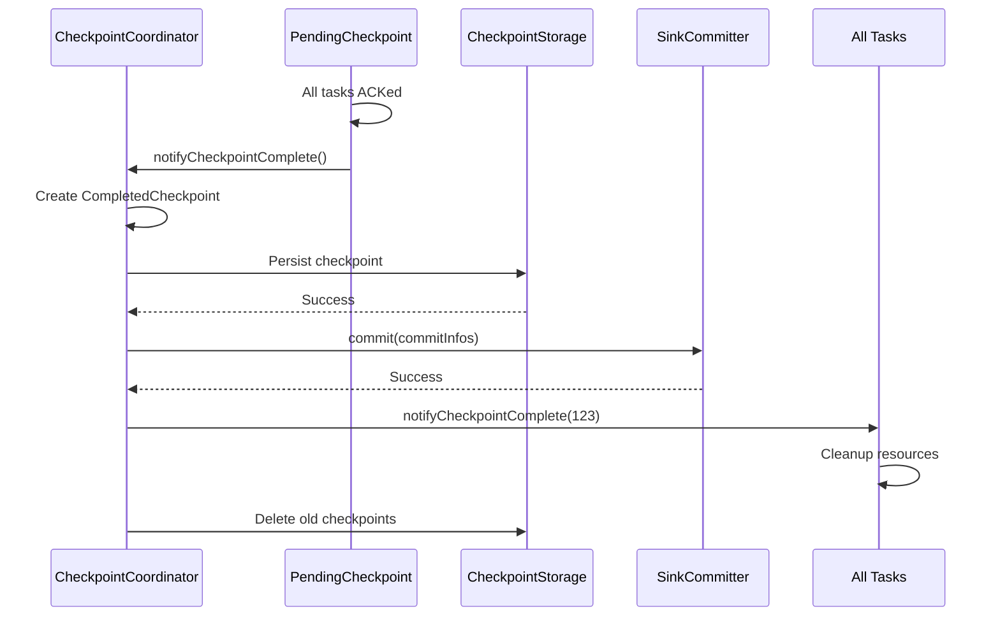
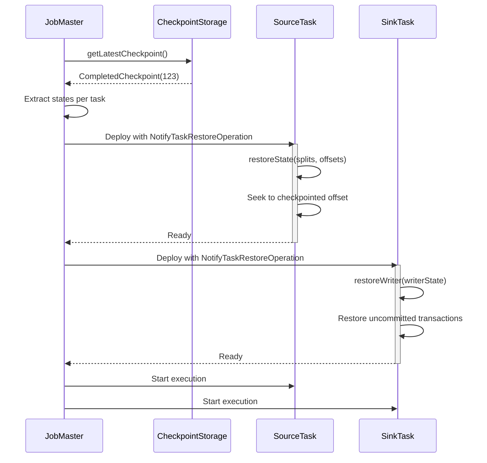

# Checkpoint Mechanism

## 1. Overview

### 1.1 Problem Background

Distributed data processing systems face critical challenges for fault tolerance:

- **State Loss**: How to preserve processing state across failures?
- **Exactly-Once**: How to ensure each record is processed exactly once?
- **Distributed Consistency**: How to create consistent snapshots across distributed tasks?
- **Performance**: How to checkpoint without blocking data processing?
- **Recovery**: How to efficiently restore state after failures?

### 1.2 Design Goals

SeaTunnel's checkpoint mechanism aims to:

1. **Guarantee Exactly-Once Semantics**: Consistent state snapshots + two-phase commit
2. **Minimize Overhead**: Asynchronous checkpoint, no data processing blocking
3. **Fast Recovery**: Restore from latest checkpoint in seconds
4. **Distributed Coordination**: Coordinate checkpoints across hundreds of tasks
5. **Pluggable Storage**: Support multiple storage backends (HDFS, S3, Local, OSS)

### 1.3 Theoretical Foundation

SeaTunnel's checkpoint is based on the **Chandy-Lamport distributed snapshot algorithm**:

**Key Idea**: Insert special markers (barriers) into data streams. When a task receives barrier:
1. Snapshot its local state
2. Forward barrier downstream
3. Continue processing

Result: Globally consistent snapshot without pausing entire system.

**Reference**: ["Distributed Snapshots: Determining Global States of Distributed Systems"](https://lamport.azurewebsites.net/pubs/chandy.pdf) (Chandy & Lamport, 1985)

## 2. Architecture Design

### 2.1 Checkpoint Architecture

```
┌─────────────────────────────────────────────────────────────────┐
│                      JobMaster (per job)                         │
│                                                                   │
│   ┌───────────────────────────────────────────────────────┐     │
│   │         CheckpointCoordinator (per pipeline)           │     │
│   │                                                         │     │
│   │  • Trigger checkpoint (periodic/manual)                │     │
│   │  • Generate checkpoint ID                              │     │
│   │  • Track pending checkpoints                           │     │
│   │  • Collect task acknowledgements                       │     │
│   │  • Persist completed checkpoints                       │     │
│   │  • Cleanup old checkpoints                             │     │
│   └───────────────────────────────────────────────────────┘     │
│                            │                                      │
│                            │ (Trigger Barrier)                    │
│                            ▼                                      │
└─────────────────────────────────────────────────────────────────┘
                             │
                             │ (CheckpointBarrier)
                             ▼
┌─────────────────────────────────────────────────────────────────┐
│                         Worker Nodes                             │
│                                                                   │
│   ┌──────────────┐      ┌──────────────┐      ┌──────────────┐ │
│   │ SourceTask 1 │      │ SourceTask 2 │      │ SourceTask N │ │
│   │              │      │              │      │              │ │
│   │ 1. Receive   │      │ 1. Receive   │      │ 1. Receive   │ │
│   │    Barrier   │      │    Barrier   │      │    Barrier   │ │
│   │ 2. Snapshot  │      │ 2. Snapshot  │      │ 2. Snapshot  │ │
│   │    State     │      │    State     │      │    State     │ │
│   │ 3. ACK       │      │ 3. ACK       │      │ 3. ACK       │ │
│   └──────┬───────┘      └──────┬───────┘      └──────┬───────┘ │
│          │                     │                     │          │
│          │ (Barrier Propagation)                     │          │
│          ▼                     ▼                     ▼          │
│   ┌──────────────┐      ┌──────────────┐      ┌──────────────┐ │
│   │ Transform 1  │      │ Transform 2  │      │ Transform N  │ │
│   │              │      │              │      │              │ │
│   │ 1. Receive   │      │ 1. Receive   │      │ 1. Receive   │ │
│   │    Barrier   │      │    Barrier   │      │    Barrier   │ │
│   │ 2. Snapshot  │      │ 2. Snapshot  │      │ 2. Snapshot  │ │
│   │    State     │      │    State     │      │    State     │ │
│   │ 3. ACK       │      │ 3. ACK       │      │ 3. ACK       │ │
│   │ 4. Forward   │      │ 4. Forward   │      │ 4. Forward   │ │
│   └──────┬───────┘      └──────┬───────┘      └──────┬───────┘ │
│          │                     │                     │          │
│          ▼                     ▼                     ▼          │
│   ┌──────────────┐      ┌──────────────┐      ┌──────────────┐ │
│   │  SinkTask 1  │      │  SinkTask 2  │      │  SinkTask N  │ │
│   │              │      │              │      │              │ │
│   │ 1. Receive   │      │ 1. Receive   │      │ 1. Receive   │ │
│   │    Barrier   │      │    Barrier   │      │    Barrier   │ │
│   │ 2. Prepare   │      │ 2. Prepare   │      │ 2. Prepare   │ │
│   │    Commit    │      │    Commit    │      │    Commit    │ │
│   │ 3. Snapshot  │      │ 3. Snapshot  │      │ 3. Snapshot  │ │
│   │    State     │      │    State     │      │    State     │ │
│   │ 4. ACK       │      │ 4. ACK       │      │ 4. ACK       │ │
│   └──────────────┘      └──────────────┘      └──────────────┘ │
└─────────────────────────────────────────────────────────────────┘
                             │
                             │ (All ACKs received)
                             ▼
┌─────────────────────────────────────────────────────────────────┐
│                    CheckpointStorage                             │
│                  (HDFS / S3 / Local / OSS)                       │
│                                                                   │
│   CompletedCheckpoint {                                          │
│     checkpointId: 123                                            │
│     taskStates: {                                                │
│       SourceTask-1: { splits: [...], offsets: [...] }           │
│       SinkTask-1: { commitInfo: XidInfo(...) }                  │
│       ...                                                        │
│     }                                                            │
│   }                                                              │
└─────────────────────────────────────────────────────────────────┘
```

### 2.2 Key Data Structures

#### CheckpointCoordinator

```java
public class CheckpointCoordinator {
    // Checkpoint ID generator
    private final CheckpointIDCounter checkpointIdCounter;

    // Checkpoint execution plan
    private final CheckpointPlan checkpointPlan;

    // Pending checkpoints (in progress)
    private final Map<Long, PendingCheckpoint> pendingCheckpoints;

    // Completed checkpoints (success)
    private final ArrayDeque<String> completedCheckpointIds;

    // Latest completed checkpoint
    private CompletedCheckpoint latestCompletedCheckpoint;

    // Checkpoint storage
    private final CheckpointStorage checkpointStorage;

    // Configuration
    private final long checkpointInterval;      // Trigger interval (ms)
    private final long checkpointTimeout;       // Timeout (ms)
    private final int minPauseBetweenCheckpoints; // Min pause (ms)
}
```

#### PendingCheckpoint

Represents in-progress checkpoint.

```java
public class PendingCheckpoint {
    private final long checkpointId;
    private final CheckpointType checkpointType; // CHECKPOINT or SAVEPOINT
    private final long triggerTimestamp;

    // Tasks that haven't acknowledged yet
    private final Set<Long> notYetAcknowledgedTasks;

    // Collected action states (from task ACKs)
    private final Map<ActionStateKey, ActionState> actionStates;

    // Task statistics (records processed, bytes, etc.)
    private final Map<Long, TaskStatistics> taskStatistics;

    // Future completed when all tasks ACK
    private final CompletableFuture<CompletedCheckpoint> completableFuture;

    /**
     * Called when task acknowledges checkpoint
     */
    public void acknowledgeTask(long taskId, List<ActionSubtaskState> states,
                                TaskStatistics statistics) {
        notYetAcknowledgedTasks.remove(taskId);

        // Collect states
        for (ActionSubtaskState state : states) {
            actionStates.computeIfAbsent(state.getKey(), k -> new ActionState())
                        .putSubtaskState(state);
        }

        // Collect statistics
        taskStatistics.put(taskId, statistics);

        // Check if all tasks acknowledged
        if (notYetAcknowledgedTasks.isEmpty()) {
            completeCheckpoint();
        }
    }

    private void completeCheckpoint() {
        CompletedCheckpoint completed = new CompletedCheckpoint(
            checkpointId, actionStates, taskStatistics, System.currentTimeMillis()
        );
        completableFuture.complete(completed);
    }
}
```

#### CompletedCheckpoint

Persisted checkpoint data.

```java
public class CompletedCheckpoint implements Serializable {
    private final long checkpointId;
    private final Map<ActionStateKey, ActionState> taskStates;
    private final Map<Long, TaskStatistics> taskStatistics;
    private final long completedTimestamp;
}

public class ActionState implements Serializable {
    private final ActionStateKey key; // (pipelineId, actionId)
    private final Map<Integer, ActionSubtaskState> subtaskStates;
}

public class ActionSubtaskState implements Serializable {
    private final int subtaskIndex;
    private final byte[] state; // Serialized state
}
```

### 2.3 CheckpointStorage

Abstraction for checkpoint persistence.

```java
public interface CheckpointStorage {
    /**
     * Store completed checkpoint
     */
    void storeCheckpoint(CompletedCheckpoint checkpoint) throws IOException;

    /**
     * Get latest checkpoint
     */
    Optional<CompletedCheckpoint> getLatestCheckpoint() throws IOException;

    /**
     * Get specific checkpoint by ID
     */
    Optional<CompletedCheckpoint> getCheckpoint(long checkpointId) throws IOException;

    /**
     * Delete old checkpoint
     */
    void deleteCheckpoint(long checkpointId) throws IOException;
}
```

**Implementations**:
- `LocalFileStorage`: Local file system (testing)
- `HdfsStorage`: Hadoop FileSystem-based backend; can work with HDFS/S3A/etc depending on Hadoop configuration

Note: S3 and OSS support are provided through Hadoop FileSystem configuration (e.g., `fs.s3a.impl`) rather than separate CheckpointStorage implementations.

## 3. Checkpoint Flow

### 3.1 Trigger Checkpoint



**Trigger Conditions**:
1. Checkpoint interval elapsed (e.g., 60 seconds)
2. Minimum pause between checkpoints elapsed (e.g., 10 seconds)
3. Number of concurrent checkpoints < max (e.g., 1)
4. No checkpoint in progress (for single concurrent)

### 3.2 Barrier Propagation



**Barrier Flow Rules**:
1. **Source Tasks**: Start of pipeline, receive barrier from coordinator
2. **Transform Tasks**: Receive from upstream, snapshot, forward downstream
3. **Sink Tasks**: End of pipeline, receive from upstream, snapshot, no forward

**Barrier Alignment** (for tasks with multiple inputs):
```java
// Task with 2 inputs
Input 1: ──data──data──[barrier-123]──data──data──
                         │ Wait!
Input 2: ──data──data──data──data──[barrier-123]──
                                     │
                                     ▼
                        Both barriers received, snapshot state
```

### 3.3 State Snapshot

Each task type snapshots different state:

**SourceTask**:
```java
@Override
public void triggerBarrier(long checkpointId) {
    // 1. Snapshot SourceReader state (splits + offsets)
    List<byte[]> states = sourceFlowLifeCycle.snapshotState(checkpointId);

    // 2. Create ActionSubtaskState
    ActionSubtaskState state = new ActionSubtaskState(subtaskIndex, states);

    // 3. Send ACK to coordinator
    sendAcknowledgement(checkpointId, Collections.singletonList(state));

    // 4. Forward barrier downstream
    forwardBarrierToDownstream(checkpointId);
}
```

**TransformTask**:
```java
@Override
public void triggerBarrier(long checkpointId) {
    // 1. Snapshot Transform state (usually stateless, empty state)
    List<byte[]> states = transformFlowLifeCycle.snapshotState(checkpointId);

    // 2. Create ActionSubtaskState
    ActionSubtaskState state = new ActionSubtaskState(subtaskIndex, states);

    // 3. Send ACK
    sendAcknowledgement(checkpointId, Collections.singletonList(state));

    // 4. Forward barrier
    forwardBarrierToDownstream(checkpointId);
}
```

**SinkTask**:
```java
@Override
public void triggerBarrier(long checkpointId) {
    // 1. Prepare commit (TWO-PHASE COMMIT)
    Optional<CommitInfoT> commitInfo = sinkWriter.prepareCommit(checkpointId);

    // 2. Snapshot writer state
    List<StateT> writerStates = sinkWriter.snapshotState(checkpointId);

    // 3. Create ActionSubtaskState (includes both commit info and state)
    ActionSubtaskState state = new ActionSubtaskState(
        subtaskIndex,
        serialize(writerStates),
        commitInfo.orElse(null)
    );

    // 4. Send ACK (NO forwarding - end of pipeline)
    sendAcknowledgement(checkpointId, Collections.singletonList(state));
}
```

### 3.4 Checkpoint Completion



**Completion Steps**:
1. All tasks acknowledged
2. Create `CompletedCheckpoint` from `PendingCheckpoint`
3. Persist checkpoint to storage
4. Trigger sink commit (two-phase commit)
5. Notify all tasks of completion
6. Cleanup old checkpoints (retain last N)

### 3.5 Checkpoint Timeout

```java
// CheckpointCoordinator
private void startCheckpointTimeout(long checkpointId, long timeoutMs) {
    scheduledExecutor.schedule(() -> {
        PendingCheckpoint pending = pendingCheckpoints.get(checkpointId);
        if (pending != null && !pending.isCompleted()) {
            LOG.warn("Checkpoint {} timeout after {}ms, {} tasks not yet acknowledged",
                     checkpointId, timeoutMs, pending.getNotYetAcknowledgedTasks());

            // Fail checkpoint
            pending.abort();
            pendingCheckpoints.remove(checkpointId);

            // Trigger job failover if needed
            handleCheckpointFailure(checkpointId);
        }
    }, timeoutMs, TimeUnit.MILLISECONDS);
}
```

**Timeout Handling**:
- Default timeout: 10 minutes
- If timeout, checkpoint fails
- Job continues with previous checkpoint
- Next checkpoint will be triggered per schedule

## 4. Recovery Process

### 4.1 Restore from Checkpoint



**Restore Steps**:
1. JobMaster retrieves latest `CompletedCheckpoint` from storage
2. Extract state for each task (by ActionStateKey and subtaskIndex)
3. Deploy tasks with `NotifyTaskRestoreOperation` containing state
4. Tasks restore state:
   - **SourceReader**: Restore splits and offsets, seek to position
   - **Transform**: Restore transform state (usually none)
   - **SinkWriter**: Restore writer state, may have uncommitted transactions
5. Tasks transition to READY_START state
6. Job resumes execution

**Example: JDBC Source Recovery**:
```java
public class JdbcSourceReader {
    @Override
    public void restoreState(List<JdbcSourceState> states) {
        for (JdbcSourceState state : states) {
            JdbcSourceSplit split = state.getSplit();
            long offset = state.getCurrentOffset();

            // Restore split with offset
            pendingSplits.add(split);

            // When processing split, start from offset
            String query = split.getQuery() + " OFFSET " + offset;
        }
    }
}
```

### 4.2 Exactly-Once Recovery

Combination of checkpoint restore + sink two-phase commit ensures exactly-once:

```
Checkpoint N (completed):
  Source offsets: [100, 200, 300]
  Sink prepared commits: [XID-1, XID-2, XID-3]
  Sink committer commits XID-1, XID-2, XID-3

                    ↓ [Failure]

Recovery from Checkpoint N:
  1. Restore source offsets: [100, 200, 300]
  2. Sources start reading from offset 100, 200, 300
  3. Sink writers restore state (may have uncommitted XIDs)
  4. Sink committer retries committing XIDs (idempotent)

Result: Records 0-99, 100-199, 200-299 committed exactly once
        Records from 100+ reprocessed but not duplicated (idempotent commit)
```

## 5. Configuration and Tuning

### 5.1 Checkpoint Configuration

```hocon
env {
  # Enable checkpoint
  checkpoint.interval = 60000 # Trigger every 60 seconds

  # Checkpoint timeout
  checkpoint.timeout = 600000 # 10 minutes

  # Min pause between checkpoints
  min-pause = 10000 # 10 seconds
}
```

Checkpoint storage is configured on the engine side (e.g., `config/seatunnel.yaml` under `seatunnel.engine.checkpoint.storage`), rather than as job-level `env` options.

### 5.2 Tuning Guidelines

**Checkpoint Interval**:
- **Shorter interval**: Faster recovery, higher overhead
- **Longer interval**: Lower overhead, slower recovery

**Trade-offs**:
- Shorter interval → More frequent I/O → Higher storage cost
- Longer interval → Less overhead → Longer recovery time

**Rule of Thumb**: Set interval to tolerable recovery time (data loss window).

**Checkpoint Timeout**:
- Should be >> checkpoint interval
- Depends on state size and storage speed
- Choose based on end-to-end latency, state size, and checkpoint storage throughput

**Storage Selection (SeaTunnel Engine)**:
- `localfile` (LocalFileStorage): local filesystem, non-HA
- `hdfs` (HdfsStorage): Hadoop FileSystem-based backend; can work with HDFS/S3A/etc depending on Hadoop configuration

## 6. Performance Optimization

### 6.1 Async Checkpoint

State snapshot doesn't block data processing:

```java
public class AsyncSnapshotSupport {
    @Override
    public void snapshotState(long checkpointId) {
        // 1. Create snapshot of current state (fast, in-memory copy)
        StateSnapshot snapshot = createSnapshot();

        // 2. Continue data processing (doesn't wait for serialization/upload)
        // ...

        // 3. Async serialize and upload
        CompletableFuture.runAsync(() -> {
            byte[] serialized = serialize(snapshot);
            checkpointStorage.upload(checkpointId, serialized);
        }, executorService);
    }
}
```

### 6.2 Incremental Checkpoint (Future)

Only checkpoint changed state:

```java
// Full checkpoint (first)
Checkpoint 1: State = 1GB → Upload 1GB

// Incremental checkpoints (subsequent)
Checkpoint 2: State = 1.1GB → Upload 100MB (delta)
Checkpoint 3: State = 1.05GB → Upload 0MB (deletion doesn't upload)
```

**Benefits**:
- Reduce checkpoint time
- Lower storage I/O
- Faster checkpoint completion

**Challenges**:
- More complex state management
- Need to track state changes
- Restore requires chain of deltas

### 6.3 Local State Backend (Future)

Store hot state locally, checkpoint only summary:

```java
// RocksDB local state backend
class RocksDBStateBackend {
    private final RocksDB rocksDB; // Fast local SSD

    @Override
    public void put(String key, byte[] value) {
        rocksDB.put(key.getBytes(), value); // Local write (fast)
    }

    @Override
    public byte[] snapshotState() {
        // Only checkpoint RocksDB snapshot reference
        return rocksDB.createCheckpoint().getBytes();
    }
}
```

## 7. Best Practices

### 7.1 State Size Optimization

**1. Keep State Small**:
```java
// ❌ BAD: Buffer entire dataset
class BadSourceReader {
    private List<SeaTunnelRow> bufferedRows = new ArrayList<>(); // May be huge!

    List<State> snapshotState() {
        return serialize(bufferedRows); // Huge state
    }
}

// ✅ GOOD: Track offset only
class GoodSourceReader {
    private long currentOffset = 0;

    List<State> snapshotState() {
        return serialize(currentOffset); // Small state
    }
}
```

**2. Use Efficient Serialization**:
- Prefer Protobuf, Kryo over Java serialization
- Compress large state (gzip, snappy)

### 7.2 Monitoring

**Key Metrics**:
- `checkpoint_duration`: Time from trigger to completion
- `checkpoint_size`: Size of persisted checkpoint
- `checkpoint_failure_rate`: Percentage of failed checkpoints
- `checkpoint_alignment_duration`: Time spent aligning barriers

**Alerting**:
- Alert if `checkpoint_duration` > threshold (e.g., 5 minutes)
- Alert if `checkpoint_failure_rate` > 10%
- Alert if no checkpoint completed in 2x interval

### 7.3 Troubleshooting

**Problem**: Checkpoint timeout

**Possible Causes**:
1. Task stuck (slow data processing)
2. Large state (slow serialization/upload)
3. Slow storage (network/disk I/O)
4. Barrier alignment slow (skewed data)

**Solutions**:
- Increase checkpoint timeout
- Optimize state size
- Use faster storage
- Tune parallelism

**Problem**: High checkpoint overhead

**Possible Causes**:
1. Checkpoint interval too short
2. Large state size
3. Slow storage

**Solutions**:
- Increase checkpoint interval
- Optimize state size
- Enable incremental checkpoint (when available)

## 8. Related Resources

- [Architecture Overview](../overview.md)
- [Design Philosophy](../design-philosophy.md)
- [Engine Architecture](../engine/engine-architecture.md)
- [Sink Architecture](../api-design/sink-architecture.md)
- [Exactly-Once Semantics](exactly-once.md)

## 9. References

### Key Source Files

- [CheckpointCoordinator.java](../../../seatunnel-engine/seatunnel-engine-server/src/main/java/org/apache/seatunnel/engine/server/checkpoint/CheckpointCoordinator.java)
- [PendingCheckpoint.java](../../../seatunnel-engine/seatunnel-engine-server/src/main/java/org/apache/seatunnel/engine/server/checkpoint/PendingCheckpoint.java)
- [CheckpointStorage.java](../../../seatunnel-engine/seatunnel-engine-storage/checkpoint-storage-api/src/main/java/org/apache/seatunnel/engine/checkpoint/storage/api/CheckpointStorage.java)

### Academic Papers

- Chandy, K. M., & Lamport, L. (1985). ["Distributed Snapshots: Determining Global States of Distributed Systems"](https://lamport.azurewebsites.net/pubs/chandy.pdf)
- Carbone, P., et al. (2017). ["State Management in Apache Flink"](http://www.vldb.org/pvldb/vol10/p1718-carbone.pdf)

### Further Reading

- [Apache Flink Checkpointing](https://nightlies.apache.org/flink/flink-docs-stable/docs/dev/datastream/fault-tolerance/checkpointing/)
- [Spark Structured Streaming Checkpointing](https://spark.apache.org/docs/latest/structured-streaming-programming-guide.html#recovering-from-failures-with-checkpointing)
