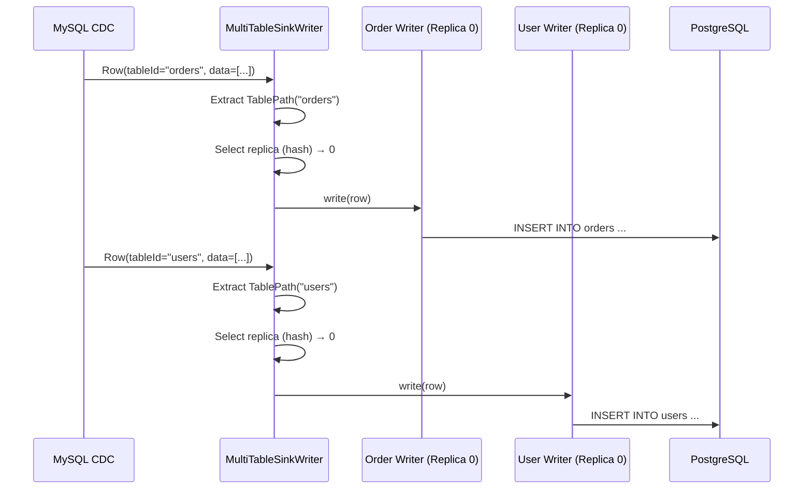
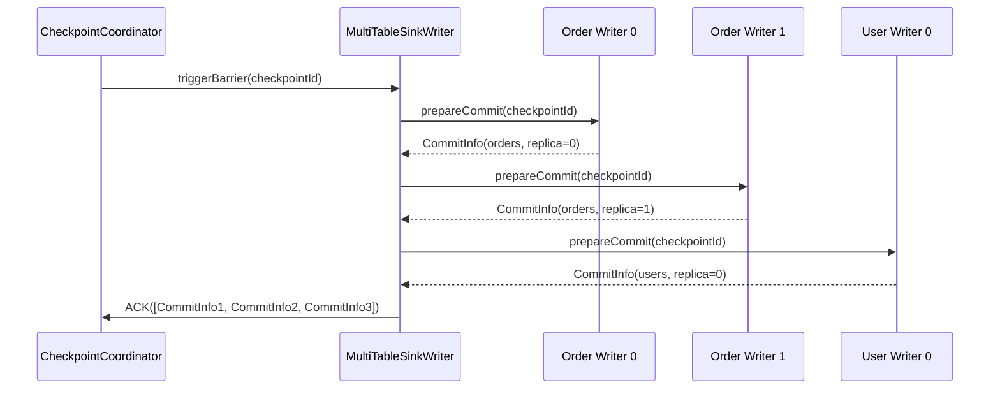

# Multi-Table Synchronization Architecture

## 1. Overview

### 1.1 Problem Background

Database migration and CDC scenarios often require synchronizing hundreds of tables:

- **Resource Efficiency**: How to avoid creating one job per table?
- **Consistent Snapshot**: How to ensure all tables start from same point in time?
- **Schema Routing**: How to route data to correct target tables?
- **Independent Schemas**: How to handle different schemas per table?
- **Parallel Writing**: How to maximize throughput for multiple tables?

### 1.2 Design Goals

SeaTunnel's multi-table synchronization aims to:

1. **Single Job, Multiple Tables**: Synchronize hundreds of tables in one job
2. **Resource Efficiency**: Share resources across tables
3. **Schema Independence**: Each table maintains its own schema
4. **Dynamic Routing**: Route records to correct sink based on table identity
5. **Horizontal Scalability**: Support replica writers for high throughput

### 1.3 Use Cases

**Database Migration**:
```hocon
source {
  MySQL-CDC {
    # Capture all tables in database
    database-name = "my_db"
    table-name = ".*" # Regex: all tables
  }
}

sink {
  JDBC {
    # Write to PostgreSQL
    url = "jdbc:postgresql://..."
  }
}
```

**Multi-Table CDC**:
```hocon
source {
  MySQL-CDC {
    table-name = "order_.*|user_.*|product_.*" # Multiple table patterns
  }
}

sink {
  Elasticsearch {
    # Different indices per table
  }
}
```

## 2. Core Abstractions

### 2.1 TablePath

Unique identifier for routing records to tables.

```java
public class TablePath implements Serializable {
    private final String databaseName;
    private final String schemaName;
    private final String tableName;

    // Unique string representation
    public String getFullName() {
        return String.join(".", databaseName, schemaName, tableName);
    }
}
```

**Example**:
```java
TablePath orderTable = TablePath.of("my_db", "public", "orders");
TablePath userTable = TablePath.of("my_db", "public", "users");
```

### 2.2 SeaTunnelRow with TableId

Records carry table identity for routing.

```java
public class SeaTunnelRow {
    private final String tableId; // TablePath serialized
    private final SeaTunnelRowKind rowKind; // INSERT, UPDATE, DELETE
    private final Object[] fields;

    public TablePath getTablePath() {
        return TablePath.deserialize(tableId);
    }
}
```

### 2.3 SinkIdentifier

Unique identifier for sink writers (table + replica index).

```java
public class SinkIdentifier implements Serializable {
    private final TableIdentifier tableIdentifier;
    private final int index; // Replica index

    // For multi-table: one identifier per table per replica
    // Example: (orders, 0), (orders, 1), (users, 0), (users, 1)
}
```

## 3. MultiTableSource Architecture

### 3.1 Structure

```java
public class MultiTableSource<T, SplitT, StateT>
    implements SeaTunnelSource<T, SplitT, StateT> {

    // Underlying sources (one per table)
    private final Map<TablePath, SeaTunnelSource<T, SplitT, StateT>> sources;

    // Produced catalog tables
    private final List<CatalogTable> catalogTables;
}
```

### 3.2 Creation

```java
// From configuration
MultiTableSource<SeaTunnelRow, ?, ?> multiSource =
    MultiTableSource.builder()
        .addSource(orderTablePath, orderSource)
        .addSource(userTablePath, userSource)
        .addSource(productTablePath, productSource)
        .build();
```

### 3.3 Enumerator: Unified Split Assignment

```java
public class MultiTableSourceSplitEnumerator {
    private final Map<TablePath, SourceSplitEnumerator> enumerators;

    @Override
    public void handleSplitRequest(int subtaskId) {
        // Round-robin across table enumerators
        for (Map.Entry<TablePath, SourceSplitEnumerator> entry : enumerators.entrySet()) {
            TablePath tablePath = entry.getKey();
            SourceSplitEnumerator enumerator = entry.getValue();

            // Request split from table enumerator
            enumerator.handleSplitRequest(subtaskId);
        }
    }

    @Override
    public void addReader(int subtaskId) {
        // Register reader with all table enumerators
        for (SourceSplitEnumerator enumerator : enumerators.values()) {
            enumerator.addReader(subtaskId);
        }
    }
}
```

### 3.4 Reader: Multi-Table Data Reading

```java
public class MultiTableSourceReader {
    private final Map<TablePath, SourceReader> readers;
    private final Queue<TablePath> readOrder; // Round-robin queue

    @Override
    public void pollNext(Collector<SeaTunnelRow> output) {
        if (readOrder.isEmpty()) {
            return;
        }

        // Round-robin read from tables
        TablePath currentTable = readOrder.poll();
        SourceReader reader = readers.get(currentTable);

        // Read from current table
        reader.pollNext(new Collector<SeaTunnelRow>() {
            @Override
            public void collect(SeaTunnelRow row) {
                // Tag row with table path
                row.setTableId(currentTable.serialize());
                output.collect(row);
            }
        });

        // Re-add to queue for next round
        readOrder.offer(currentTable);
    }

    @Override
    public void addSplits(List<SplitT> splits) {
        // Route splits to correct table readers
        for (SplitT split : splits) {
            TablePath tablePath = extractTablePath(split);
            SourceReader reader = readers.get(tablePath);
            reader.addSplits(Collections.singletonList(split));

            // Add table to read order if not present
            if (!readOrder.contains(tablePath)) {
                readOrder.offer(tablePath);
            }
        }
    }
}
```

## 4. MultiTableSink Architecture

### 4.1 Structure

```java
public class MultiTableSink<IN, StateT, CommitInfoT, AggregatedCommitInfoT>
    implements SeaTunnelSink<IN, StateT, CommitInfoT, AggregatedCommitInfoT> {

    // Underlying sinks (one per table)
    private final Map<TablePath, SeaTunnelSink> sinks;

    // Number of writer replicas per table
    private final int replicaNum;

    // Input catalog tables
    private final List<CatalogTable> catalogTables;
}
```

### 4.2 Writer: Multi-Table Writing with Replicas

```java
public class MultiTableSinkWriter<IN, CommitInfoT, StateT>
    implements SinkWriter<IN, CommitInfoT, StateT> {

    // Writers per table (multiple replicas per table)
    private final Map<SinkIdentifier, SinkWriter<IN, CommitInfoT, StateT>> writers;

    // Replica count per table
    private final int replicaNum;

    // Context
    private final int writerIndex; // This writer's global index

    @Override
    public void write(IN element) throws IOException {
        SeaTunnelRow row = (SeaTunnelRow) element;

        // 1. Determine target table
        TablePath tablePath = row.getTablePath();

        // 2. Select replica for this table (load balancing)
        int replicaIndex = selectReplica(tablePath, row);

        // 3. Get writer for (table, replica)
        SinkIdentifier identifier = new SinkIdentifier(
            new TableIdentifier(tablePath),
            replicaIndex
        );

        SinkWriter<IN, CommitInfoT, StateT> writer = writers.get(identifier);

        // 4. Write to selected writer
        writer.write(element);
    }

    private int selectReplica(TablePath tablePath, SeaTunnelRow row) {
        // If primary key is available, route stably by primary key hash.
        Optional<Object> primaryKey = extractPrimaryKeyIfPresent(row);
        if (primaryKey.isPresent()) {
            return Math.abs(primaryKey.get().hashCode()) % replicaNum;
        }

        // Otherwise, distribute across replicas (no stable routing guarantee).
        return (int) (System.nanoTime() % replicaNum);
    }

    @Override
    public Optional<CommitInfoT> prepareCommit(long checkpointId) throws IOException {
        // Collect commit info from all writers
        List<CommitInfoT> allCommitInfos = new ArrayList<>();

        for (SinkWriter<IN, CommitInfoT, StateT> writer : writers.values()) {
            Optional<CommitInfoT> commitInfo = writer.prepareCommit(checkpointId);
            commitInfo.ifPresent(allCommitInfos::add);
        }

        // Wrap in multi-table commit info
        return Optional.of((CommitInfoT) new MultiTableCommitInfo(allCommitInfos));
    }

    @Override
    public List<StateT> snapshotState(long checkpointId) throws IOException {
        // Snapshot all writers
        List<StateT> allStates = new ArrayList<>();

        for (Map.Entry<SinkIdentifier, SinkWriter> entry : writers.entrySet()) {
            List<StateT> states = entry.getValue().snapshotState(checkpointId);

            // Tag states with sink identifier for recovery
            for (StateT state : states) {
                allStates.add(wrapWithIdentifier(entry.getKey(), state));
            }
        }

        return allStates;
    }
}
```

### 4.3 Committer: Multi-Table Commit Coordination

```java
public class MultiTableSinkCommitter<CommitInfoT>
    implements SinkCommitter<CommitInfoT> {

    // Committers per table
    private final Map<TablePath, SinkCommitter<CommitInfoT>> committers;

    @Override
    public List<CommitInfoT> commit(List<CommitInfoT> commitInfos) throws IOException {
        List<CommitInfoT> failed = new ArrayList<>();

        // Group commit infos by table
        Map<TablePath, List<CommitInfoT>> groupedInfos = groupByTable(commitInfos);

        // Commit per table
        for (Map.Entry<TablePath, List<CommitInfoT>> entry : groupedInfos.entrySet()) {
            TablePath tablePath = entry.getKey();
            List<CommitInfoT> tableCommitInfos = entry.getValue();

            SinkCommitter<CommitInfoT> committer = committers.get(tablePath);

            // Commit for this table
            List<CommitInfoT> tableFailed = committer.commit(tableCommitInfos);
            failed.addAll(tableFailed);
        }

        return failed;
    }

    private Map<TablePath, List<CommitInfoT>> groupByTable(List<CommitInfoT> commitInfos) {
        Map<TablePath, List<CommitInfoT>> grouped = new HashMap<>();

        for (CommitInfoT commitInfo : commitInfos) {
            TablePath tablePath = extractTablePath(commitInfo);
            grouped.computeIfAbsent(tablePath, k -> new ArrayList<>()).add(commitInfo);
        }

        return grouped;
    }
}
```

## 5. Replica Mechanism

### 5.1 Why Replicas?

**Problem**: Single writer per table becomes bottleneck for high-throughput tables.

**Solution**: Multiple replica writers per table for parallel writing.

```
Without Replicas:
  orders table (1000 writes/sec) → [Single Writer] → Bottleneck

With Replicas (replicaNum=4):
  orders table (1000 writes/sec) → [Writer 0] (250 writes/sec)
                                  → [Writer 1] (250 writes/sec)
                                  → [Writer 2] (250 writes/sec)
                                  → [Writer 3] (250 writes/sec)
```

### 5.2 Replica Configuration

```hocon
sink {
  JDBC {
    url = "..."

    # Multi-table configuration
    multi_table_sink_replica = 4 # replicas per table (applies to all tables)
  }
}
```

### 5.3 Replica Selection Strategies

**Hash-Based (when primary key is available)**:
```java
// Ensures same primary key always goes to same replica (order preservation)
int replica = Math.abs(primaryKey.hashCode()) % replicaNum;
```

**Random (when primary key is not available)**:
```java
// Distributes load across replicas (no stable routing guarantee)
int replica = (int) (System.nanoTime() % replicaNum);
```

## 6. Schema Management in Multi-Table

### 6.1 Independent Schemas

Each table maintains its own schema:

```java
public class MultiTableSink {
    // Schema per table
    private final Map<TablePath, CatalogTable> catalogTables;

    public CatalogTable getCatalogTable(TablePath tablePath) {
        return catalogTables.get(tablePath);
    }
}
```

### 6.2 Schema Evolution Routing

```java
public class MultiTableSinkWriter {
    public void handleSchemaChange(SchemaChangeEvent event) {
        // Route schema change to correct table writer
        TablePath tablePath = event.getTableId().toTablePath();

        // Apply to all replicas of this table
        for (int i = 0; i < replicaNum; i++) {
            SinkIdentifier identifier = new SinkIdentifier(
                new TableIdentifier(tablePath),
                i
            );

            SinkWriter writer = writers.get(identifier);
            writer.applySchemaChange(event);
        }
    }
}
```

## 7. Data Flow Example

### 7.1 Full Pipeline

```
┌──────────────────────────────────────────────────────────────┐
│                    MySQL CDC Source                           │
│  • Captures changes from 100 tables                           │
│  • Tags each row with TablePath                               │
└──────────────────────────┬───────────────────────────────────┘
                           │
                           ▼
         ┌─────────────────────────────────────┐
         │ SeaTunnelRow (with TablePath)       │
         │  tableId: "my_db.public.orders"     │
         │  fields: [1, "order-001", 99.99]    │
         └─────────────────────────────────────┘
                           │
                           ▼
┌──────────────────────────────────────────────────────────────┐
│                  MultiTableSinkWriter                         │
│  • Extracts TablePath from row                                │
│  • Selects replica (hash or random)                           │
│  • Routes to correct writer                                   │
└──────────────────────────┬───────────────────────────────────┘
                           │
        ┌──────────────────┼──────────────────┐
        ▼                  ▼                  ▼
┌──────────────┐   ┌──────────────┐   ┌──────────────┐
│ orders       │   │ users        │   │ products     │
│ Writer 0     │   │ Writer 0     │   │ Writer 0     │
│ Writer 1     │   │ Writer 1     │   │ Writer 1     │
│ Writer 2     │   │              │   │              │
│ Writer 3     │   │              │   │              │
└──────────────┘   └──────────────┘   └──────────────┘
        │                  │                  │
        ▼                  ▼                  ▼
┌──────────────┐   ┌──────────────┐   ┌──────────────┐
│ PostgreSQL   │   │ PostgreSQL   │   │ PostgreSQL   │
│ orders       │   │ users        │   │ products     │
└──────────────┘   └──────────────┘   └──────────────┘
```

### 7.2 Write Flow



### 7.3 Checkpoint Flow



## 8. Performance Optimization

### 8.1 Replica Sizing

**Rule of Thumb**:
```
replicaNum = ceil(Table Write Rate / Single Writer Throughput)

Example:
  orders: 10,000 writes/sec
  Single writer: 2,500 writes/sec
  replicaNum = ceil(10,000 / 2,500) = 4
```

### 8.2 Table-Specific Replicas

```java
// Future enhancement: different replicas per table
Map<TablePath, Integer> replicaConfig = Map.of(
    TablePath.of("orders"), 4,      // High-throughput table
    TablePath.of("users"), 2,       // Medium-throughput
    TablePath.of("config"), 1       // Low-throughput
);
```

### 8.3 Batch Writing

```java
public class MultiTableSinkWriter {
    private final Map<SinkIdentifier, List<SeaTunnelRow>> buffers;
    private static final int BATCH_SIZE = 1000;

    @Override
    public void write(SeaTunnelRow row) {
        SinkIdentifier identifier = selectWriter(row);

        List<SeaTunnelRow> buffer = buffers.computeIfAbsent(
            identifier,
            k -> new ArrayList<>()
        );

        buffer.add(row);

        if (buffer.size() >= BATCH_SIZE) {
            flushBuffer(identifier, buffer);
        }
    }
}
```

## 9. Monitoring and Observability

### 9.1 Key Metrics

**Per-Table Metrics**:
- `table.{tableName}.records_written`: Records written per table
- `table.{tableName}.bytes_written`: Bytes written per table
- `table.{tableName}.write_latency`: Write latency per table

**Per-Replica Metrics**:
- `table.{tableName}.replica.{index}.records`: Records per replica
- `table.{tableName}.replica.{index}.utilization`: Replica utilization

**Global Metrics**:
- `multitable.tables.total`: Total number of tables
- `multitable.writers.total`: Total number of writers (tables × replicas)
- `multitable.throughput`: Aggregate throughput

### 9.2 Monitoring Dashboard

```
Multi-Table Job: mysql-to-postgres

Tables: 100
Writers: 250 (avg 2.5 replicas per table)
Throughput: 50,000 records/sec

Top Tables by Throughput:
  1. orders: 15,000 rec/sec (4 replicas)
  2. events: 10,000 rec/sec (4 replicas)
  3. users: 5,000 rec/sec (2 replicas)
  ...

Replica Distribution:
  orders:
    Replica 0: 3,750 rec/sec (25%)
    Replica 1: 3,800 rec/sec (25.3%)
    Replica 2: 3,700 rec/sec (24.7%)
    Replica 3: 3,750 rec/sec (25%)
```

## 10. Best Practices

### 10.1 Table Selection

Table include/exclude patterns are connector-specific. Please refer to the specific Source connector documentation for the supported option keys and formats.

### 10.2 Replica Configuration

**Start Conservative**:
```hocon
sink {
  JDBC {
    # Start with 1 replica, increase if bottleneck
    multi_table_sink_replica = 1
  }
}
```

**Monitor and Tune**:
```bash
# Check if single replica is bottleneck
# If write latency high → increase replicas
multi_table_sink_replica = 2  # Double capacity
```

### 10.3 Schema Management

**Pre-create Target Tables**:
```sql
-- Better: pre-create all target tables
CREATE TABLE orders (...);
CREATE TABLE users (...);
CREATE TABLE products (...);
```

**Enable Auto-Create (Carefully)**:
```hocon
sink {
  JDBC {
    # Auto-create missing tables
    schema-evolution {
      enabled = true
      auto-create-table = true
    }
  }
}
```

### 10.4 Error Handling

Error tolerance and retry policies are typically connector-specific. Avoid relying on undocumented `multi-table.*` option keys unless they are defined by the connector you use.

## 11. Limitations and Considerations

### 11.1 Current Limitations

**Shared Parallelism**:
- All tables share same parallelism
- Cannot set different parallelism per table

**Fixed Replicas**:
- Same replica count for all tables
- High-throughput and low-throughput tables treated equally

**Memory Overhead**:
- Each writer maintains separate buffer
- 100 tables × 4 replicas = 400 writers in memory

### 11.2 Workarounds

**High-Throughput Tables**:
```hocon
# Option 1: Separate job for hot tables
job-1 { source { table-name = "orders" } } # Dedicated job

job-2 { source { table-name = "user_.*|product_.*" } } # Rest
```

**Memory Optimization**:
```hocon
# Reduce buffer size per writer
sink {
  JDBC {
    batch-size = 500 # Smaller batches
  }
}
```

## 12. Future Enhancements

### 12.1 Dynamic Replicas

Per-table replica overrides are not supported by the current `multi_table_sink_replica` option (it applies to all tables). If you need per-table replicas, it requires additional connector/framework capabilities.

### 12.2 Adaptive Replicas

```java
// Auto-adjust replicas based on throughput
if (table.getWriteRate() > threshold) {
    increaseReplicas(table);
} else if (table.getWriteRate() < lowThreshold) {
    decreaseReplicas(table);
}
```

## 13. Related Resources

- [CatalogTable and Metadata](../api-design/catalog-table.md)
- [Sink Architecture](../api-design/sink-architecture.md)
- [DAG Execution](../engine/dag-execution.md)
- [Schema Evolution](../../introduction/concepts/schema-evolution.md)

## 14. References

### Key Source Files

- [MultiTableSink.java](../../../seatunnel-api/src/main/java/org/apache/seatunnel/api/sink/MultiTableSink.java)
- [SinkIdentifier.java](../../../seatunnel-api/src/main/java/org/apache/seatunnel/api/sink/SinkIdentifier.java)
- [TablePath.java](../../../seatunnel-api/src/main/java/org/apache/seatunnel/api/table/catalog/TablePath.java)

### Example Implementations

- MySQL CDC Source: `seatunnel-connectors-v2/connector-cdc/connector-cdc-mysql/`
- JDBC Sink: `seatunnel-connectors-v2/connector-jdbc/`
