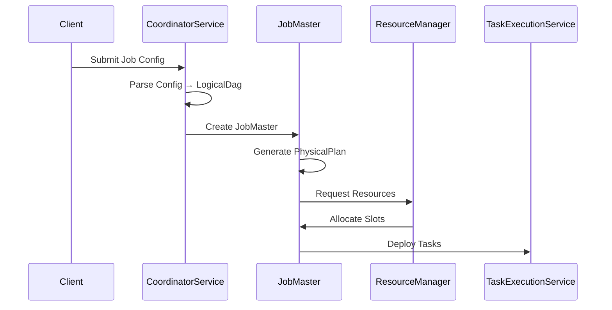

# SeaTunnel Architecture Overview

## 1. Introduction

### 1.1 Design Goals

SeaTunnel is designed as a distributed multimodal data integration tool with the following core objectives:

- **Engine Independence**: Decouple connector logic from execution engines, enabling the same connectors to run on SeaTunnel Engine (Zeta), Apache Flink, or Apache Spark
- **High Performance**: Support large-scale data synchronization with ultra-high-performance throughput and low latency
- **Fault Tolerance**: Provide exactly-once semantics through distributed snapshots and two-phase commit
- **Ease of Use**: Offer simple configuration and a rich connector ecosystem
- **Extensibility**: Plugin-based architecture allowing easy addition of new connectors and transforms

### 1.2 Target Use Cases

- **Batch Data Synchronization**: Large-scale batch data migration between heterogeneous data sources
- **Real-time Data Integration**: Stream data capture and synchronization with CDC support
- **Data Lake/Warehouse Ingestion**: Efficient data loading to data lakes (Iceberg, Hudi, Delta Lake) and warehouses
- **Multi-table Synchronization**: Synchronizing multiple tables in a single job with schema evolution support

## 2. Overall Architecture

SeaTunnel adopts a layered architecture that separates concerns and enables flexibility:

```
┌─────────────────────────────────────────────────────────────────┐
│                      User Configuration Layer                    │
│                  (HOCON Config / SQL / Web UI)                   │
└─────────────────────────────────────────────────────────────────┘
                              │
                              ▼
┌─────────────────────────────────────────────────────────────────┐
│                      SeaTunnel API Layer                         │
│         (Source API / Sink API / Transform API / Table API)      │
│                                                                   │
│  • SeaTunnelSource        • CatalogTable                         │
│  • SeaTunnelSink          • TableSchema                          │
│  • SeaTunnelTransform     • SchemaChangeEvent                    │
└─────────────────────────────────────────────────────────────────┘
                              │
                              ▼
┌─────────────────────────────────────────────────────────────────┐
│                    Connector Ecosystem                           │
│                                                                   │
│  [Jdbc] [Kafka] [MySQL-CDC] [Elasticsearch] [Iceberg] ...       │
│                    (Connector Ecosystem)                          │
└─────────────────────────────────────────────────────────────────┘
                              │
                              ▼
┌─────────────────────────────────────────────────────────────────┐
│                     Translation Layer                            │
│          (Adapts SeaTunnel API to Engine-Specific API)           │
│                                                                   │
│  • FlinkSource/FlinkSink     • SparkSource/SparkSink            │
│  • Context Adapters          • Serialization Adapters           │
└─────────────────────────────────────────────────────────────────┘
                              │
        ┌─────────────────────┼─────────────────────┐
        ▼                     ▼                     ▼
┌──────────────┐      ┌──────────────┐      ┌──────────────┐
│  SeaTunnel   │      │    Apache    │      │    Apache    │
│ Engine (Zeta)│      │     Flink    │      │     Spark    │
│              │      │              │      │              │
│ • Master     │      │ • JobManager │      │ • Driver     │
│ • Worker     │      │ • TaskManager│      │ • Executor   │
│ • Checkpoint │      │ • State      │      │ • RDD/DS     │
└──────────────┘      └──────────────┘      └──────────────┘
```

### 2.1 Layer Responsibilities

| Layer | Responsibility | Key Components |
|-------|---------------|----------------|
| **Configuration Layer** | Job definition, parameter configuration | HOCON parser, SQL parser, config validation |
| **API Layer** | Unified abstraction for connectors | Source/Sink/Transform interfaces, CatalogTable |
| **Connector Layer** | Data source/sink implementations | Various connectors (JDBC, Kafka, CDC, etc.) |
| **Translation Layer** | Engine-specific adaptation | Flink/Spark adapters, context wrappers |
| **Engine Layer** | Job execution and resource management | Scheduling, fault tolerance, state management |

## 3. Core Components

### 3.1 SeaTunnel API

The API layer provides engine-independent abstractions:

#### Source API
- **SeaTunnelSource**: Factory interface for creating readers and enumerators
- **SourceSplitEnumerator**: Master-side component for split generation and assignment
- **SourceReader**: Worker-side component for reading data from splits
- **SourceSplit**: Minimal serializable unit representing a data partition

**Key Design**: Separation of coordination (Enumerator) and execution (Reader) enables efficient parallel processing and fault tolerance.

**Code Reference**:
- [seatunnel-api/.../SeaTunnelSource.java](../../seatunnel-api/src/main/java/org/apache/seatunnel/api/source/SeaTunnelSource.java)
- [seatunnel-api/.../SourceSplitEnumerator.java](../../seatunnel-api/src/main/java/org/apache/seatunnel/api/source/SourceSplitEnumerator.java)

#### Sink API
- **SeaTunnelSink**: Factory interface for creating writers and committers
- **SinkWriter**: Worker-side component for writing data
- **SinkCommitter**: Coordinator for commit operations from multiple writers
- **SinkAggregatedCommitter**: Global coordinator for aggregated commits

**Key Design**: Two-phase commit protocol (prepareCommit → commit) ensures exactly-once semantics.

**Code Reference**:
- [seatunnel-api/.../SeaTunnelSink.java](../../seatunnel-api/src/main/java/org/apache/seatunnel/api/sink/SeaTunnelSink.java)
- [seatunnel-api/.../SinkWriter.java](../../seatunnel-api/src/main/java/org/apache/seatunnel/api/sink/SinkWriter.java)

#### Transform API
- **SeaTunnelTransform**: Data transformation interface
- **SeaTunnelMapTransform**: 1:1 transformation
- **SeaTunnelFlatMapTransform**: 1:N transformation

**Code Reference**:
- [seatunnel-api/.../SeaTunnelTransform.java](../../seatunnel-api/src/main/java/org/apache/seatunnel/api/transform/SeaTunnelTransform.java)

#### Table API
- **CatalogTable**: Complete table metadata (schema, partition keys, options)
- **TableSchema**: Schema definition (columns, primary key, constraints)
- **SchemaChangeEvent**: Represents DDL changes for schema evolution

**Code Reference**:
- [seatunnel-api/.../CatalogTable.java](../../seatunnel-api/src/main/java/org/apache/seatunnel/api/table/catalog/CatalogTable.java)

### 3.2 SeaTunnel Engine (Zeta)

The native execution engine provides:

#### Master Components
- **CoordinatorService**: Manages all running JobMasters
- **JobMaster**: Manages single job lifecycle, generates physical plans, coordinates checkpoints
- **CheckpointCoordinator**: Coordinates distributed snapshots per pipeline
- **ResourceManager**: Manages worker resources and slot allocation

#### Worker Components
- **TaskExecutionService**: Deploys and executes tasks
- **SeaTunnelTask**: Executes Source/Transform/Sink logic
- **FlowLifeCycle**: Manages lifecycle of Source/Transform/Sink components

#### Execution Model
```
LogicalDag → PhysicalPlan → SubPlan (Pipeline) → PhysicalVertex → TaskGroup → SeaTunnelTask
```

**Code Reference**:
- [seatunnel-engine/.../server/CoordinatorService.java](../../seatunnel-engine/seatunnel-engine-server/src/main/java/org/apache/seatunnel/engine/server/CoordinatorService.java)
- [seatunnel-engine/.../server/master/JobMaster.java](../../seatunnel-engine/seatunnel-engine-server/src/main/java/org/apache/seatunnel/engine/server/master/JobMaster.java)

### 3.3 Translation Layer

Enables engine portability through adapter pattern:

- **FlinkSource/FlinkSink**: Adapts SeaTunnel API to Flink's Source/Sink interfaces
- **SparkSource/SparkSink**: Adapts SeaTunnel API to Spark's RDD/Dataset interfaces
- **Context Adapters**: Wraps engine-specific contexts (SourceReaderContext, SinkWriterContext)
- **Serialization Adapters**: Bridges SeaTunnel and engine serialization mechanisms

**Code Reference**:
- [seatunnel-translation/.../flink/source/FlinkSource.java](../../seatunnel-translation/seatunnel-translation-flink/seatunnel-translation-flink-common/src/main/java/org/apache/seatunnel/translation/flink/source/FlinkSource.java)

### 3.4 Connector Ecosystem

All connectors follow a standardized structure:

```
connector-[name]/
├── src/main/java/.../
│   ├── [Name]Source.java          # Implements SeaTunnelSource
│   ├── [Name]SourceReader.java    # Implements SourceReader
│   ├── [Name]SourceSplitEnumerator.java
│   ├── [Name]SourceSplit.java
│   ├── [Name]Sink.java            # Implements SeaTunnelSink
│   ├── [Name]SinkWriter.java      # Implements SinkWriter
│   └── config/[Name]Config.java
└── src/main/resources/META-INF/services/
    ├── org.apache.seatunnel.api.table.factory.TableSourceFactory
    └── org.apache.seatunnel.api.table.factory.TableSinkFactory
```

**Discovery Mechanism**: Java SPI (Service Provider Interface) for dynamic connector loading.

## 4. Data Flow Model

### 4.1 Source Data Flow

```
Data Source
    │
    ▼
┌─────────────────────┐
│ SourceSplitEnumerator│ (Master Side)
│  • Generate Splits   │
│  • Assign to Readers │
└─────────────────────┘
    │ (Split Assignment)
    ▼
┌─────────────────────┐
│   SourceReader      │ (Worker Side)
│  • Read from Split  │
│  • Emit Records     │
└─────────────────────┘
    │
    ▼
 SeaTunnelRow
    │
    ▼
 Transform Chain (Optional)
    │
    ▼
 SeaTunnelRow
    │
    ▼
┌─────────────────────┐
│    SinkWriter       │ (Worker Side)
│  • Buffer Records   │
│  • Prepare Commit   │
└─────────────────────┘
    │ (CommitInfo)
    ▼
┌─────────────────────┐
│   SinkCommitter     │ (Coordinator)
│  • Commit Changes   │
└─────────────────────┘
    │
    ▼
Data Sink
```

### 4.2 Split-based Parallelism

- Data sources are divided into **Splits** (e.g., file blocks, database partitions, Kafka partitions)
- Each **SourceReader** processes one or more splits independently
- Dynamic split assignment enables load balancing and fault recovery
- Split state is checkpointed for exactly-once processing

### 4.3 Pipeline Execution

Jobs are divided into **Pipelines** (SubPlans):

```
Pipeline 1: [Source A] → [Transform 1] → [Sink A]
                                ↓
Pipeline 2: [Source B] ───────→ [Transform 2] → [Sink B]
```

Each pipeline:
- Has independent parallelism configuration
- Maintains its own checkpoint coordinator
- Can execute concurrently or sequentially

## 5. Job Execution Flow

### 5.1 Submission Phase



### 5.2 Execution Phase

1. **Task Initialization**
   - Deploy tasks to allocated slots
   - Initialize Source/Transform/Sink components
   - Restore state from checkpoint (if recovering)

2. **Data Processing**
   - SourceReader pulls data from splits
   - Data flows through transform chain
   - SinkWriter buffers and writes data

3. **Checkpoint Coordination**
   - CheckpointCoordinator triggers checkpoint
   - Checkpoint barriers flow through data pipeline
   - Tasks snapshot their state
   - Coordinator collects acknowledgements

4. **Commit Phase**
   - SinkWriter prepares commit information
   - SinkCommitter coordinates commits
   - State persisted to checkpoint storage

### 5.3 State Machine

**Task State Transitions**:
```
CREATED → INIT → WAITING_RESTORE → READY_START → STARTING → RUNNING
                                                                ↓
                    FAILED ← ─────────────────────── → PREPARE_CLOSE → CLOSED
                                                                ↓
                                                             CANCELED
```

**Job State Transitions**:
```
CREATED → SCHEDULED → RUNNING → FINISHED
            ↓            ↓
          FAILED      CANCELING → CANCELED
```

## 6. Key Features

### 6.1 Fault Tolerance

**Checkpoint Mechanism**:
- Distributed snapshots inspired by Chandy-Lamport algorithm
- Checkpoint barriers propagate through data streams
- State stored in pluggable checkpoint storage (HDFS, S3, local)
- Automatic recovery from latest successful checkpoint

**Failover Strategy**:
- Task-level failover: Restart failed task and related pipeline
- Region-based failover: Minimize impact on unaffected tasks
- Split reassignment: Failed splits redistributed to healthy workers

### 6.2 Exactly-Once Semantics

**Two-Phase Commit Protocol**:
1. **Prepare Phase**: SinkWriter prepares commit info during checkpoint
2. **Commit Phase**: SinkCommitter commits after checkpoint completes
3. **Abort Handling**: Roll back on failure before commit

**Idempotency**: SinkCommitter operations must be idempotent to handle retries

### 6.3 Dynamic Resource Management

- **Slot-based Allocation**: Fine-grained resource management
- **Tag-based Filtering**: Assign tasks to specific worker groups
- **Load Balancing**: Multiple strategies (random, slot ratio, system load)
- **Dynamic Scaling**: Add/remove workers without job restart (future)

### 6.4 Schema Evolution

- **DDL Propagation**: Capture schema changes from source (ADD/DROP/MODIFY columns)
- **Schema Mapping**: Transform schema changes through pipeline
- **Dynamic Application**: Apply schema changes to sink tables
- **Compatibility Checks**: Validate schema changes before application

### 6.5 Multi-Table Support

- **Single Job, Multiple Tables**: Synchronize hundreds of tables in one job
- **Table Routing**: Route records to correct sink based on TablePath
- **Independent Schemas**: Each table maintains its own schema
- **Replica Support**: Multiple writer replicas per table for higher throughput

## 7. Module Structure

```
seatunnel/
├── seatunnel-api/                 # Core API definitions
│   ├── source/                    # Source API
│   ├── sink/                      # Sink API
│   ├── transform/                 # Transform API
│   └── table/                     # Table and Schema API
│
├── seatunnel-connectors-v2/       # Connector implementations
│   ├── connector-jdbc/            # JDBC connector
│   ├── connector-kafka/           # Kafka connector
│   ├── connector-cdc-mysql/       # MySQL CDC connector
│   └── ...                        # connectors
│
├── seatunnel-transforms-v2/       # Transform implementations
│   ├── transform-sql/             # SQL transform
│   ├── transform-filter/          # Filter transform
│   └── ...
│
├── seatunnel-engine/              # SeaTunnel Engine (Zeta)
│   ├── seatunnel-engine-core/     # Core execution logic
│   ├── seatunnel-engine-server/   # Server components (Master/Worker)
│   └── seatunnel-engine-storage/  # Checkpoint storage
│
├── seatunnel-translation/         # Engine translation layers
│   ├── seatunnel-translation-flink/
│   └── seatunnel-translation-spark/
│
├── seatunnel-formats/             # Data format handlers
│   ├── seatunnel-format-json/
│   ├── seatunnel-format-avro/
│   └── ...
│
├── seatunnel-core/                # Job submission and CLI
└── seatunnel-e2e/                 # End-to-end tests
```

## 8. Design Principles

### 8.1 Separation of Concerns

- **API vs Implementation**: Clean API boundaries enable multiple implementations
- **Coordination vs Execution**: Enumerator/Committer (master) separate from Reader/Writer (worker)
- **Logical vs Physical**: LogicalDag (user intent) separate from PhysicalPlan (execution details)

### 8.2 Plugin Architecture

- **SPI-based Discovery**: Connectors loaded dynamically via Java SPI
- **Class Loader Isolation**: Each connector uses isolated class loader
- **Hot Pluggable**: Add connectors without rebuilding core

### 8.3 Engine Independence

- **Unified API**: Same connector code runs on any engine
- **Translation Layer**: Adapts API to engine specifics
- **No Engine Leakage**: Connector developers don't need engine knowledge

### 8.4 Scalability

- **Horizontal Scaling**: Add workers to increase throughput
- **Split-based Parallelism**: Fine-grained parallel processing
- **Stateless Workers**: Workers can be added/removed dynamically

### 8.5 Reliability

- **Distributed Checkpoints**: Consistent snapshots across distributed tasks
- **Incremental State**: Optimize checkpoint size for large state
- **Exactly-Once Guarantee**: End-to-end consistency

## 9. Next Steps

To dive deeper into specific architectural components:

- [Design Philosophy](design-philosophy.md) - Core design principles and trade-offs
- [Source Architecture](api-design/source-architecture.md) - Deep dive into Source API design
- [Sink Architecture](api-design/sink-architecture.md) - Deep dive into Sink API design
- [Engine Architecture](engine/engine-architecture.md) - SeaTunnel Engine internals
- [Checkpoint Mechanism](fault-tolerance/checkpoint-mechanism.md) - Fault tolerance implementation

For practical guides:

- [How to Create Your Connector](../developer/how-to-create-your-connector.md)
- [Quick Start](../getting-started/locally/quick-start-seatunnel-engine.md)

## 10. References

### 10.1 Related Concepts

- [Apache Flink](https://flink.apache.org/) - Inspiration for checkpoint and state management
- [Apache Kafka](https://kafka.apache.org/) - Consumer group model influenced split assignment
- [Chandy-Lamport Algorithm](https://en.wikipedia.org/wiki/Chandy-Lamport_algorithm) - Distributed snapshot algorithm
